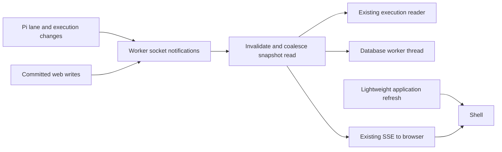

# Fast history and responsive return

## TL;DR for Lyubomir

- Long conversations should reopen promptly and stay responsive while Pi works, without delaying approvals or hiding new output.
- The first release integrates the existing cache, database-worker and notification work; it adds no new history store or database service.
- The existing performance chat owns that implementation. The remaining job is integration, realistic measurement and release acceptance.
- Prove it with 1, 5 and 10 actual open chats, including approval, output, reconnect and restart. Reader microbenchmarks alone do not establish this.
- Keep the external-user beta walkthrough as the delivery gate; this improvement supports its return visit.

## Implementation plan

### Verified position and scope

This integrates [research opportunity 1](../../research/2026-09-29-product-opportunities.md#1-make-the-interface-fast-by-avoiding-work-that-has-not-changed) into existing work. **Hallvi: SQLite blocking and chat performance**, chat `01a0dccd-9bde-7851-8ed3-1ef4ab28c836`, owns all three changes; do not commission another implementation.

Source review on 29 September 2026 inspected research baseline `261cd33ffc1123e1f953b29fe1dcddae0489de44`, required main snapshot `cc7e9179ba053553163d2ee0a025ae4cd48ec2c7`, and coordinator HEAD `abf8b5c4d05476e935cc4ef647c026483ad4f061`. The relevant performance paths are unchanged between the first two revisions.

At that main snapshot:

- The [SSE route](../../../src/app/api/applications/[applicationId]/chats/[chatId]/events/route.ts) rebuilds and serializes `chatSnapshot` every 500 ms. [Projection](../../../src/server/pi-conversation.ts) joins Pi's transcript, application-wide execution files and presented information. Equality suppresses delivery only after that work.
- [Execution reads](../../../src/server/operator-execution.ts) synchronously enumerate, parse and sort every execution. [SQLite access](../../../src/server/db.ts) is also synchronous, with WAL and a 5,000 ms busy timeout.
- [Pi ownership](../../../src/server/pi-owner.ts) already caches native history by session tip and latest operation result. Queue, steer, durable acceptance and explicit restart recovery already exist.
- The [shell](../../../src/components/hallvi/operator-shell.tsx) additionally fetches the complete [operator view](../../../src/server/operator-view.ts) every 2.5 seconds while active and 15 seconds while idle, invoking the same snapshot path.

Working code inspected around 13:18 UTC in `execution-cache/hallvi` and `async-sqlite-runtime/hallvi` was based on `cc6db62190d80ee2bc385aee90999f2fdbe5bd77` **plus uncommitted changes**. The cache already has bounded asynchronous reads, file-version checks, shared in-flight scans and `invalidateExecutionReads`. The database branch already has named operations in dedicated worker threads, transaction ownership and build/package changes. The notification chat's reviewed design is waiting for their combined baseline; the integration checkout was still clean at `cc7e9179`. These observations are not merged or installed-release proof. Pin the eventual commits before acceptance.

The research's isolated reader took 76.44/82.58 ms p50/p95 including serialization for 1,000 records with 20,000 output characters each. The cache branch's separate 2,000-record experiment reports 20,000 content reads/parses becoming zero for ten warm readers; metadata scans and serialization remain. **Neither exercised ten actual browser chats.** The parent reports 881 versus 16 ms maximum timer gaps under an 800 ms SQLite lock: separate contention evidence, not throughput. This planning turn ran no experiments.

### Integrate the existing design

Keep SQLite, Pi's native sessions, execution files and shared information authoritative. Reuse incoming `execution-reader.ts` and `database-{client,worker,store}.ts`. Worker threads preserve SQLite's single-writer limit; execution writes and JSON serialization remain synchronous. The cache's 4,096-entry/estimated-32-MiB bound covers retained content, not responses or transient memory.

Extend [worker.sock](../../../src/server/worker-link.ts) through the notification owner's design: scoped invalidations after successful writes and Pi events, one upstream subscription per web process, and the existing browser SSE transport. Execution/information changes invalidate all subscribed chats in that application; lane changes target their conversation. Identity includes the database path and controller configuration directory. Web writes notify local readers after commit and relay to the worker without echo loops; delivery failure must not turn an accepted write into failure.

Register listeners before reading initial state. Coalesce rapid changes with one build in flight and a generation counter: a change during that build must cause another read. Invoke the cache invalidation hook before the new scan so it cannot join a scan begun before the change. Reconnect always reads authoritative full state. Subscription loss updates availability once; bounded connection retries do not repeatedly rebuild history. Abort releases subscriptions/timers, and slow consumers must not accumulate unbounded snapshots. No durable event log or token replay is needed.

Split the shell's periodic fetch into lightweight application metadata through the existing application GET route and `api.ts`/`types.ts`. Merge that partial response without overwriting SSE chat fields. Preserve deployment-watch freshness, secret-request metadata, repository access and controller-protection facts; do not call `chatSnapshot` or scan executions on that timer. Existing access observations, traffic streams and display clocks retain their own responsibilities.

Preserve **Always ask / Hallvi decides / Bypass**, authoritative approval decisions, request-key deduplication, drafts and explicit Continue/Stop after interruption. Reading/subscribing starts no Pi operation. Faster delivery never proves a deployment succeeded or grants authority over application business logic. Keep the [existing visual language](../../../src/components/hallvi/DESIGN.md); pagination, transcript virtualization and output-on-demand remain measurement-driven follow-ups.

### Reviewable increments

1. **Integrate the two existing storage branches.** Resolve shared awaits in `operator-execution.ts`, `pi-conversation.ts`, `operator-view.ts`, `saved-information.ts` and `requests.ts`. Replace the cache branch's synchronous recovery reader with awaited settlement before socket intake and before clearing Pi's driving state. Preserve whole transactions, retained ownership, shutdown draining, error propagation and the packaged database-worker entry. Record exact candidate commits and reuse the owners' focused tests.
2. **Land the notification owner's slice on that baseline.** Cover lane/token/tool previews, execution replacement/decisions, information create/update/retire and application changes. Apply the metadata-only frontend refresh. Update the existing scripted worker to emit explicit change signals from fixture mutations; periodic fixture notifications would conceal missing production signals.
3. **Prove the integrated candidate and prepare its release.** Run the checks below against the combined revision, repair failures, then verify the package starts its database worker and preserves history across restart. Add dated evidence to existing testing documentation and the PR; update owning architecture/roadmap wording as appropriate.

### Dependencies and overlapping proposals

The existing storage branches and their integration are **real blockers** for notification implementation and final acceptance. Pinning the combined candidate is a blocker for meaningful before/after claims. No other numbered proposal blocks this one.

| Proposals                                                             | Shared boundary; coordination needed                                                                                                                                 |
| --------------------------------------------------------------------- | -------------------------------------------------------------------------------------------------------------------------------------------------------------------- |
| 02 Open/reconnect                                                     | `operator-shell.tsx`, `operator-view.ts`, application route; preserve access refresh while separating history.                                                       |
| 03 Work/results; 04 Return brief                                      | Shell, `pi-conversation.ts`, `types.ts`, saved-information projections; consume the same fresh evidence without adding another polling loop.                         |
| 05 Handoff; 11 CLI adoption                                           | `requests.ts`, execution readers and CLI evidence; preserve request/operation/execution identity and redaction.                                                      |
| 06 Care; 07 Recovery; 08 Procedures; 09 Adoption; 10 Update rehearsal | Shared saved-information/application writers and database lifecycle; future writers use the same committed-change boundary. These are follow-ups, not prerequisites. |

### Acceptance, evidence and operation

Follow [verify-hallvi](../../../.agents/skills/verify-hallvi/SKILL.md) and [the testing bar](../../../tests/README.md). Use Node 22, locked dependencies and isolated fixture database/config/account directories. Future retained-history checks start from a credential-free snapshot; operational checks need exclusive attachment and the documented `apps → exec → wait → inspect` path, with useful application behavior independently checked.

- **Actual load comparison:** same machine and fixtures, baseline `cc7e9179` versus integrated candidate, production builds. Exercise 1/5/10 open chats with 1,000–2,000 execution records and representative Pi histories, both shared-application and distinct-application readers. Record cold/warm conditions and a cache-over-budget case. Measure snapshot p50/p95, web/Pi event-loop delay, idle CPU, RSS, file reads/parses, bytes sent, first usable history and browser input-to-paint delay. Require repeatable improvement at 5/10 chats without material regression in cold return or input response; retain distributions.
- **Deterministic acceptance:** after initialization, unchanged chats perform zero recurring full snapshot builds/transcript requests/execution scans across at least two 15-second metadata intervals. Heartbeats and lightweight metadata reads remain allowed. Warm histories fitting the cache reread only changed contents. Two clients see an approval, streamed output and completed/failed outcome; an unrelated application does not rebuild. Inject one change during subscription and one during a delayed read; neither may be lost.
- **Lifecycle acceptance:** reuse owner, execution, CLI, streaming-output and worker-restart coverage for all three modes, queue/steer/Stop, browser approval and reconnect. A committed information update/retirement reaches side chats too. A disconnected or restarted worker is not shown as successful work and resumes nothing automatically. Reuse the real SQLite contention test, then check the assembled web/Pi lifecycle and packaged worker; component tests alone are insufficient.

The [beta sequence](../../../ROADMAP.md#public-self-service-beta-preparation) still requires a non-owner install/update, external private-repository connection where applicable, and a fresh deploy → useful behavior → restart → return walkthrough with clear authority. This performance release supports that gate; synthetic load tests cannot close it. No preview, dependency installation, live model/provider action or runtime mutation was performed for this plan.

Rollback the integrated code/package together only after confirming unchanged schema/Pi format compatibility. Stop/drain the task's controller, preserve current SQLite/native history/evidence and restart the compatible previous candidate; never reset state or replay unknown writes. Caches can be discarded. Remove only task-created fixtures, snapshots and processes after retaining redacted evidence, following [resource cleanup](../../development-resources.md).

### Unresolved decision

**One decision: the user-visible performance budget.** Default to deterministic freshness/idle-work gates plus comparative latency evidence for this release; agree numeric return/input targets from the first integrated browser baseline. This avoids an arbitrary machine-dependent threshold, but leaves “fast enough” subject to owner acceptance. No other unresolved product decision blocks the draft.
