# 02 — Open and reconnect

## TL;DR for Lyubomir

- Return to an application through **Open** or **Reconnect**, without composing a request or reconstructing the deployment conversation.
- First release: one previously established private route, using the existing main Pi conversation, SSH tunnel tool and approvals. A model turn remains; removing it is a separate contract decision.
- Distinguish a missing tunnel from an unavailable controller, failed SSH access and an application that did not answer. Never infer an outage from a missing tunnel.
- Prove the return journey after disconnect and controller restart, including a laptop opening a remote controller’s application and finding its saved data. Keep the external-user beta walkthrough first.

## Implementation plan

### Evidence and sequencing

Planning only, 29 September 2026. Inspected the research checkout at `abf8b5c4d05476e935cc4ef647c026483ad4f061`, whose product source matches research baseline `261cd33ffc1123e1f953b29fe1dcddae0489de44`. Also inspected the supplied main snapshot `cc7e9179ba053553163d2ee0a025ae4cd48ec2c7` with read-only `git show`/`git diff`. The private-access, tool, permission, record and shell implementations below are unchanged between those source revisions. Main additionally improves the controller’s visible host label and browser-fixture startup/assertions; reuse those changes.

This develops [research opportunity 2](../../research/2026-09-29-product-opportunities.md#2-make-open-work-after-the-owner-comes-back). Easier return visits are a supported hypothesis, not a measured improvement. [Roadmap](../../../ROADMAP.md#current-priority-and-sequencing-boundary) still prioritizes the exact installable candidate and a non-owner’s install → connect → deploy → useful behavior → refresh → restart → return [walkthrough](../../beta-walkthrough.md). This proposal improves its return step; it does not substitute for external-user acceptance or pull broader care forward.

### What already works, and the gap

- [`openServerPort`](../../../src/server/private-access.ts) creates/reuses an application/host/port-specific SSH control socket, pins the host key, binds both forwarding endpoints to loopback, respects `HALLVI_PRIVATE_PORTS`, and checks controller-local HTTP without following redirects. It does not change remote listeners or firewalls. SSH success with `httpStatus: null` is possible.
- [`open_server_port`](../../../src/server/pi.ts) is main-conversation-only and calls [`executionContext.execute`](../../../src/server/operator-execution.ts). Always ask waits before the callback; Hallvi decides can request approval; Bypass executes without prompting. Cancellation, decline and interrupted evidence already exist.
- The [access GET](../../../src/app/api/applications/[applicationId]/access/route.ts) selects a live access record. Private `open` means **SSH master alive**, not HTTP success. It also returns the [cached SSH pulse](../../../src/server/pulse.ts), held for up to two minutes. The [shell](../../../src/components/hallvi/operator-shell.tsx) polls every 30 seconds, maps the private boolean to application pulse, and retains its previous answer on transport failure. Its reopen action only drafts a message.
- [Saved access content](../../../src/server/operator-data.ts) already carries mode, server text, URL and both ports. The server field is descriptive, not a verified connection identifier. [Record reads](../../../src/server/saved-information.ts) sort by update time, while [release access selection](../../../src/components/hallvi/release-records.ts) sorts by establishment time; a clicked URL and reconnected route must use one selection.

### Recommended contract and flow

**Submit a scoped request through Pi first.** Reconnect should send directly to the main conversation through the existing [message endpoint](../../../src/app/api/applications/[applicationId]/chats/[chatId]/messages/route.ts), preserving drafts and using its request key, acknowledgement and outcome machinery. A busy operator queues it normally; interrupted work retains Continue/Stop. An unavailable worker means the request was not accepted, not that the application failed. Keep the destination open with progress and a link to the corresponding conversation/approval.

Extend the existing `open_server_port` contract with an alternative saved-route form: `{ accessRecordId, expectedUpdatedAt }`, mutually exclusive with its existing explicit-port form. Resolve the application-scoped record and current connection on the server. Require an established, non-retired private record with valid loopback URL and ports. Require an unambiguous match to the attached host; for this first slice, accept the canonical host address in `content.server`. Older descriptive labels need Pi to establish the match and update that same record before this action is eligible. Do not invent a host mapping or migration.

Capture the resolved public host identity and ports for the approval’s target/input, excluding credential paths; recheck record revision and connection immediately before executing, including after an approval wait. A changed/retired record, changed host, occupied port or port outside the installation’s range stops this attempt. Reconnect preserves the saved port; changing the route is ordinary Pi work with a newly explained result. Initial setup retains the current explicit-port tool form.

The scoped request authorizes reopening that route and reporting its HTTP result. It does not authorize service restarts, publishing, firewall changes or application repairs. A failure offers a separate investigation request. Business-logic defects still go to the owner’s coding agent under [Product](../../../PRODUCT.md#operating-boundary).

| Mode | Reconnect behavior |
| --- | --- |
| Always ask | The existing pending-call approval shows the resolved route; no SSH creation/reuse callback runs before approval. |
| Hallvi decides | Pi retains the decision to ask through its existing approval tool; otherwise the tunnel call proceeds. |
| Bypass | The scoped call executes without an added confirmation. |

**The required change is a record-bound tool argument path and an explicitly submitted UI request, not a fourth permission mode.** Do not call `openServerPort` directly from a page observation or bypass its wrapper. A no-model POST would instead need an explicit product decision about user-authorized mutations, their approvals/evidence and ownership outside Pi; it is not covered by [Product’s closed observation list](../../../PRODUCT.md#what-the-modes-cover). Defer it. Keep current observation exceptions unchanged; use the tool’s existing HTTP check for reconnect results rather than adding background probes.

```mermaid
flowchart LR
  U[Owner presses Reconnect] --> Q[Main Pi request with saved record reference]
  Q --> P[Existing permission boundary]
  P --> V[Revalidate record and attached host]
  V --> T[Reuse or open the same loopback SSH route]
  T --> H[Controller HTTP check and execution evidence]
  H --> R[Show Open or the specific unresolved result]
  R --> B[Owner opens app from their browser]
```

### States and the owner’s device

Keep observations separate in the access response/projection; include observation time and route identity. Do not translate private tunnel presence into `pulse.app = answering`, or keep an old green answer after the controller stops responding.

| Evidence | User-facing result and next action |
| --- | --- |
| Page cannot reach controller | “Cannot reach Hallvi”; application/host state unknown. Retry the page or restore the existing laptop connection. A closed page cannot diagnose this itself. |
| No usable saved private route | “Private access has not been established”; ask Pi to inspect/setup. |
| SSH master absent | “Private connection is closed”; offer Reconnect. Application condition remains unknown. |
| Reconnect SSH fails | “Hallvi could not connect to the server”; distinguish reported authentication, host-key or port-conflict errors, without claiming the host is down. |
| Tunnel exists, HTTP check gets no response | “Connection opened; the application did not answer this check”; offer investigation. A cached successful SSH pulse does not establish app health. |
| HTTP response received | Report status and check time; offer Open. Redirects/sign-in are not useful-behavior proof, and 5xx needs an error indication. |
| Controller check succeeds, laptop cannot open | Explain the laptop-to-controller forwarding leg; do not diagnose an application outage or change exposure. |

The [remote installation](../../installation.md#on-another-machine) already forwards interface, terminal and private-link ports together, bound to laptop loopback. Reuse its instructions and main’s controller label. Do not infer browser location from `127.0.0.1`, attempt cross-origin browser probes, expose the controller publicly, or add Tailscale. After asynchronous reconnect, present an ordinary Open link rather than depend on an automatically opened tab.

### Reviewable increments

1. **Truthful state and one route selector.** Update the access route, shell and shared access projection; distinguish observation failure from a closed tunnel. Reuse the result in [`AccessLink`/`PageHead`](../../../src/components/hallvi/deployment-prototype/page-head.tsx), Overview, Access and the release strip. Preserve existing layout/tone rules in [DESIGN](../../../src/components/hallvi/DESIGN.md).
2. **Scoped reconnect.** Add the saved-route tool form and direct main-conversation submission, pending/declined/interrupted presentation and same-port behavior. Reuse native request/operation identity; do not build another job or approval store. Update [operator design](../../operator-design.md#default-application-access), [development access guidance](../../development.md#private-application-access), installation wording and the tool description together.
3. **Prove return and remote-device use.** Exercise the acceptance checks below, record the exact implementation revision and evidence, and fix failures before claiming the journey complete.

## Dependencies and overlaps

No other numbered proposal is a prerequisite. The actual blockers are a valid established route/SSH connection and an available main Pi session; remote use also requires the already-supported laptop forwarding arrangement.

- **#1 Fast history:** shared `operator-shell.tsx`, execution readers and fixtures; useful responsiveness work, not a blocker.
- **#3 Work/result clarity:** shared execution/approval presentation, shell and page headers; coordinate pending/unknown wording rather than duplicate its work.
- **#4 Return brief:** shared Overview and saved-record projections; consume access evidence, never infer an outage from old observations.
- **#6 Care:** shares access observations and permission documentation; continuous supervision remains separate.
- **#7 Recovery, #9 Adoption, #10 Update rehearsal, #11 Agent interface:** reuse the route/tool and existing request evidence. None requires a new reconnect transport. #5 can receive an application-defect handoff; #8 may reuse recorded procedure knowledge, neither blocks this slice.

## Acceptance, evidence limits and cleanup

Follow [verify-hallvi](../../../.agents/skills/verify-hallvi/SKILL.md) and its [guide](../../verification.md). These are future checks; this planning turn ran no product tests, model calls, services or provider operations.

- **Focused fixtures:** extend existing private-access/Pi permission tests for saved-route validation, wrong application, changed record/host during approval, refusal and same-port conflict. Exercise all three modes, including decline and interruption without replay. Use the existing execution integration test to prove approval gates the callback.
- **Browser journey:** use existing scenario/browser fixtures for closed → queued/approval → result → Open, controller loss, worker refusal, an existing draft, refresh and duplicate clicks. Verify one request identity, consistent header/release/access state and no invented app-health claim. Synthetic records prove rendering, not reachability.
- **Operational proof:** on a task-owned disposable SSH/app fixture, close only its tunnel, restart its controller, and separately stop its app to distinguish the failures. Reuse the same tool/request flow. For real Pi work, follow `apps → exec → wait → inspect`, matching request, operation and execution; completion alone is insufficient. Then use an authorized installed remote controller from a laptop and retrieve a previously saved application item. Record elapsed Open-to-use time, model interactions and approval wait separately; no speedup is established yet.

Use Node 22 and locked dependencies during implementation, then proportionate lint/types/browser checks and formatting. Preserve the public external-user beta gate. Rollback restores the previous UI/tool implementation and ordinary Pi reopen path; no database migration is planned. Stop only test-owned tunnels/processes by recorded identity and remove only disposable fixtures; retain application data, records, credentials and unrelated connections under [resource rules](../../development-resources.md).

## Unresolved decision

**Should unchanged reconnect eventually run without Pi?** Default: ship the Pi-backed slice first. It preserves current permission/evidence ownership at the cost of model availability and latency. Measure that cost in the return walkthrough before approving a separate deterministic mutation contract. No other product decisions block this plan.
