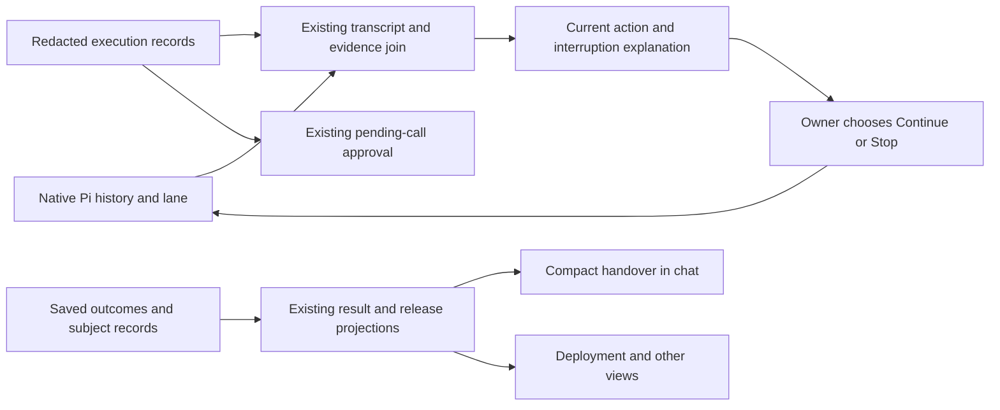

# 03. Clear progress and results

## TL;DR for Lyubomir

- Make the current action, useful discoveries, approval consequences and verified result understandable without reading the terminal.
- Ship the smallest slice first: improve the existing work line with the recorded action and target, and have Pi surface useful findings as it discovers them.
- Then explain interrupted work before Continue/Stop and make handover answer four questions: what changed, what was checked, what runs now, and what remains unknown.
- Reuse Pi history, executions and saved records. Coordinate evidence meanings with plans 04/05; neither feature blocks this work.
- Prove comprehension and refresh behavior, then exercise real Pi and useful application behavior within the existing beta walkthrough.

## Implementation plan

### Verified starting point and delivery boundary

Inspected checkout `abf8b5c4d05476e935cc4ef647c026483ad4f061`, product baseline `261cd33ffc1123e1f953b29fe1dcddae0489de44`, and main snapshot `cc7e9179ba053553163d2ee0a025ae4cd48ec2c7` through read-only `git show`/`git diff`. Relevant code is unchanged. Main updates shared-information browser assertions; use those during implementation. This source review establishes no rendered or live-operation result.

[Research opportunity 3](../../research/2026-09-29-product-opportunities.md#3-reduce-uncertainty-early-and-explain-consequential-changes) is a supported UX hypothesis. Several foundations already exist:

- [runActivity](../../../src/components/hallvi/run-activity.ts) distinguishes approval waits, commands and their location, quiet output, model waits and reply writing. [PiActivity](../../../src/components/hallvi/pi-activity.tsx) preserves intermediate messages and call order.
- [OperatorConsole](../../../src/components/hallvi/operator-console.tsx) shows intent, target, exact input, output and Approve/Decline. [pi.ts](../../../src/server/pi.ts) already requests concise progress, consequential outcomes and verification.
- [Conversation projection](../../../src/server/pi-conversation.ts) joins Pi tool-call IDs to execution evidence and saved-information references. Native [Continue/Stop](../../../src/server/pi-owner.ts) already handles interruption and queues.
- [Saved records](../../../src/server/operator-data.ts) carry changes, checks, evidence and timestamps. [Release projection](../../../src/components/hallvi/release-records.ts) already separates the latest attempt from the last verified release.

One concrete ambiguity: [stopOutcome](../../../src/components/hallvi/chat-pane.tsx) counts `interrupted` executions as commands that ran, while [settleRunningExecutions](../../../src/server/operator-execution.ts) assigns that status to both pending approvals and running calls. That status cannot establish execution.

The [Roadmap](../../../ROADMAP.md#public-self-service-beta-preparation) requires a non-owner to install the exact candidate, connect accounts, deploy, use the application and return after restart, including authority comprehension. Earlier owner acceptance is dated evidence. These are beta improvements; broader care and recovery remain later work.

### Recommended experience and data flow

**Current work and early findings.** Keep the single live line and [design language](../../../src/components/hallvi/DESIGN.md). Extend `runActivity` with `intentOf(input)` and `whereItRan`, linked to the matching execution; retain neutral fallbacks. “Restarting the web process on server X” states intention, not completion. Keep waiting/input cards authoritative, elapsed time descriptive, and percentages absent.

Tighten runtime guidance: report evidenced, new findings useful to the owner's next decision before lengthy work. Example: “The Compose file includes PostgreSQL; the external API key is still needed.” Use intermediate Pi messages, which survive reload. Save only lasting discoveries through `save_information`; no progress records or reporting timer. Repository requirements remain distinct from observed runtime.

**Approval consequences.** Keep one decision on the pending execution. Above its exact redacted command/arguments, show intent, target and material consequence: downtime, data change, exposure or cost when applicable. Use `request_approval.action`; for execution approvals, add an optional bounded `consequence` string to tool-input metadata in `pi.ts`. This is Pi's expectation, not a guarantee. Retain it in redacted execution input, strip it before forwarding workspace arguments, and exclude it from [command extraction](../../../src/components/hallvi/execution-text.ts). Missing metadata means unspecified, never “safe.” Do not classify shell text. Preserve **Always ask / Hallvi decides / Bypass**, without duplicate approval.

**Interruption and Stop.** Enrich the existing recovery block in `chat-pane.tsx` with the last confirmed result, the particular unsettled call/target, and queued follow-ups. Scope evidence by conversation, reply and tool-call identity; never borrow the newest execution from another chat. Say “Build command completed; restart outcome unconfirmed” unless a saved observation supports the stronger claim that an image was built. Treat `interrupted` conservatively, including after Stop. Worker-unavailable or missing history means evidence unavailable, not “nothing ran.”

Continue resumes original work and queued messages, not just an inspection. Native resume supplies an unknown-outcome result instead of replaying the call. Reinforce guidance to investigate before further changes. Stop drops waiting messages; it neither undoes changes nor proves a remote process stopped. Replace “Nothing has run since” with Hallvi initiating no resumed work. Expired approvals stay historical; no replay or reconciliation subsystem.

**Compact handover.** Give operational replies four concise answers, supported by the existing result card:

| Question | Existing source and honest limit |
| --- | --- |
| What changed? | Deployment `changes`, outcome body and linked executions; a command intention is not an observed effect. |
| What was checked? | Original checks and evidence with observation time; keep passed, failed and informational checks distinct. |
| What runs now? | Recorded revision, services/images and target, qualified by later attempts; retain “last verified” when current runtime is unconfirmed. |
| What remains unknown? | Informational checks, incomplete evidence and recorded next step; an empty list does not prove everything was checked. |

Refine [InformationContent](../../../src/components/hallvi/information-content.tsx) and the final-answer guidance, rather than adding a second handover record. Its deployment details currently print `content.image`; use the existing [releasedServices](../../../src/server/record-projection.ts) adapter for multi-service records. Keep historical results dated and link to current Deployment; later work must not rewrite what a past reply established. Application business-logic defects become evidence and a coding-agent handoff, preserving [Product's operating boundary](../../../PRODUCT.md#operating-boundary).

Use existing sources without a progress store, receipt channel, additional worker or model call on refresh.

### Reviewable increments

1. **Current action and useful findings:** change `run-activity.ts`, its caller in `chat-pane.tsx`, and targeted `pi.ts` guidance. Review one quiet command and one missing-input journey. This is the smallest release.
2. **Consequences and interruption:** update `operator-console.tsx`, tool metadata/extraction and the existing recovery summary. Keep native permission and lifecycle endpoints unchanged. Review approved, declined and interrupted outcomes.
3. **Handover:** refine the existing result component and prompt; reuse release/service readers. Review failure followed by success, missing evidence and refresh. Update owning design/presentation documents during implementation, not this planning turn.

### Dependencies and overlapping proposals

| Proposal | Coordination and dependency |
| --- | --- |
| 04 return brief | Shares `chat-pane.tsx`, `operator-shell.tsx`, release/record readers and evidence links. This plan owns the current reply; 04 owns changes since a visit. Agree vocabulary and edit ownership before touching shared files; shipping 04 is not a blocker. |
| 05 coding-agent handoff | Shares `pi.ts`, record/evidence selection and result rendering. Reuse identities and uncertainty meanings; 05 owns the copyable investigation packet. No new transport or general code editing here. Not a blocker. |
| 01 fast history | May change snapshots and execution loading. Preserve stable IDs and required summary fields without another poll or complete-log download. Coordinate overlapping code; no performance redesign prerequisite. |
| 02 Open; 11 CLI adoption | Consume existing access/result evidence. Reconnect and CLI usability are useful follow-ups, not blockers; this plan does not claim that a saved URL is reachable. |

Across 03/04/05, tie “confirmed,” “current,” “unresolved” and “unknown” to the specific operation, revision and evidence. Later success resolves an earlier problem only when its checks address that same problem; unrelated success cannot clear it.

### Acceptance, evidence and cleanup

Follow [verify-hallvi](../../../.agents/skills/verify-hallvi/SKILL.md) and the [verification guide](../../verification.md). Future checks, not completed evidence:

- Extend existing `run-activity`, `chat-recovery` and execution-text tests for specific action/target, another reply's excluded evidence, and ambiguous interrupted execution. Reuse `operator-execution`/`pi-owner` integration coverage for all three modes, decline, queue order and no replay; add only the missing assertion for changed behavior.
- Exercise existing browser fixtures for progress, ordered Pi text and typed records. Refresh while working, awaiting approval/input, interrupted and completed; inspect desktop, narrow width and keyboard use. Confirm one explanation, reachable evidence links and consistent chat/Deployment claims.
- Extend the isolated worker-restart journey with a task-owned SSH fixture: an observable marker written before connection loss, then a held command. Check the marker and execution IDs before/after Continue and Stop; also interrupt an approval before execution. Use disposable state, never fault-inject a retained application. This proves lifecycle/side effects, not Pi's judgment.
- For prompt quality, use real Pi with an exclusively attached suitable application or authorized disposable deployment. Follow `apps → exec → wait → inspect`, retain matching request/operation/execution IDs, and independently verify the named revision and useful behavior. Ask an unfamiliar owner to explain current work, the decision, checked outcome and uncertainty without opening raw logs. Record time to first correct useful finding separately from task duration; improvement remains unmeasured until compared.

Use Node 22 and locked dependencies; run focused checks, types and formatting. Check older records without optional metadata on a snapshot. UI/prompt rollback requires no migration and must never replay commands. Detach only the attached application; stop task-owned processes and remove exact fixtures after preserving redacted evidence. This plan created no runtime resources.

### Unresolved decisions

One: is a separate consequence sentence worth the extra tool metadata? **Default: yes, optional and bounded**, because intent alone rarely explains downtime or cost. If the first browser review shows existing action text is sufficient, omit the extra field. No other unresolved decisions block the draft.
