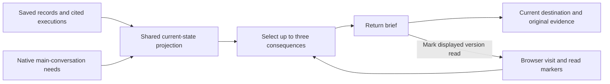

# 04 — A useful return brief

Status: proposed plan, 29 September 2026. No product changes or runtime checks performed.

## TL;DR for Lyubomir

- Returning to an application shows at most three things that matter: a consequential change, an unresolved problem, or a decision waiting for you.
- Start with an on-screen brief built deterministically from existing records. No model report, notification service, or background checks.
- Collapse matching failure/recovery observations into their latest consequence, with both records available. Reading a brief never resolves a problem or approves work.
- Visit/read state stays in this browser and does not sync across browsers; share evidence/current-state meanings with plan 03.
- Test whether an unfamiliar owner can identify the last verified release, uncertainty, and outstanding action within 30 seconds. This target is a hypothesis; the external-user beta walkthrough remains first.

## Implementation plan

### Verified starting point and gap

Inspected checkout `abf8b5c4d05476e935cc4ef647c026483ad4f061`, whose product source matches baseline `261cd33ffc1123e1f953b29fe1dcddae0489de44`, and relevant files at main snapshot `cc7e9179ba053553163d2ee0a025ae4cd48ec2c7` through `git show`. The source paths below are unchanged between those source revisions; main's controller-label changes are outside this proposal. These are source observations, not deployment evidence.

Existing foundations already do much of the work:

- [Record projection](../../../src/server/record-projection.ts) assembles observations by subject/key and separates presence, outcome, and freshness. A decisive verified subject record can replace an older failure; an informational record cannot.
- [History](../../../src/components/hallvi/history-records.ts) suppresses routine successes and keeps consequential outcomes and failures. General `resolves` pairing is absent; `carriedOnAfter` means work continued, not recovery. Its ten-minute command grouping is proximity, not causal evidence.
- [Release projection](../../../src/components/hallvi/release-records.ts) distinguishes the latest attempt from the last verified release and provides exact cited execution lookup through `workFor`. [Overview](../../../src/components/hallvi/overview-page.tsx) has deployment return guidance; [its projection](../../../src/components/hallvi/overview-records.ts) already supplies needs and recent activity.
- [Request inspection](../../../src/server/requests.ts) reads approval, input, and interruption state. [The shell](../../../src/components/hallvi/operator-shell.tsx) already refreshes records and streams conversation updates. Neither the [schema](../../../src/server/db-schema.ts) nor inspected browser persistence tracks a return brief or last visit.

The gap is selection since the owner last looked. [Research opportunity 4](../../research/2026-09-29-product-opportunities.md#4-give-returning-owners-a-short-account-of-what-matters) supports testing the benefit; demand and comprehension improvement remain hypotheses.

### Smallest useful design

Render one compact region at application entry in `operator-shell.tsx`, including conversation returns; do not duplicate it in Overview. Follow the [presentation language](../../../src/components/hallvi/DESIGN.md): dated claims, evidence disclosures, keyboard-accessible actions, no arrival animation or mandatory acknowledgement.

Select up to three consequences: current decisions/interruption, unresolved failures or consequential warnings, then unread release/access/recovery changes. Break ties by recorded time and ID; deduplicate subjects/native requests. Repeated passes, rewritten wording, and relative timestamps do not earn news. A recommendation with `nextStep` is an offer, not a pending decision. Missing backups on a tiny app do not become warnings.

Each item carries a sentence, recorded time, source IDs, and destination/main-conversation action. Use exact evidence links, never History's proximity window. Link overflow counts to History or current decisions; keep omitted changes unread. Do not paginate into another feed.

With no qualifying items, show “No new recorded changes” beside History, never a health claim. First visit baselines old successes while showing current needs. Missing records remain unassessed; unavailable reads say current work could not be checked.

### Current consequence, acknowledgement, and evidence

Reuse plan 03's vocabulary: **last verified runtime**, **latest attempt**, **unknown remote outcome**, and **recorded observation**. A completed Pi answer or successful command proves neither a serving release nor useful application behavior. Show the last verification time; a later uncertain attempt must leave the current runtime unconfirmed.

Collapse only matching evidence. For the same application, subject identity, and check key, a decisive recovery can yield: “The web check passed at 14:10; it failed at 14:02.” Disclose both records. Earlier failed keys must be superseded and the shared current-state reading must agree; HTTP success cannot clear a database failure or still-current failed judgement. Call a release retry recovered only when repository, server, revision, and supporting checks match. Otherwise show the latest verified release without inventing a repair relationship. Keep separate attempt records. Missing identity leaves recovery unconfirmed; retirement withdraws evidence, never proves recovery.

**Acknowledged** means this browser marked this displayed version read. **Resolved** means current operational evidence establishes that the problem no longer holds, or the original decision/input lifecycle has actually settled. Acknowledgement removes unread emphasis from an unresolved need but never hides its action, updates its record, approves a command, or grants authority. Following an old item opens the current conversation/destination and rechecks state; the brief contains no executable approval control.

Keep browser-local state by controller origin/application ID: last foreground visit plus per-subject observed/acknowledged semantic fingerprints. Store IDs/hashes, not text, logs, or secrets; exclude timestamp and prose-only changes. Update observed versions from complete data; acknowledge only displayed versions. Unshown/concurrently changed versions remain unread. Refresh/background tabs never acknowledge. Prune obsolete entries and tolerate unavailable storage. No database migration or second knowledge store is needed.

### Reviewable increments

1. **Share inputs with 03.** Extract reusable attention reading from `requests.ts`: existing inputs, live main-conversation state, and [awaitingDecision](../../../src/server/operator-execution.ts). Carry request identities and unavailable/interrupted distinctions through [operator view](../../../src/server/operator-view.ts), [snapshots](../../../src/server/pi-conversation.ts), and [types](../../../src/server/types.ts). Side-chat state cannot substitute for main state. Reuse loaded records/refresh paths; add no parallel operation/result schema or repeated CLI inspection reads.
2. **Project consequences.** Add a pure `src/components/hallvi/return-brief-records.ts` selector over those inputs and existing record/release projections. Define semantic fingerprints, bounded selection, and conservative recovery grouping. Use existing `SavedInformation.evidence`; first release adds no general issue or event table and no Pi prompt requirement.
3. **Render and retain read state.** Add `return-brief.tsx` and `return-brief-state.ts`, integrate once in the shell, and use existing destination navigation and draft-preserving conversation actions. Update the owning presentation/design wording during implementation. Preserve **Always ask / Hallvi decides / Bypass**; opening or reading the brief starts no operational work. Application business-logic defects still go to the owner's coding agent.
4. **Verify the journey.** Add focused fixtures and one browser journey, then observe an unfamiliar owner. Preserve the [beta sequence](../../../ROADMAP.md#public-self-service-beta-preparation): installable exact candidate, external-user installation/accounts/deployment/use/restart/return, and clear authority. This feature does not complete that gate.

### Dependencies and overlapping files

| Proposal | Coordination and dependency |
| --- | --- |
| 03 — work and results | Shared evidence/unknown-state semantics are a real integration prerequisite; all of 03 is not a blocker. Coordinate `requests.ts`, `types.ts`, `operator-view.ts`, `pi-conversation.ts`, release projection, and shell changes under one owner. |
| 01 — fast history | Overlaps snapshot readers and shell refreshes. Useful follow-up, not a feature blocker; reuse its read path and add no independent poller or transcript scan. |
| 02 — Open/reconnect | Optional action improvement. Reuse its established action if available; 04 must not introduce reconnection authority. Overlap: shell and Overview. |
| 05 — coding-agent handoff | Share evidence references and uncertainty wording, not the handoff UI. No blocking dependency. |
| 06 / 07 — care / recovery | Future sources of meaningful recorded outcomes. Neither is required; 04 adds no scheduler, notification delivery, restore procedure, or monitoring promise. |

### Acceptance, evidence limits, and rollback

Follow [verify-hallvi](../../../.agents/skills/verify-hallvi/SKILL.md) and the [testing bar](../../../tests/README.md). Implementation uses Node 22 and `npm ci` in an isolated branch. Start with credential-free [scenario records](../../../tests/fixtures/scenario-records.ts); no live Pi/provider run is needed to prove selection or browser persistence.

- Focused projection checks: matched failure/recovery becomes one item; unrelated success and partial recovery do not clear failures; unknown later execution cannot claim the old release is current; routine passes stay quiet; three-item capping preserves unseen changes. Reuse existing freshness tests rather than duplicating their matrix.
- One browser journey: return, inspect evidence, mark read, refresh, reopen, and settle a pending input through its real fixture UI. Unresolved needs remain after acknowledgement; a later version reappears unread. Cover storage unavailable, main state while viewing a side chat, and worker restart with no stale executable approval. Check desktop/mobile, keyboard focus, and no extra model calls or observation requests.
- Usability experiment: after a simulated absence with failed-then-successful work, ask an unfamiliar owner to name the last verified revision, limits of current knowledge, and next decision within 30 seconds. Record errors and time; synthetic checks do not establish user benefit or real deployment health. Any later real trial uses an exclusively attached retained application, read-only evidence, and the existing verification/cleanup workflow.

Rollback removes the brief integration; existing records, History, and conversations remain authoritative. The versioned browser key can be ignored or cleared without touching product records or credentials. Stop only task-owned previews and remove only their disposable fixtures. Run formatting and proportionate type/browser checks on the implementation; this planning turn performs document/link review only.

### Unresolved decisions

1. **Browser-local or owner-wide read state?** Recommend browser-local for release one: no owner-identity or schema work, with duplicate briefs across devices as the explicit tradeoff.
2. **General causal resolution links now?** Recommend no. Ship only record-supported current-consequence collapse; add an explicit relationship later with 03 only if a real return journey needs stronger causal claims. This leaves some legacy failures unpaired instead of inventing a repair.
