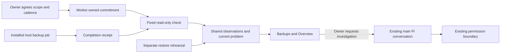

# 06. One quiet, visible care commitment

## TL;DR for Lyubomir

- Know whether one agreed application backup completed, when Hallvi checked, and when it will check again.
- First release: one daily completion check, a quiet result in Backups, one persistent problem when something goes wrong, and **Pause checks**. Investigation goes through the existing main conversation.
- Background collection is outside today's observation contract. Approve a narrowly scoped product-contract change before implementing it; keep all three permission modes intact.
- Prove success, failure, recovery, missed checks and controller downtime on a disposable real setup. A completed copy never implies a tested restore.

## Implementation plan

### Verified starting point and sequencing

Read-only inspection covered research baseline `261cd33ffc1123e1f953b29fe1dcddae0489de44`, coordinator checkout `abf8b5c4d05476e935cc4ef647c026483ad4f061`, and supplied main snapshot `cc7e9179ba053553163d2ee0a025ae4cd48ec2c7`. The checkout adds research/feedback to the baseline. A targeted baseline-to-main diff shows the care-relevant server code, backup components, Product, operator design and Roadmap unchanged. Main's development-document addition identifies the controller host; it does not add care. This is source evidence, not a live installation audit.

The [research recommendation and opportunity 6](../../research/2026-09-29-product-opportunities.md#6-prove-one-quiet-ongoing-care-loop) remain hypotheses about usefulness. Keep the [beta acceptance sequence](../../../ROADMAP.md#public-self-service-beta-preparation) first: exact installable candidate, external-user installation/account connection, useful deployment, restart/return, and understood authority. Quiet care follows that gate; this plan does not replace it.

Already implemented:

- [Backup projections](../../../src/components/hallvi/backups-records.ts) and [Backups](../../../src/components/hallvi/backups-page.tsx) separate plans, actual copies, destination/coverage and restore tests linked to a particular copy. Preserve them.
- The [worker](../../../src/server/pi-worker.ts) runs a [branch watch](../../../src/server/deployment-watch.ts) and [controller protection](../../../src/server/controller-protection.ts). Neither is an application-backup observer. Controller-copy success currently follows an object-store PUT; it is not download/read-back or restoration proof.
- The [legacy scheduled runner](../../../scripts/scheduled-backups/runner.py) records application backup receipts; success requires upload, download and matching length/hash. Nothing in current `src/` installs it. Its `--status` path constructs `State`, creating directories and applying permissions: it is not a purely read-only probe. Do not revive its retired deployment integration or run this command under an observation exemption.

### The first commitment

A care commitment is an owner's persistent instruction to perform one bounded check. Offer it only for an established backup whose data scope and machine-readable completion evidence are known, not during every tiny app's onboarding.

| Visible item | First-release contract |
| --- | --- |
| Scope | One application, connected host, backup-plan identity, included database/files and actual destination. |
| Where | The backup job runs on its Linux host; Hallvi observes from the named controller. |
| Cadence | One daily check at an agreed UTC time, after the backup's completion deadline. Preserve the host job's own schedule/timezone separately. |
| Last result | Last attempted check, last successful observation, latest qualifying copy and its recovery point. |
| Next due | Controller's persisted next check; host's next backup only when actually observed, never guessed from prose or cron. |
| Interruption | One in-app attention item for a failed/missed backup or unresolved observation gap; repeats update the same problem. |
| Pause | **Pause checks** stops observation and pending retries. Explain that the installed backup job continues. |

Example: the agreed backup starts at 02:00 UTC, must finish by 03:00, and Hallvi checks at 03:05. These are configurable example commitments, not measured safe defaults for every application. Start with daily UTC scheduling, not an arbitrary cron engine.

### Resolve authority before adding a timer

[Product's closed observation list](../../../PRODUCT.md#what-the-modes-cover) currently requires page lifetime and no retained collection. A scheduled SSH read with persisted results fails that contract even when harmless. Existing branch watching is not permission to broaden the list.

Recommend an explicit, reviewed amendment: add only **owner-enabled backup-completion observation**, with fixed product-owned reading code, constrained identities, bounded retained evidence, visible cadence and revocation. Update Product's lifetime/persistence clauses for that named observation and the [operator design](../../operator-design.md#always-on-care-and-visible-commitments) together. This is a new consented observation capability, not an undocumented exception for arbitrary scripts.

Consent authorizes observation, not repair. Installing/changing the backup job remains Pi work through [the existing executor](../../../src/server/operator-execution.ts): **Always ask** approves model-composed executions; **Hallvi decides** leaves approval judgment with Pi; **Bypass** executes without prompts within the requested scope. Consent never preapproves future Pi commands. Stop/start of an independently installed host schedule is a separate operational request. Do not create a fourth mode or restore pending approvals after restart.

### Implementation and evidence flow

Use a small proposed `src/server/backup-care.ts`, following [deployment configuration's worker ownership](../../../src/server/deployment-automation.ts). One `care.json` per application holds executable consent, binding revision, cadence/deadline, pause, next due time and pointers to check/problem records. This file is scheduling authority, not another knowledge store. Ordinary `save_information` notes cannot activate care. An owner action through proposed `src/app/api/applications/[applicationId]/backup-care/route.ts` and [worker-link](../../../src/server/worker-link.ts) enables the displayed scope, preserving the existing same-origin boundary. Changing host, plan, destination or observation scope requires renewed agreement.

Add a fixed reader in proposed `src/server/backup-care-reader.ts`. Use managed SSH to read bounded receipt data and fixed timer properties; accept validated identifiers, not commands or executable paths. Never execute the host's backup script merely to inspect it. Support one proven receipt shape initially, reusing the legacy runner's evidence meanings where applicable. A missing compatible receipt is an activation blocker, not grounds to infer success from an active timer, file mtime or exit zero.

Validate application/job/run identity, capture/completion times, included data, destination, transfer verification and expiry. Where the producer's receipt lacks coverage/destination evidence, add it from that run's captured manifest; never borrow today's plan to certify an older copy. A previous success does not satisfy today's deadline. Display “copy completed; transfer checked” only for matching completion evidence. State its age: the receipt proves what happened then, not current object availability. Restore proof remains a separately named copy and test. Treat receipt text as data; persist only bounded, redacted fields.

[Saved information](../../../src/server/saved-information.ts) remains the common evidence/presentation mechanism: keep dated check observations, reuse one current `monitor` record/problem, and create a `backup-copy` record only for a newly established copy. Use existing facts/checks with explicit source/run identity and observed times; do not invent Pi tool-call IDs for deterministic observations. Preserve previous successful-copy facts when collection fails. Check observations carry historical detail; current attention reads only the current problem record, avoiding repeated failure cards.

Hook one asynchronous, non-overlapping check into `pi-worker.ts`, independent of Pi being busy. A 30-second read deadline and one retry after 15 minutes bound collection; then retain the gap and wait for the next daily check or an owner request. Recheck consent/binding before starting and before applying results, so a late result cannot reactivate paused or rebound care.

First-release follow-up is deliberately bounded to deterministic collection and in-app attention. No automatic model turn or repair loop runs, even on failure. **Investigate** carries the record reference into the normal main-conversation composer. Existing native queue/steer, approval and Continue/Stop behavior remains authoritative. Automatic bounded diagnosis is a later experiment, not machinery needed for this release.

### Failure, downtime and presentation

Distinguish **backup failed**, **completion overdue**, **could not check**, **check overdue** and **paused**. An unreachable host establishes an observation gap, not a failed application. Record the first failed read immediately; escalate its unresolved gap after the single retry. A definite failed backup or overdue completion earns attention immediately. A new successful copy closes that problem; successful connectivity alone does not. Recovery updates the same item quietly. No repeated toast, chat message or model call accompanies unchanged results.

Use the existing Backups surface for the commitment and clocks, with only actionable current problems on Overview. Preserve [certainty, timestamps and evidence disclosure](../../../src/components/hallvi/DESIGN.md#the-presentation-protocol); no new dashboard or mandatory setup warning.

When the controller sleeps, the independently installed host job may continue; observation and notification cannot. At restart, preserve the missed interval, perform one catch-up read and schedule the next future check. Never replay every missed slot or auto-resume interrupted Pi work. Host receipts may establish intervening copies retrospectively, but cannot erase the period without observation. Expose overdue status from persisted deadlines even if the worker is unavailable. In-app delivery means the owner sees attention while connected or on return; external/offline delivery is deferred. An existing always-on Ubuntu controller is sufficient for the trial, without creating hosted infrastructure.

### Three reviewable increments

1. **Contract and receipt proof.** Agree the named observation boundary; specify one actual backup's receipt semantics and read path. Add focused parser/no-mutation fixtures. Update owning product/design/presentation wording in the implementation PR.
2. **One durable checker.** Add worker-owned consent/schedule, fixed reader, same-origin endpoint and saved-record updates. Prove retry bounds, restart catch-up, pause races and no model dispatch with disposable fixtures.
3. **Visible commitment and real trial.** Wire [operator-view](../../../src/server/operator-view.ts), [types](../../../src/server/types.ts), [operator-shell](../../../src/components/hallvi/operator-shell.tsx), Backups and Overview to those records. Exercise the controls and the actual host/storage path, then evaluate detection, missed coverage and owner interruptions before expanding.

## Dependencies and overlap

- **Real blockers:** beta sequencing, agreement to the explicit observation-contract amendment, and one backup with trustworthy completion evidence. [07](07-recovery-rehearsal.md) can supply that backup, but its full restore rehearsal is not a blocker for truthfully reporting completion.
- **Useful follow-ups:** [03](03-work-and-results.md) and [04](04-return-brief.md) consume current problems/recovery; coordinate `operator-view.ts`, `types.ts`, `operator-shell.tsx` and Overview. [01](01-fast-history.md) shares saved-record reads and worker notification paths; no performance redesign is required here.
- [07](07-recovery-rehearsal.md) shares Backups, backup projections and receipt semantics; it owns restore proof. [08](08-learned-procedures.md) may retain setup knowledge, which grants no scheduling authority. [09](09-existing-stack-adoption.md) may supply another backup source later; support one source first. [05](05-coding-agent-handoff.md), [10](10-update-rehearsal.md) and [11](11-cli-agent-adoption.md) are not blockers. Application business-logic defects still go to the owner's coding agent.

## Acceptance, evidence limits and rollback

Apply [verify-hallvi](../../../.agents/skills/verify-hallvi/SKILL.md) proportionately:

- **Focused integration:** disposable database/config, fake clock and SSH stand-in. Cover a healthy period, real failure/recovery, missing or stale receipt, malformed/wrong identity, unreachable host, controller restart, pause and unchanged repeats. Assert zero automatic model calls, bounded reads and one current problem. Retain the existing permission tests; verify setup/investigation respects all three modes and no unapproved Always-ask command runs.
- **UI:** extend `tests/fixtures/scenario-records.ts`; inspect Backups and Overview, pause/resume, evidence and return after refresh. A stale receipt must not become a fresh copy, and recovery of copy A must not certify copy B.
- **Operational proof:** after implementation, use Node 22/`npm ci` and a task-owned Linux systemd fixture, synthetic stateful data and authorized object storage. Follow the named controller's `apps → exec → wait → inspect` path for setup/investigation, matching request and execution identities. Independently check the uploaded archive; inject failures only in the disposable setup. Stop its controller across a due interval and verify both host-job continuation and truthful catch-up. Mocks cannot prove SSH, transfer, deployment or restoration.

Record tested revision, detection delay, missed intervals, distinct owner interruptions and model usage across the trial; usefulness remains unmeasured here. Run relevant checks and `npm run format` for implementation, adding `test:operator` only if changing the Python runner. This planning turn performed source/document review only.

Rollback pauses/disables the checker, preserving records, backups and the host job; a restored controller must require re-enabling care before it competes with the original. Stop only task-owned test processes and remove exact disposable resources after retaining redacted evidence. Removing or changing the installed backup schedule requires its own scoped request.

## Unresolved decisions

1. **Accept the named background-observation amendment?** Recommended: yes, limited to this opt-in fixed reader and retained evidence. This provides unattended checking while preserving the three modes for Pi work. Until agreed, keep checks owner-triggered; do not ship this background collector under today's page-bound contract.

No other unresolved product decisions are required for this first slice. Receipt location and daily deadline are application-specific setup facts to verify, not new platform choices.
