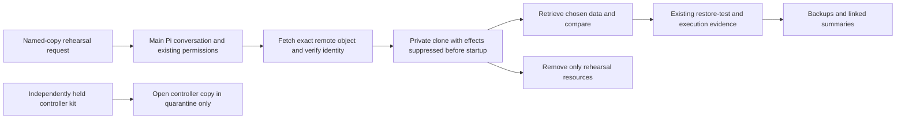

# 07 — Prove application recovery

## TL;DR for Lyubomir

- Prove that one named remote backup can open privately and return a chosen document with matching content.
- First release: one on-demand rehearsal using Pi, existing backup records and the current Backups page; suppress clone email, webhooks and jobs before startup.
- It needs independent storage access, a usable copy and measured spare capacity. Finish the current external-user beta gate first; update rehearsal **10** depends on the application-restore proof.
- Success means retrieved data, exact copy/version evidence, elapsed time and verified cleanup. Separately check that someone can use the existing controller recovery kit without consulting the original controller; replacement activation remains outside scope.

## Implementation plan

### Verified starting point and gap

Inspected research checkout `abf8b5c4d05476e935cc4ef647c026483ad4f061`, whose product source matches research baseline `261cd33ffc1123e1f953b29fe1dcddae0489de44`. Also inspected relevant files with read-only `git show`/`git diff` at main snapshot `cc7e9179ba053553163d2ee0a025ae4cd48ec2c7`: the recovery implementation below is unchanged. These are source observations, not a current deployment check. The [research recommendation and opportunity 7](../../research/2026-09-29-product-opportunities.md#7-make-recovery-a-demonstrated-user-outcome) propose completing a journey, not adding backups from scratch.

Already implemented:

- [Backups](../../../src/components/hallvi/backup-stages.tsx) selects a copy and drafts an isolated or replacement restore request. Selecting it executes nothing. [The shared projection](../../../src/components/hallvi/backups-records.ts) distinguishes plans, copies, destinations, coverage and `restored-copy` identity.
- [Pi's existing contract](../../../src/server/pi.ts) specifies `backup-plan`, `backup-copy` and `restore-test` records, including `covers`, `took` and `restored-copy`. General server execution performs application-specific capture and restore. [Controller file transfer](../../../src/server/backup-store.ts) checks a downloaded file's digest; it is not object storage. The [older scheduled runner](../../../scripts/scheduled-backups/CONTRACT.md) can restore supported archives, but current product code does not install it. Reuse it where already installed and compatible; do not add a new installer merely for this trial.
- [Controller protection](../../../src/server/controller-protection.ts) captures and encrypts records, sessions and credentials, uploads copies, retains 14 and exposes a recovery kit. [The existing decrypt command](../../../scripts/controller-backups/decrypt-copy.mjs) verifies the archive and leaves quarantine markers. It activates nothing.

Historical evidence is bounded: [Paperless's September 13 restore](../../testing/2026-09-13-deployment-capability.md#still-open) used a same-server copy; [September 15's local proof](../../testing/2026-09-15-local-backup-proof.md) verified rows/files and matching copy identities with SSH/provider stand-ins. Neither establishes this current remote-storage-to-usable-application journey.

One concrete projection gap merits correction: `protectionFromRecords` adds a non-failed restore to `verifiedCopies` when `restored-copy` exists, without requiring a passing `restored` check. Consequently an informational record can support a verified verdict. Existing tests commonly build restore records with empty checks. This is a code-path finding, not a reproduced live incident.

Keep the [beta sequence](../../../ROADMAP.md#public-self-service-beta-preparation): exact installable candidate → non-owner install/connect/deploy/use/restart/return → fix observed friction and verify authority comprehension. This requested rehearsal follows that gate; it does not replace it or introduce another beta prerequisite.

### Recommended journey and evidence

Default to an available retained Paperless application and its already tagged document; establish the actual app, host, immutable running images, selected document and named copy before execution. Use its existing compatible backup procedure through real R2/S3 storage. If no suitable remote copy exists, complete one capture/transfer through that procedure first and record the gap honestly. A controller-local archive cannot satisfy the remote-storage criterion.

Before arranging the clone, establish consistency and coverage: database snapshot, document files, configuration, required secrets and revision must belong to the same recoverable point. Identify omissions and dependencies on registries, source, storage account/MFA, encryption keys, application login and external services. Missing secrets go through existing private inputs, never records or reports. Compare the selected document against its value at the copy's recovery point, not a newer live value.

Measure available RAM/disk and live workload; budget archive download, extraction, database/index growth, images and clone runtime. Explain estimated duration, storage/egress and any new compute cost before allocation, including unknowns and a stop bound. Prefer an existing host only with demonstrated headroom and separable resources; otherwise use an authorized temporary host. Same-host success does not demonstrate survival of host loss.

Restore into unique directories, volumes, database/queue instances and Compose names. Before any application process starts, inspect the resolved configuration: no production database, broker, mounted directory, provider token or live integration endpoint. Disable scheduled tasks, inbox polling, outbound email/webhooks and consumers that can repeat production jobs. Use existing application configuration and a clone-only network with outbound access blocked; allow only internal dependencies and private inspection. Pre-fetch images before introducing recovered state. Do not alter a shared host's firewall globally to achieve isolation. If required behavior cannot run under these constraints, report the limitation before booting.

Boot the captured application version, expose it only through existing private access, and verify reachability from the reviewing device. Sign in, find the chosen document through normal application search, download it and compare content/digest plus representative metadata. HTTP 200, container health, archive hashes and row counts alone are insufficient. Record disabled behavior as untested. Never merge recovered rows into production or overwrite the live application's access/topology records with clone identities.

Use `save_information` once per result, with linked execution evidence. Give each copy and restore attempt its own subject ID so an earlier check cannot qualify a later attempt. Keep `destination-kind`, `covers`, capture time, object identity/digest and source/image identity on the copy; the restore names that exact subject in `restored-copy`, carries `took`, its test date, observed `restored` and retrieval checks, recovered coverage and exclusions. Store extra details in existing facts/body/evidence; no new table, archive format or workflow engine. A missing result is unknown, not success. A lost connection requires inspecting partial effects before retrying through native Pi continuity.

**Minimum reusable result for 10:** application ID; backup subject/object identity, digest and recovery point; captured image/configuration identities; exact clone project, volumes, network and private endpoint; verified suppression settings; restore-test ID, check keys and linked execution IDs; selected-data comparison; cleanup outcome. Keep these in the same records, with enough procedure detail to recreate a cleaned-up clone. An explicitly retained clone also needs its owner and expiry. Plan 10 can reuse this evidence and isolation setup, but records target-version checks separately from both baseline restoration and live deployment. Nothing here promotes a clone.

### Three reviewable increments

1. **Make the existing result truthful.** Tighten [the projection](../../../src/components/hallvi/backups-records.ts) so verification requires a passed `restored` check for the same restore subject, with failed checks taking precedence. Preserve old records as history; missing checks mean proof is unrecorded. Update the narrow backup guidance in [pi.ts](../../../src/server/pi.ts) and the existing isolated draft in [backup-stages.tsx](../../../src/components/hallvi/backup-stages.tsx). Show the chosen-data result, revision, duration and limits through existing disclosures. Keep the [design language](../../../src/components/hallvi/DESIGN.md): Backups owns the detail, other views share its projection. No mandatory wizard or routine warning for tiny applications.
2. **Run one complete application rehearsal.** Use the named controller's existing request path, selected copy and isolation procedure above. Preserve redacted evidence and a dated verification report. Fix only failures this journey exposes. The rehearsal proves that copy at that version; it installs no schedule and makes no uptime or recovery-time guarantee.
3. **Check the existing controller kit independently.** Improve the existing kit presentation in [controller-protection.tsx](../../../src/components/hallvi/controller-protection.tsx) and [Connections](../../../src/components/hallvi/connections-screen.tsx) to include the already available prefix, kit creation date and independently accessible recovery instructions. A second reader in a blank environment, without the original controller or its account directories, must locate the chosen controller object, obtain storage access through the independently held account/MFA, identify the saved passphrase and follow the [existing procedure](../../../scripts/controller-backups/README.md) into quarantine. Document how to obtain and prepare the existing decrypt tool before introducing secrets. Record object identity/capture time and successful decryption as the key-to-copy match; dates alone do not establish it. Inspect manifest dependencies and source revision read-only. Update unclear instructions in that owning document. Do not remove quarantine markers, start a worker, renew copied credentials or contact application hosts. The [replacement rehearsal](../../../scripts/controller-backups/REHEARSAL.md) documents an older schema and remains a separate project; “kit saved” and “archive opened” never mean replacement takeover proved.

Throughout, preserve **Always ask / Hallvi decides / Bypass** as [defined in Product](../../../PRODUCT.md#permission-modes). There is no extra approval category or exception for rehearsal work. Scope still bounds commands and spending in Bypass. Pi uses normal runtime guidance, not contributor skills. Application business logic remains outside Hallvi's editing scope; an application defect goes to its owner with evidence.

## Dependencies and overlap

| Proposal | Relationship and shared surface |
| --- | --- |
| **10 — Update rehearsal** | **Hard downstream dependency on increments 1–2:** consume the application-restore evidence and isolation procedure before applying a target version. The separate controller-kit check in increment 3 does **not** block 10. Share `pi.ts`, `backup-stages.tsx`, `backups-records.ts` and fixtures; do not build another clone engine. |
| **6 — Ongoing care** | Useful follow-up, not a blocker. Shares backup facts/projection and `pi.ts`; checking a backup completed does not prove restoration. Periodic rehearsals require a later explicit commitment. |
| **2 / 3 / 4 — Return access, explanations, return brief** | Useful presentation integration, not blockers. Reuse private access now; coordinate changes to `pi.ts`, access result presentation and shared record readers. A clone's link must not replace the live link. |
| **8 / 9 / 11 — Procedures, adoption, agent interface** | Reuse the successful procedure later; adoption only blocks if the chosen app is not represented. Existing CLI is sufficient now. Share `save_information`/`pi.ts` and verification documentation. |
| **1 / 5 — Performance and coding handoff** | No initial dependency. Use the handoff if recovery exposes an application-code defect; performance work must preserve record/evidence identity. |

Actual run blockers are access to an identifiable usable copy and independent keys, compatible images/configuration, authorized capacity and demonstrable clone isolation. No new backup format, scheduler, controller replacement or external notification service is required.

## Acceptance, evidence limits and cleanup

These are future checks, selected using [verify-hallvi](../../../.agents/skills/verify-hallvi/SKILL.md) and its [guide](../../verification.md); none was executed during planning.

- **Focused fixtures:** extend [protection-verdict tests](../../../tests/application/integration/protection-verdict.test.ts) for an informational/no-check restore, failed check and passed check tied to the correct copy. Retain older-copy/newer-copy and incomplete-coverage cases. Exercise the draft and result through existing backup-stage/scenario fixtures, refresh Backups and linked summaries, and inspect desktop/mobile rendering. Kit UI checks use synthetic secrets. Run controller archive tests only if that code changes.
- **Real proof:** Node 22, locked dependencies in an implementation checkout, an exclusively attached compatible retained application, real storage/SSH, independently held access and a chosen test document. Follow `apps → exec → wait → inspect`, recording request/operation/execution IDs; `completed` means Pi answered. Independently verify remote object identity, restored retrieval, blocked clone egress, stopped jobs and unchanged live access/data. Record recovery point and elapsed phases. Inject corruption/missing credentials only into disposable copies, never retained state.
- **Cleanup and rollback:** record exact created resources before boot. On failure, stop the clone and inspect uncertain effects; production is never a rollback target. Remove only rehearsal containers, networks, volumes, directories, tunnels and separately billed resources; verify removal and live behavior. Keep original backups/history and independently held kit. Report leftovers, cost and any retained clone explicitly. Controller inspection ends with quarantine intact; dispose only of its task-owned decrypted copy after retaining redacted evidence. Follow [resource ownership rules](../../development-resources.md).

This proves one application's selected behavior from one copy on the tested infrastructure. It does not prove every record, every provider, concurrent-write consistency beyond the chosen capture method, production cutover, full host loss or controller takeover. Usability and trust improvements remain hypotheses until the owner can correctly explain the result and limits.

## Unresolved decisions

One conditional decision: if the current host lacks safe headroom, **recommend a short-lived separate host under an agreed spending ceiling**, accepting extra cost to avoid competing with the live app. Otherwise use a separately isolated clone on existing capacity and state its shared failure domain. No other product decision blocks this plan; actual app/copy identities and access are execution-time prerequisites.
