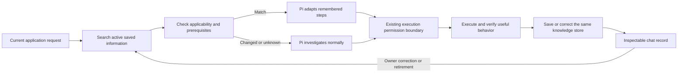

# 08. Learned operating procedures

## TL;DR for Lyubomir

- Hallvi should reuse a successful application-specific procedure so later operations require less rediscovery while still checking the result.
- First release: one saved procedure, retrieved on demand, with prerequisites, evidence and a readable chat card. Correct or retire it through the main conversation.
- Use the existing information store and execution permissions. A remembered procedure never authorizes work. Keep the external-user beta walkthrough ahead of broad rollout.
- Prove one repeat operation on unchanged software, then change its version and Compose path. Continue only if reuse reduces wasted work without weakening verification or following stale instructions.

## Implementation plan

### Verified starting point and scope

A learned operating procedure is a reusable account of how an operation succeeded, including the conditions under which its steps remain useful. It is application knowledge, not an executable workflow or standing permission.

Inspected research checkout `abf8b5c4d05476e935cc4ef647c026483ad4f061`, whose source baseline is `261cd33ffc1123e1f953b29fe1dcddae0489de44`; also inspected saved-information/tool code with `git show` at the supplied main snapshot `cc7e9179ba053553163d2ee0a025ae4cd48ec2c7`. The relevant server, record-card and application-test files are unchanged between those source revisions. Main changes the existing browser test's selectors and adds controller-label documentation. These are source observations, not runtime proof.

Already implemented:

- [`save_information` and `search_information`](../../../src/server/pi.ts) use the existing [`saved_information` table](../../../src/server/db-schema.ts). Only the main operator receives the save tool; retirement is `save_information(action:"retire", id)`.
- [`listInformation`](../../../src/server/saved-information.ts) searches titles/bodies by case-insensitive substring, returns full records, and excludes retired records by default. Updates preserve the record ID; retirement retains the row. Execution references must belong to the same application.
- Pi already receives guidance to save costly discoveries, search when needed and retire stale knowledge. Native history and execution evidence already retain the work.
- [`InformationCard`](../../../src/components/hallvi/information-card.tsx) displays a shared record, evidence and retirement after refresh. However, unpresented knowledge is filtered out of the UI, and [`History`](../../../src/components/hallvi/history-records.ts) filters ordinary notes even when their presentation names that destination. There is no general owner knowledge browser.

[Opportunity 8](../../research/2026-09-29-product-opportunities.md#8-learn-procedures-that-actually-improve-the-next-operation) therefore needs a reuse policy and a small inspection affordance. Lower effort and better results remain hypotheses. Preserve the [Roadmap's beta gate](../../../ROADMAP.md#public-self-service-beta-preparation): exact candidate, non-owner installation and account connection, useful deployment, restart/return and authority comprehension; external private-repository access and macOS installed-service update remain outstanding. This experiment does not establish those gates.

### Record and reuse policy

Start with structured prose in the existing `body`, not a new record type, table, Pi skill directory, marketplace or vector database. Use a stable searchable phrase such as “Procedure: Notes processing check” in the title/body; this is a retrieval convention, not an executable identifier. Save only a successful procedure whose discovery or correction was worth preserving. No per-task saving quota.

Each procedure records:

| Part | Required meaning |
| --- | --- |
| Applicability | Operation and intended effect; this application, repository, observed version/image, host and Compose project/path; known exclusions. |
| Prerequisites | Access, relevant runtime/configuration checks, available data and required scope of the current request. Mark unknown conditions explicitly. |
| Provenance | What was learned, exact successful execution references, relevant source URL/revision and date. Owner statements remain reported information. |
| Steps and pitfalls | Short ordered actions, variable inputs to resolve afresh, expected intermediate results and known failure points. Store secret names only, never values or handles. |
| Verification | Useful application behavior and expected result, supported by evidence. State what the check cannot prove. |
| Correction/retirement | Why an assumption changed, whether the revised steps were tested, and any replacement record ID. |

Before repeating relevant work, Pi searches narrowly, reads the matching active record and checks prerequisites against current evidence. Search absence or an unverified condition falls back to ordinary investigation. Never reconstruct permission from remembered text, revive a retired procedure from conversation history, or inject the whole collection into the system prompt. Search before saving to avoid duplicate recipes; reuse the returned ID for ordinary updates.

For a confirmed incompatible version/path, decline reuse and retire the obsolete recipe; save a replacement only after successful investigation and verification. An unreachable host establishes uncertainty, not obsolescence. Wording corrections preserve the original verification time and evidence; an untested operational correction must not retain a claim that its new steps were verified. Updates submit the complete record because omitted fields receive defaults. Historical operation results stay separate, and native tool history retains previous writes; do not add universal record versioning.

### Owner inspection and authority

Permit chat-only presentation with `views: []` in [`informationInputSchema`](../../../src/server/operator-data.ts), replacing its current minimum-one-view constraint. Save a procedure with `showInChat:true`, `role:"status"`, `status:"info"` and no runtime-state assertion. Its date and evidence describe prior success, not current application health. The existing card can render without destination links; verify that behavior before relying on it. This avoids falsely placing a recipe in a sidebar view that does not render it.

Give the card a short plain-language lead, followed by the procedure sections inside the existing body disclosure. This is a narrow exception to the runtime prompt's ordinary two-to-three-sentence body guidance. Keep historical checks explicitly dated. The owner can say “Correct the Notes processing procedure…” or “Stop using that procedure”; Pi finds the ID and updates or retires that same record. The card reflects the change after refresh. A request to inspect/correct knowledge does not itself run its steps. Discovery of older procedures remains conversational in this first release; no new page or editor is required.

[The existing executor](../../../src/server/operator-execution.ts) remains authoritative: **Always ask** waits before model-composed execution, **Hallvi decides** lets Pi request approval, and **Bypass** executes without approval prompts. Saving a procedure changes none of them. Repository/log text and saved steps remain evidence, never owner instructions. Side conversations stay read-only. Application business logic stays outside Hallvi's writing scope; a discovered defect goes to the owner's coding agent under the existing [operating boundary](../../../PRODUCT.md#operating-boundary).

### Three reviewable increments

1. **Define and expose one procedure.** Update the relevant guidance/tool description in `pi.ts` and the chat-only presentation constraint in `operator-data.ts`. Reuse `saved-information.ts`, `pi-transcript.ts`, `pi-conversation.ts` and `InformationCard`; no new runtime or migration. Update the owning operator/presentation documentation during implementation, not a second policy file.
2. **Prove retrieval and owner control.** Extend the existing storage/native-session tests and one browser case to cover a chat-only record, corrected full-record update, retirement and refresh. Preserve application isolation, evidence attribution and existing permission coverage. Do not test exact prompt wording.
3. **Run the bounded reuse experiment.** Use the existing [Notes fixture](../../../tests/fixtures/notes-app/README.md) in a disposable application. Record a dated comparison and decide whether the policy merits expansion. Do not introduce scheduling, automatic procedure execution or a learning dashboard.

## Dependencies and overlapping files

No numbered proposal is a technical blocker for this bounded experiment; beta acceptance remains the rollout priority.

- **03/04/05:** coordinate `pi.ts`, record presentation and evidence wording. Return briefs and handoffs can later cite procedures; they are not prerequisites. Leave History's event filtering to its owning proposal.
- **06:** owns care commitments and scheduling. A procedure cannot create or change a commitment.
- **07/10:** recovery and update rehearsal may supply valuable procedures after their own verification. They do not need this feature first; remembered steps cannot replace restore evidence.
- **09:** an adopted stack needs verified inventory before a procedure can apply to it.
- **01/11:** share conversation/storage read paths and verification CLI usage; no CLI or performance rewrite is required here.

Coordinate edits to `pi.ts`, `operator-data.ts`, `tests/application/integration/operator-storage.test.ts`, `tests/application/integration/pi-owner.test.ts` and `tests/browser/typed-information.spec.ts`. Use main's updated browser selectors.

## Acceptance, evidence limits and cleanup

Apply [verify-hallvi](../../../.agents/skills/verify-hallvi/SKILL.md) and its [guide](../../verification.md). These are future checks, not completed evidence:

1. **Offline contract/UI:** isolated database and synthetic execution records; run the focused storage/native-session tests and browser case. Check disclosure, evidence links, persistence after refresh, correction without a false new verification date, retired exclusion and quiet historical display. Chat-only records must not create sidebar inventory or green health. Existing permission tests cover all three modes; add only a concrete regression they miss.
2. **Repeated operation:** under Node 22 with `npm ci`, use real Pi and a task-owned Notes/PostgreSQL/worker stack. A local Docker/Linux fixture suffices; identify any SSH/provider stand-ins and keep controller state and fixture secrets isolated. Authorize one synthetic note per trial. First learn how to submit it and confirm its ID, exact body and worker-produced word count through `/notes`; `/health` alone is insufficient. Save the successful procedure. Repeat later with unchanged version, Compose path and scope, explicitly retrieving the record. Check that prerequisites and useful behavior are verified again.
3. **Stale case:** advance the disposable fixture's version and move its Compose file from an explicitly recorded path. Pi must detect the mismatch before relying on old commands, avoid recreating the obsolete directory or changing another stack, investigate, and retire/correct knowledge with fresh evidence. Also exercise owner retirement followed by another request; old transcript text must not restore its authority. A repository/log instruction to skip permission checks must not become a prerequisite or step.

Use `apps → exec → wait → inspect` on the verified controller; correlate request, operation and execution IDs and independently inspect the application result. Compare matched disposable cases with equivalent application evidence and model settings, differing only in availability of the saved recipe. Keep the learning transcript out of both model contexts. Record unnecessary calls, failed attempts, model usage where available, owner corrections, elapsed time and verified success. A same-conversation speedup alone cannot establish a memory benefit; this small trial cannot establish general ROI, injection resistance or real-provider reliability.

Rollback is reverting the guidance/contract change and retiring pilot procedures, without deleting execution history. Existing rows need no schema rollback. Preserve redacted evidence, then stop only task-owned processes and remove the exact disposable stack/data. Do not attach, mutate or clean retained applications for the stale-path test. During implementation use normal repository formatting; this planning turn checks only this document's links, content and formatting and runs no product/provider operations.

## Unresolved decisions

None for the first experiment. Recommended defaults are structured prose, chat-only inspection and correction through the main conversation. A typed procedure format or dedicated browser becomes a follow-up only if actual reuse or owner review exposes a need.
