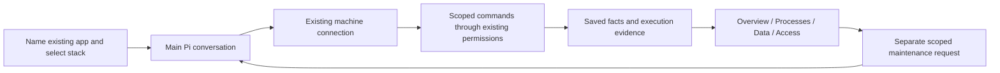

# 09 — Adopt an existing Compose application

## TL;DR for Lyubomir

- Let someone say “Paperless already runs here” and get a useful application view without reconstructing or redeploying it.
- First release: one selected Compose stack on one existing Linux host; discover its services, configuration identities, data and access. Then try one separately requested restart of one suitable web service.
- Server connection already exists. The main change is removing the compulsory GitHub repository and the UI’s assumption that understanding an app requires deploying it.
- Prove discovery left the stack unchanged, saved views survive returning, existing data remains usable, and maintenance touches only the named service. Keep the current beta walkthrough first.

## Implementation plan

### Verified starting point and sequencing

Adoption means recording and operating an existing application in place. For example, Hallvi discovers Paperless’s current Compose project and document storage; it does not create a second Paperless installation.

Inspected research checkout `abf8b5c4d05476e935cc4ef647c026483ad4f061`, whose product source matches baseline `261cd33ffc1123e1f953b29fe1dcddae0489de44`. Read-only comparison with main snapshot `cc7e9179ba053553163d2ee0a025ae4cd48ec2c7`, including direct inspection of its application creation, found the relevant intake/operator/connection/presentation files unchanged. Main’s newer [instance label](../../../src/app/api/host/route.ts) identifies the controller, not the application server. These are source findings, not a live-host trial.

The [research recommendation and opportunity 9](../../research/2026-09-29-product-opportunities.md#9-adopt-an-application-already-running-on-a-server) support this intake experiment; owner demand remains a hypothesis. Preserve the [current beta gate](../../../ROADMAP.md#public-self-service-beta-preparation): an external user installs the exact candidate, connects access, deploys useful software, uses it and returns after restart. Adoption follows that acceptance; it neither replaces it nor adds a new beta prerequisite.

Already implemented:

- [MachineConnect](../../../src/components/hallvi/onboarding/machine-connect.tsx), [connection checks](../../../src/server/connection-checks.ts) and [server access](../../../src/server/server-access.ts) install an application-specific public key with owner action, pin the supplied host fingerprint, verify SSH/administrator access and save the host on the Application. There is no separate host registry to rebuild. The fixed probe checks Docker presence, not the selected Compose project.
- The main Pi conversation owns work; `server_bash`, execution evidence and `save_information` already support investigation and durable facts. [Saved-information subjects](../../../src/server/operator-data.ts) cover processes, volumes, databases, variables, access and observed topology.

The gap is concrete: [creation](../../../src/server/applications.ts) parses a GitHub URL and immediately checks it; [storage](../../../src/server/db-schema.ts) requires three repository fields. The [welcome](../../../src/components/hallvi/onboarding/journey-rail.tsx) says “Read repository / Deploy”; [Overview](../../../src/components/hallvi/overview-page.tsx) and [Deployment](../../../src/components/hallvi/deployment-page.tsx) direct an application without a release toward deployment. Typed deployment content requires a repository URL and hexadecimal revision, so it must not stand in for an imported runtime.

### Recommended experience and data flow

Add “Already running on a server” beside repository intake in [NewApplicationScreen](../../../src/components/hallvi/new-application-screen.tsx). Ask for its name, then use the main conversation to identify the stack by its existing project, directory or known address. An ambiguous selection gets a short candidate list and an owner choice. Model connection alone starts no discovery.

Reuse the existing machine card with adoption wording and the existing-machine path selected; do not offer a new server as the next step. Reuse an already attached host where present. Public-key installation changes SSH authorization and must remain disclosed; the subsequent application discovery is read-only. Keep the existing key ownership model rather than copying another application’s credential paths.

Make the repository identity nullable as a group through [types](../../../src/server/types.ts), [request schema](../../../src/server/schemas.ts), [creation API](../../../src/app/api/applications/route.ts), database and creation logic. Preserve retry identity and reject changed settings under the same request key. Repository-backed creation remains unchanged. Missing repository means “not connected,” not a failed GitHub check: skip reconnect checks, repository snapshot loading, source transfer and deployment-choice/watch setup for these apps. [Pi’s workspace](../../../src/server/pi-workspace.ts) already supports empty scratch space. Guard the existing repository tools; do not invent a GitHub URL. A discovered repository is provenance in saved knowledge initially, not authority to deploy its latest branch.

Give Pi a narrow adoption instruction in [pi.ts](../../../src/server/pi.ts): inspect the selected running stack, preserve its configuration, and save what was established. Its existing repository-first, private-by-default deployment instructions need this explicit distinction: discovering an existing public application must not make it private or replace its proxy. The ordinary **Always ask / Hallvi decides / Bypass** [rules](../../../PRODUCT.md#permission-modes) still govern every model-composed discovery command. Adoption adds no exception to Product’s closed list of automatic observations and starts no ongoing care. General SSH privileges remain general; this is scoped operator behavior, not enforced isolation from neighbouring applications.

Discovery should establish:

- **Identity:** verified host, Compose project, working directory, ordered Compose/override paths, selected services and dependencies, active profiles and environment-file identities where knowable. Reconcile configuration with actual container labels, image IDs/digests and start times; unknown invocation details stay unknown.
- **Data:** named volumes and bind paths, database owner, persistent uploads, shared/external resources and existing backup evidence. A mount establishes location, not tested persistence or recoverability.
- **Configuration and access:** variable names/source locations only; current route, proxy, ports and network scope. Filter metadata on the host before returning output: raw environment, interpolated Compose output, full container inspection and credential-bearing URLs must not enter Pi history. Existing redaction cannot be assumed to know secrets discovered on that host.

Use one application-scoped saved record for the chosen Compose scope and provenance, with stable fact keys and execution references. Reuse process/volume/database/access records and optional observed topology for the views. Service identity should survive container replacement; record the current container ID separately. Shared dependencies are observed references, not implicit maintenance targets. Recheck this scope before later changes; unresolved target identity or shared writers outside the scope stop the proposed maintenance. Missing configuration remains an explicit discovery limit, never a reason to reconstruct the stack.

The smallest useful handoff says what runs where, where its data lives, how the owner reaches it, what was checked and what remains unknown. Adapt the shared return projection and journey rail to say “Existing application inspected.” Do not fabricate a deployment event, uptime guarantee or source commit. Show existing cards/registers with their dates and evidence; Deployment can say “No releases performed by Hallvi” and link to the observed runtime. Preserve nonstandard service names and proxy conventions. If LAN/VPN access does not fit the current tunnel/public typed record, use an accurately labelled generic access fact/link rather than misclassifying or changing it.

### Three reviewable increments

1. **Repository-optional identity and entry.** Update creation, API client, identity/home rendering, [operator view](../../../src/server/operator-view.ts), [workspace source](../../../src/server/pi-workspace-source.ts) and repository-only callers. Include [supported schema migration](../../../scripts/migrations.mjs), schema version and retained-state compatibility. Fix removal’s current repository-name confirmation for applications without repositories; removing Hallvi records must not uninstall the stack.
2. **Read-only discovery and useful return.** Adapt the connection card, Pi guidance, saved scope and Overview/Deployment empty states. Keep existing record projections and sidebar rules. One synthetic populated stack should render without a fake release or a deploy prompt; then prove actual discovery on a disposable Linux fixture.
3. **One bounded maintenance trial.** Separately request a restart of one selected web service whose data is external and whose interruption is acceptable. Resolve its current container against the saved project/service identity immediately before acting. State the brief expected outage; restart that container only, with no pull, recreation, database/worker restart, configuration change or project-wide command. Verify the same image and existing useful read afterward. A restart is not reversible: if it fails, retain evidence and report the failure, without silently widening into rebuild, rollback or data restoration. Application business-logic fixes remain outside Hallvi’s scope.

### Dependencies and overlap

**Real blockers:** the existing beta sequencing gate before rollout; repository-optional identity and truthful observed-runtime presentation before adoption can ship. No other numbered proposal is a technical prerequisite.

Coordinate shared files with **02** (`operator-shell.tsx`, access records; reconnect is a useful follow-up), **03/04** (Overview, return and result projections), and **08** (`pi.ts`, saved knowledge; remembered scope grants no authority). **06** owns later care/scheduling. **07/10** supply future restore and update rehearsal; neither is required for inspection or the selected restart. **05** can improve a discovered-defect handoff. **11** supplies the already-implemented CLI for verification; it does not need application creation added. **01** may improve record-read performance but does not block this intake. Reconcile `pi.ts` and record contracts once across these proposals.

### Acceptance, evidence and cleanup

Follow [verify-hallvi](../../../.agents/skills/verify-hallvi/SKILL.md) and its [guide](../../verification.md), proportionately:

- **Focused checks:** repository-free creation/retry, existing repository intake, no accidental GitHub/watch calls, migration preserving old applications/history, and one browser journey through adoption, record rendering and refresh. Reuse current application-route, storage/upgrade, workspace-source and onboarding tests; do not duplicate the existing permission suite.
- **Operational fixture:** a task-owned Linux SSH/Compose host with a populated web/database stack, bind-mounted uploads, an unrelated second project and a shared proxy. Seed a known document/row and secret sentinels. Record container IDs/start times, image identities, configuration comparisons and neighbour behavior before/after discovery. Require no discovery-caused restart, rewrite, new container, changed ingress or leaked sentinel; retrieve the existing document and row independently. Test one ambiguous selection without choosing a stack for the owner.
- **Maintenance proof:** use the named controller’s `apps → exec → wait → inspect`, matching request, operation and execution identities. Exercise an Always ask wait before execution and a declined call; reuse established mode tests for the other modes. Independently check only the requested container restarted, its image/data remained usable and neighbours stayed up. Browser screenshots and a return after controller restart establish the view, not continuous health.

Use Node 22 and locked dependencies in the future implementation checkout. Keep migration rollback copies; test upgrade on a credential-free snapshot before attaching retained state. No retained application should be restarted merely to test adoption. Remove only task-owned fixtures/tunnels by exact identity; preserve pre-existing stacks, shared proxies, data and host keys. Abandoning adoption requires no stack rollback. Removing a newly installed Hallvi SSH key is a separate exact-key revocation, never broad authorized-keys cleanup.

After technical proof, try two or three consenting owners: measure time to an accurate useful view, manual conversion required, unplanned interruption, first maintenance success and return use. Source inspection, synthetic tests and one fixture cannot establish demand, arbitrary Compose compatibility or production safety. This planning turn ran no Pi, provider, deployment or runtime checks.

### Unresolved decisions

One: which maintenance action best demonstrates value in the owner pilot? Default to the single eligible web-service restart above because its effects are bounded and directly observable. If owners have no useful restart job, choose an existing documented backup command as a separate agreed trial; that needs its own copy/consistency evidence and makes no restore claim. The intake design need not wait for that choice.
