# 10. Rehearse a stateful update

## TL;DR for Lyubomir

- See whether a requested update preserves useful behavior on a restored copy before deciding to change the live application.
- First release: one application, one named backup and one pinned target version, requested in conversation; no rehearsal on every commit.
- **Blocked on 07:** reuse its demonstrated restore, isolation, copy identity and cleanup arrangements. Start with an application update that keeps the database engine’s major version unchanged.
- Success means the selected data still matches and a new task completes on the clone. Show failed or incomplete checks, capacity/cost and code-versus-data rollback limits; passing never means the version is live.

## Implementation plan

### Verified baseline and gap

Inspected research checkout `abf8b5c4d05476e935cc4ef647c026483ad4f061`, whose product source matches research baseline `261cd33ffc1123e1f953b29fe1dcddae0489de44`. Compared the relevant source and owning documents with main snapshot `cc7e9179ba053553163d2ee0a025ae4cd48ec2c7`, including direct `git show` reads of deployment and restore projections. Those implementation paths are unchanged; main adds controller-label documentation and unrelated UI changes. These are source observations, not runtime verification.

The [research recommendation and opportunity 10](../../research/2026-09-29-product-opportunities.md#10-rehearse-a-stateful-update-before-touching-the-live-application) motivate this experiment. Preserve the [beta sequence](../../../ROADMAP.md#current-priority-and-sequencing-boundary): external-user installation, fresh deployment, useful access, refresh/return and owner acceptance come before broader recovery and update features. This proposal adds no beta prerequisite.

Already implemented:

- Pi performs operational work through general tools in one main conversation. [Source transfer](../../../src/server/repository-transfer.ts) resolves an exact commit and verifies archive transfer; [deployment content](../../../src/server/operator-data.ts) distinguishes source revision and service images/digests.
- [Backups](../../../src/components/hallvi/backups-records.ts) distinguishes plans, copies and restore tests, linking a restore through `restored-copy`. [Saved information](../../../src/server/saved-information.ts) persists shared records and checks execution references against the application.
- [Dated Paperless evidence](../../testing/2026-09-13-deployment-capability.md#target-2--paperless-ngx) reports an isolated restore and document checks, **not** a version-update rehearsal or off-server recovery proof. [Local backup evidence](../../testing/2026-09-15-local-backup-proof.md#the-precise-missing-capability) explains that Pi authors capture/restore commands; the historical scheduled runner is not installed by the product.

There is no distinct update-rehearsal record in the inspected contract. Both [release projection](../../../src/components/hallvi/release-records.ts) and [branch automation](../../../src/server/deployment-automation.ts) consume `content.kind: deployment`; misusing it for a clone could mark the target live. Also, `verifiedCopies` currently admits a non-failed restore with an identity without requiring a passed behavior check. **07 must establish a truthful restore-success predicate before 10 relies on it.** The expected reduction in update uncertainty remains a hypothesis; no rehearsal performance or customer-demand measurement was made here.

### Smallest design and operational boundary

Accept a request such as “Rehearse version B against copy C; leave the live application alone.” Reuse [07 recovery rehearsal](07-recovery-rehearsal.md) end to end. Its application-restore capability is the blocker; controller replacement is not. Do not start a second operator, introduce a workflow engine or revive the old backup runner.

**Required handoff from 07:** application ID; copy subject/object/digest/recovery point; captured image/configuration identities; clone project, volumes, network and private endpoint; suppression evidence; restore-test ID plus the passed `restored` and selected-data check keys and execution IDs; cleanup outcome or retained-clone owner/expiry. Recreate a cleaned-up clone and rerun the baseline checks before updating it; an old report alone is insufficient.

1. **Bind the inputs.** Record application/host identity; the backup subject ID, object/version or checksum, recovery point and coverage; 07’s restore-test and clone/resource identities; baseline source/images; exact target commit and per-service immutable images, including unchanged dependencies. For a source build, retain the resulting image identity and material build/configuration differences: a commit alone does not identify built bytes. Refuse mutable tags as the final identity.
2. **Check the window.** Read live deployment and automation state. An active branch watch can deploy independently when Pi becomes idle: explain this and include the existing pause control in the agreed scope, leaving it visibly paused for the owner’s update/resume decision. Rehearsal never grants live-release authority. Explain estimated duration, disk for archive/extraction/images/builds, CPU/memory headroom and any transfer/storage/compute cost. Recheck before starting; insufficient headroom means no clone, not evicting another application.
3. **Restore and contain.** Use 07’s proven target and exact disposable resources. Distinct Compose names alone are insufficient: require separate volumes, database, queue, networks and ports; no production mounts, endpoints or shared writable storage. Prefetch artifacts before starting restored services. Keep outbound access blocked, mail/webhooks and scheduled jobs disabled, production integration credentials absent, and access private. Enable only clone-local workers needed for the criterion. Recheck these properties after applying target configuration. If the selected app cannot operate under this boundary, record the limit instead of weakening it. General privileged shell still relies on Pi’s judgment; this is no universal sandbox guarantee.
4. **Establish before and after.** First boot the restored baseline and verify the selected data. Then apply the requested target and its existing migrations, verify the running identities, repeat the same check and exercise one new task. Example: retrieve a selected document with matching bytes, then upload a synthetic document and observe processing, search and download. Database answers and HTTP 200 alone do not pass. Keep copy age and untested dependencies visible.

Preserve [Always ask / Hallvi decides / Bypass](../../../PRODUCT.md#permission-modes) exactly. Restore, update and cleanup use existing tools and approvals, with no spending exception or separate release gate. A rehearsal request authorizes its stated scope, not production deployment. Application logic or migration-code defects produce evidence for the owner’s coding agent; Pi does not patch them in place.

```mermaid
flowchart LR
    Request[Requested copy and target] --> Pi[Main Pi conversation and existing permissions]
    Pi --> Restore[07 isolated restore and baseline behavior]
    Restore --> Update[Apply pinned target only to clone]
    Update --> Check[Check retained data and new useful work]
    Check --> Record[Shared rehearsal result and limits]
    Record --> Owner[Owner decides live update or resumes automation]
    Owner --> Release[Existing release path with fresh checks]
```

### Records, presentation and reviewable increments

**1. Bind evidence without changing live facts.** Extend [operator-data.ts](../../../src/server/operator-data.ts), [record-contract.ts](../../../src/server/record-contract.ts) and [saved-information.ts](../../../src/server/saved-information.ts) with one `update-rehearsal` content variant in existing saved information. Reuse 07’s copy/restore identity fields and isolation evidence; add baseline/target identities and rollback assessment. Give the event a rehearsal subject in the existing reference vocabulary and [view mapping](../../../src/server/record-projection.ts), so checks name the clone attempt, never production subjects. Validate same-application references and the restore-to-copy relationship. Reuse status, checks, timestamps and execution evidence; add no table. Missing identity, baseline, isolation or behavior evidence cannot produce a verified result. An incompatible update must not overwrite a successful baseline restore.

**2. Teach and exercise the bounded request.** Add concise guidance and the record contract in [pi.ts](../../../src/server/pi.ts), keeping contributor instructions out of Pi sessions. Use native queue, interruption and Continue/Stop behavior. After a lost command response, inspect the named clone before retrying; neither timeout nor a completed answer proves an update result. Coordinate any narrow changes to 07’s operational primitives there rather than duplicating them here.

**3. Present the decision and verify it.** Add one “Update rehearsals” disclosure beneath the live releases in [deployment-page.tsx](../../../src/components/hallvi/deployment-page.tsx), using the existing register/card styling. Extend [information-content.tsx](../../../src/components/hallvi/information-content.tsx) and [history-records.ts](../../../src/components/hallvi/history-records.ts) so the same event survives refresh in chat and History. Show copy time, baseline → target, meaningful checks, limitations, duration and rollback assessment. Link to 07’s restore record in Backups. Keep live release/access, production condition and backup-proof projections separate; no new sidebar destination or automatic Apply button.

### Dependencies and shared files

| Proposal | Relationship and overlap |
| --- | --- |
| **07 recovery rehearsal** | **Real blocker:** demonstrated remote-copy restore, isolation, evidence identity, success predicate and cleanup. Coordinate `pi.ts`, `operator-data.ts`, `record-contract.ts`, `saved-information.ts`, Backups projections and fixtures. Reuse its chosen host arrangement; no second-host lifecycle here. |
| **03 work/results; 05 coding-agent handoff** | Useful follow-ups, not blockers. Share outcome language, `pi.ts`, information presentation and History. A plain evidence handoff suffices initially. |
| **08 learned procedures; 11 CLI adoption** | Useful reuse/distribution. Existing saved knowledge and `apps → exec → wait → inspect` already suffice. |
| **06 quiet care; 09 existing-stack adoption** | Independent. No scheduled rehearsal; adopted stacks can participate later once the same recovery prerequisites hold. |

### Acceptance, rollback and cleanup

Follow [verify-hallvi](../../../.agents/skills/verify-hallvi/SKILL.md) and the [testing bar](../../../tests/README.md). These are **future acceptance checks**, not results of this planning turn:

- One focused contract/projection test covers missing or mismatched identities, an inconclusive attempt and a failed update after a good restore. A passing rehearsal cannot change `deployedRevision`, satisfy `releaseSince`, replace production access or prove a different backup. Reuse existing permission coverage.
- Extend [scenario records](../../../tests/fixtures/scenario-records.ts) for the decision view and one browser journey through disclosure, evidence and refresh. Check that “passed in restored copy” cannot read as “live”; an unfinished check stays unfinished.
- On Node 22 with locked dependencies, use a disposable [Shop fixture](../../../tests/fixtures/shop-app/README.md) with known orders, receipt bytes and an isolated queue. Prepare a compatible target plus a migration/configuration target whose health endpoint passes but order processing fails. Run real Pi through the named-controller CLI path; match request, operation and execution IDs, independently verify retained data and a new order/worker receipt, and confirm the incompatible target is diagnosed without application-code repair. Then repeat the happy path on 07’s selected representative app/copy, with its real storage/host path identified. Local fixtures prove neither provider transport nor universal app compatibility.

Test isolation before restored code starts and after the update, including an outbound canary and production-resource checks. Retain bounded redacted evidence, elapsed time and observed resource cost. A clone’s duration is not a production downtime guarantee.

Report **code rollback** as compatible, incompatible or unproved: old images must work with the migrated data; test that only on disposable data when supported. **Data rollback** restores a named earlier copy and loses later writes; it is a separate recovery operation, never an implication of redeploying old code. Before any later live update, recheck current release/configuration/data drift, obtain a suitable current recovery point and follow ordinary release verification. Rehearsal offers no blanket zero downtime on single-host Compose.

Use 07’s cleanup record and exact resource identities. The request must include disposal of the temporary restored user-data copy; preserve the original backup and evidence. Verify clone containers, volumes, networks and temporary access are gone. Interrupted cleanup remains recorded and private for explicit continuation; restarting Hallvi does not replay it. Reverting this feature’s code cannot undo an application migration or remove an already-created clone.

### Unresolved decisions

None at the product-design level for this draft. Default to 07’s demonstrated application/placement and an application-only update with unchanged database-engine major version. Exact copy, target, resource budget and optional downgrade check are inputs to each requested rehearsal, not a reason to expand the first release.
