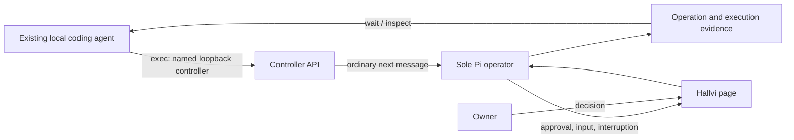

# 11. Use Hallvi from coding agents

## TL;DR for Lyubomir

- Let a builder ask their existing coding agent to deploy through Hallvi and explain what actually works, what failed, and where they must act.
- First release: one concise worked example and one observed local Codex journey through the already merged CLI. Fix only friction the exercise exposes.
- Keep Pi as the sole operator, the explicitly named loopback controller, and decisions in Hallvi. MCP and remote access are not prerequisites.
- Success means correct request/evidence attribution, a handled approval, an honestly reported failed check, and independently verified application behavior. This supplements the external-user beta walkthrough; it does not complete that gate.

## Implementation plan

### Verified starting point and gap

Inspected research checkout `abf8b5c4d05476e935cc4ef647c026483ad4f061`, its source baseline `261cd33ffc1123e1f953b29fe1dcddae0489de44`, and supplied main snapshot `cc7e9179ba053553163d2ee0a025ae4cd48ec2c7` using read-only Git inspection. The CLI, client, request projection, Pi owner and relevant CLI tests are unchanged between the two source snapshots. This plan uses the [recommendation and opportunity 11](../../research/2026-09-29-product-opportunities.md#11-prove-the-existing-clis-value-to-other-agents), checked against implementation.

PR #241 already supplies [the four request commands](../../../scripts/cli-requests.mjs). [The client](../../../scripts/controller-client.mjs) targets an explicit loopback controller and sends ordinary follow-ups to [Pi's sole owner](../../../src/server/pi-owner.ts). [Request projection](../../../src/server/requests.ts) returns the accepting operation's answer and evidence; no new execution path is needed.

The [roadmap](../../../ROADMAP.md#access-for-other-agents) records retained-application checks; they were not rerun here. [CLI browser tests](../../../tests/browser/cli.spec.ts) use a scripted model. Neither establishes adoption. **Hypothesis:** one short example enables useful delegation without reconstructing Hallvi's conversation; comprehension and reduced effort remain unmeasured.

### Smallest release and worked example

Add “From your coding agent” to [the CLI contract](../../cli.md), linked from [the documentation map](../../README.md). Use an existing **local Codex session on the controller machine**, with its ordinary shell capability. Verify that the installed candidate contains PR #241; a development rehearsal does not prove distribution.

The caller receives the controller URL, application, permitted effects and behavior criterion. Before sending, `apps`/`inspect` must identify the intended application, repository, host, main conversation and permission mode, and disclose existing work or attention. Main's [controller label](../../../src/components/hallvi/host-name.tsx) helps distinguish instances. Preserve Pi's sole ownership, current UI and [Always ask / Hallvi decides / Bypass](../../../PRODUCT.md#permission-modes); never change modes to bypass a wait.

The public example should be this small. Replace placeholders with verified values; keep the exact request text and UUID for retries. Use `node scripts/cli.mjs` instead of `hallvi` only in a development checkout.

```sh
export HALLVI_CONTROLLER_URL='http://127.0.0.1:<verified-app-port>'
hallvi apps --json
APP_ID='<selected application UUID>'
hallvi inspect "$APP_ID" --json
REQUEST_KEY='<new UUID retained for this request>'
hallvi exec "$APP_ID" - --request-key "$REQUEST_KEY" --background --json < request.txt
# Read the JSON even on nonzero exit; continue only with a returned handle.
hallvi wait '<returned handle>' --timeout 120 --json
hallvi inspect "$APP_ID" --execution '<executionId from that operation>' --json
```

The bounded request for the real pilot is an authorized redeployment of an existing stateless whoami application, using a selected immutable image digest or exact source commit:

> Deploy `<immutable identity>` for this application on its existing host and preserve its access settings. Do not provision resources, change shared host configuration or edit application code. Verify the running image/commit and GET the existing `/api` address using `X-Hallvi-Verification: <unique marker>`; report the observed application name and echoed marker against `<expected name>`. Report each failed or unverified check and any remaining owner action. If the request needs broader changes, explain them before proceeding.

Fill values from actual configuration; adjust unsupported criteria before running. Include a labelled **negative control**: compare the observed name against a deliberately wrong expectation, without repairing anything. This tests failed-check reporting without breaking the application. It is not a real defect; a separate fixture covers `completed` with an unmet objective.

For a later repair example, reuse [05's disposable Shop journey](05-coding-agent-handoff.md#packet-and-ownership): a new `pear` order produces its own `4.00 EUR` receipt. Preserve its packet and criterion identity. `inspect` exposes summaries, not packet bodies; use copied Markdown or an explicitly requested Pi answer, checking truncation. This does not block whoami.

### Caller behavior to evaluate

[The status contract](../../cli.md#what-a-request-becomes), [evidence limits](../../cli.md#output) and [verification responses](../../verification.md#3-respond-to-the-actual-outcome) remain authoritative. Evaluate whether the caller:

- distinguishes durable acceptance from completion and matches its key to the operation's evidence;
- sends approval/input decisions to Hallvi, following the same handle after approval but recognizing that answering an input card starts new work;
- distinguishes a stopped observer from interrupted Pi work, preserves unknown/partial outcomes and uses the same key only to settle uncertain acceptance;
- recognizes omitted/truncated evidence, retrieves relevant execution detail where available, and never equates `completed` with achieved behavior.

Continue/Stop stays in Hallvi. An expired wait or worker restart must not trigger a new deployment request.

The selected flow uses existing boundaries unchanged:



### Three reviewable increments

1. **Publish the example.** Edit `docs/cli.md` and its documentation-map link; check flags and placeholders against source. Keep [verify-hallvi](../../../.agents/skills/verify-hallvi/SKILL.md) and contributor instructions out of Pi's request. No product code is expected.
2. **Observe one builder.** After the beta walkthrough, run the bounded request with real Pi and a real host, on an owner-selected Always ask application. Record setup effort, clarification requests, manual investigation and the caller's explanation before revealing independent verification. Keep candidate/agent/model versions, request/operation/execution identities, timestamps and redacted results in the PR. Ask whether they would delegate another task; one trial does not establish demand.
3. **Fix demonstrated friction.** Prefer clearer documentation. If returned evidence is insufficient, narrowly change `scripts/cli-requests.mjs`, `scripts/controller-client.mjs` or `src/server/requests.ts`, update the owning contract and repeat the affected check. No new transport, schema, operator or approval mechanism.

## Dependencies and overlapping work

The [beta gate](../../beta-walkthrough.md) remains exact candidate install → connect → deploy → useful behavior → refresh/restart/return. It blocks broad promotion, not example preparation. Pilot prerequisites are an installed candidate containing the CLI, an available coding agent, an existing application and scoped authority.

| Proposal                                                                      | Dependency and overlap                                                                                                                                       |
| ----------------------------------------------------------------------------- | ------------------------------------------------------------------------------------------------------------------------------------------------------------ |
| [05: handoff](05-coding-agent-handoff.md) | Useful follow-up, not a blocker. Reuse its packet structure and criterion meanings; the whoami pilot keeps its own behavior check. Coordinate optional changes to `docs/cli.md`, `src/server/requests.ts` and evidence tests. |
| [03: results](03-work-and-results.md), [04: return brief](04-return-brief.md) | Shared evidence meanings and request/conversation projections; useful follow-ups. No UI rollout dependency.                                                  |
| [01: performance](01-fast-history.md), [02: reconnect](02-open-reconnect.md)  | Own execution/conversation readers and access behavior respectively. Measure pilot friction before making either a blocker.                                  |

## Acceptance, evidence limits and cleanup

Follow [the verification guide](../../verification.md) and [testing bar](../../../tests/README.md). Only source review, document checks and CLI help under Node 22 were performed. Acceptance below is planned; no controller or provider was contacted.

- **Docs:** review links and example arguments without a controller. Format/review the scoped diff; Markdown is ignored by repository Prettier. No broad suite for prose alone.
- **Changed behavior only:** with Node 22 and locked dependencies, select `npm test -- controller-client.test.ts pi-owner.test.ts` for client/projection changes and `npm run test:e2e -- cli.spec.ts` for CLI/UI integration. Reuse existing fixtures for input, interruption, duplicate acceptance, wrong controller and redaction; add only a missing consequential regression. Synthetic checks do not prove live deployment.
- **Caller comprehension:** use redacted fixture outcomes for input/new-operation handling, worker interruption, partial evidence and an unmet objective with `completed`. Do not crash retained applications to obtain these states. The caller must name the right owner action or uncertainty without claiming success.
- **Live result:** independently request `/api`, verify the expected name and fresh echoed marker, and compare runtime identity with the selected commit/digest. Compare the caller's explanation with those observations and the negative control. Approval timing and the CLI origin label also need browser inspection/refresh. Separate measured behavior from Pi's interpretation and from historical proofs.

For a retained rehearsal, follow [exclusive attach and compatibility checks](../../development-environment.md); use disposable state for fault injection. Availability and authorization must be checked at execution time. Keep raw output private and publish only reviewed, redacted excerpts. Detach only what the task attached; stop its recorded preview PIDs and remove only its disposable fixtures. Preserve application data, history and backups. If a real release fails, inspect effects and use an authorized compatible prior release where appropriate; rollback never means undoing migrations or deleting state. Documentation/client changes can be reverted without a data migration.

## Unresolved decisions

None. Local Codex and an existing stateless whoami application are the recommended defaults. Confirm participant availability and authority before execution. MCP, remote authentication and interactive attachment require demonstrated demand before reconsideration.
