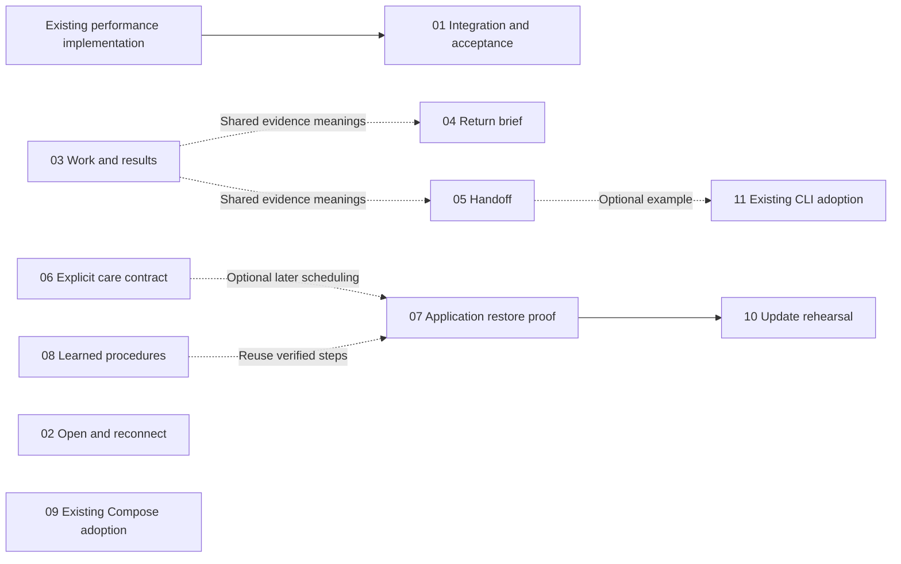

# Hallvi — coordinated implementation plans

**All 11 planning chats have finished.** Each linked plan starts with a TL;DR of at most 120 words, followed by the detailed design, source references, implementation increments, dependencies and acceptance checks. The coordinator reviewed the plans and reconciled their overlaps.

Requested on 29 September 2026, following the [product research](../../research/2026-09-29-product-opportunities.md). The plans inspect main snapshot `cc7e9179`; refresh the relevant source before implementation. They are proposals for review, not completed capabilities or a replacement for the [Roadmap](../../../ROADMAP.md).

**Implementation status, 29 September:** performance integration [PR #252](https://github.com/lustoykov/hallvi/pull/252) is merged into main at `a81b6953`. Its local fixture measurements and verification limits are recorded in the PR; merging does not establish deployment. Plan 03's first increment is being implemented from that baseline with matched before/after evidence for owner review. The other feature plans remain proposals.

## TL;DR for Lyubomir

| Plan | Smallest useful release | What establishes success |
| --- | --- | --- |
| [01 — Fast history](01-fast-history.md) | Performance integration merged in [#252](https://github.com/lustoykov/hallvi/pull/252); see its measured results and limits. | Responsive 1/5/10-chat browser sessions with fresh approvals/output, reconnect and restart. |
| [02 — Open and reconnect](02-open-reconnect.md) | One-click request to reopen the same private route through Pi. A model turn remains initially. | Open the app from the owner's laptop after disconnect/restart; distinguish access trouble from app failure. |
| [03 — Clear progress and results](03-work-and-results.md) | Improve the work line, approval consequences, interruption explanations and compact handover. | An unfamiliar owner understands what is happening and what was actually checked. |
| [04 — Return brief](04-return-brief.md) | Up to three meaningful changes or pending matters, with browser-local read state. | Correct understanding after returning; reading never resolves or approves work. |
| [05 — Coding-agent handoff](05-coding-agent-handoff.md) | Copy a saved chat packet: revision, reproduction, evidence and a behavior criterion. | The coding agent can act; the deployed repair passes the original criterion. |
| [06 — Quiet care](06-quiet-care.md) | One daily backup-completion check, quiet results, one current problem and pause. No automatic repair. | Correct failure/recovery and missed-check reporting, including controller downtime. Requires a background-observation contract. |
| [07 — Prove recovery](07-recovery-rehearsal.md) | Correct restore-verification claims and recover selected data from one named remote copy. Check the controller kit separately. | Exact copy/version, retrieved data, clone isolation and verified cleanup. |
| [08 — Learned procedures](08-learned-procedures.md) | One reusable procedure in existing saved information, with prerequisites and owner correction/retirement. | Less rediscovery; changed versions/paths prevent stale instructions being followed. |
| [09 — Adopt an existing app](09-existing-stack-adoption.md) | Repository-optional intake for one running Compose stack; read-only discovery before separate maintenance. | Accurate saved views, unchanged stack during discovery, intact data and unaffected neighbours. |
| [10 — Update rehearsal](10-update-rehearsal.md) | Apply one pinned target version to an isolated restored copy. | Retained data and new work pass; clone results never become live-release claims. Depends on 07. |
| [11 — Existing CLI adoption](11-cli-agent-adoption.md) | A concise example and one builder using their local coding agent with the merged CLI. | Correct attribution, approval handling, failed-check reporting and independently verified behavior. |

## Visual review before approval

**Owner requirement, 29 September 2026:** show before/after for UI changes before approval, at minimum in the implementation PR. This applies to each increment's visible layout, copy and interaction changes. Planning approval does not approve an unseen UI implementation.

Plans **02–10** include visible changes to access, progress, summaries, cards, controls or intake. Plan **01** primarily changes performance; plan **11** starts with documentation and CLI adoption. Apply the requirement to the actual diff: even a backend change can alter loading, interruption or recovery behavior.

- **Matched before/after:** capture the baseline and implemented branch with the same representative data, viewport and scenario. Identify both revisions and label synthetic fixtures. Put the images side by side in the PR with a short explanation of what the owner will experience differently.
- **Relevant states:** include the changed state and any affected waiting, missing-input, approval, failure or recovery state. Use a short recording for transitions or timing that still images cannot explain. Include a narrow-screen comparison when responsive layout changes.
- **Preview versus implementation:** a proposed design preview may help settle a substantial layout change early; label it as a proposal. The final PR still needs captures from the implemented revision. An image does not establish that Pi or an application operation works; keep the plan's behavioral checks.
- **Review and approval:** show the comparison to the owner and link it from the PR before requesting approval to merge. If capture or upload is blocked, keep that gap explicit and provide an accessible local preview; an unreviewed visual change is not ready for approval.
- **No visible change:** say so. For performance-only work, provide comparable measurements and the tested environment; for CLI or documentation work, show the relevant output/example change. Do not manufacture a visual redesign to satisfy the review format.

Use the existing [visual verification guidance](../../../REVIEW.md#visual-verification-evidence), [PR template](../../../.github/pull_request_template.md) and [verification workflow](../../verification.md). The coordinator carries this requirement into every implementation dispatch and checks that the linked evidence is accessible before presenting a PR for approval.

## Recommended implementation order

1. **Use the merged performance integration as the baseline.** PR #252 completed that integration. Prepare 11's documentation independently and preserve the combined behavior when editing storage, snapshots and the shell.
2. **Improve everyday use in small PRs:** 03's work line, then 02's access journey and 04's return brief. Coordinate shared projections and shell edits.
3. **Add useful retained knowledge:** 05's packet and 08's procedures. Sequence edits to `pi.ts`, record contracts and information cards under one integration owner.
4. **Prove operational capabilities:** 07's application restore before 10's update rehearsal. Resolve 06's observation contract and receipt source separately. Plan 09's broader intake/data-model change follows the core return journey.

These increments do not make all eleven features prerequisites for beta. Keep the external-user install → deploy → use → restart → return checks in the release sequence.

## Shared choices and dependencies

- **Reconnect:** recommend Pi first. It removes request composition while preserving execution/approval ownership; removing model latency needs a later deterministic-mutation contract.
- **Care:** agree a narrowly scoped, owner-enabled background reader before adding it. Stored procedures and ordinary notes never activate scheduling or authorize repair.
- **Read state:** start per browser; cross-device acknowledgement can follow.
- **Evidence:** later success resolves a prior failure only when identity and checks establish the relationship. Current work, changes since a visit and a portable defect packet remain distinct presentations.
- **Recovery:** 10 needs 07's application restore/isolation/evidence, **not** its separate controller-kit readability check. Neither rehearsal needs care scheduling.
- **CLI:** 11 uses the merged interface. The packet in 05 is useful later and does not block its pilot.

Solid arrows are blocking dependencies; dashed arrows are coordination or follow-ups. These chats performed planning only. Acceptance checks describe future work; historical evidence and current source observations are labelled separately.
