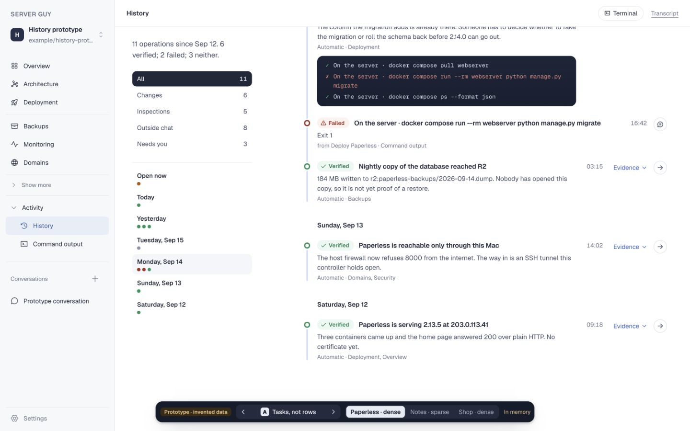
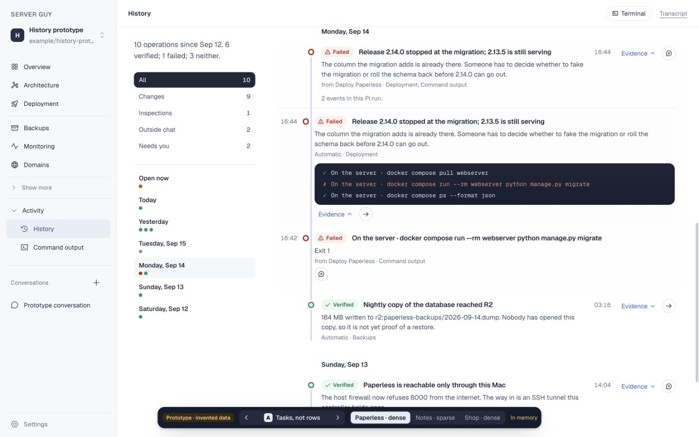
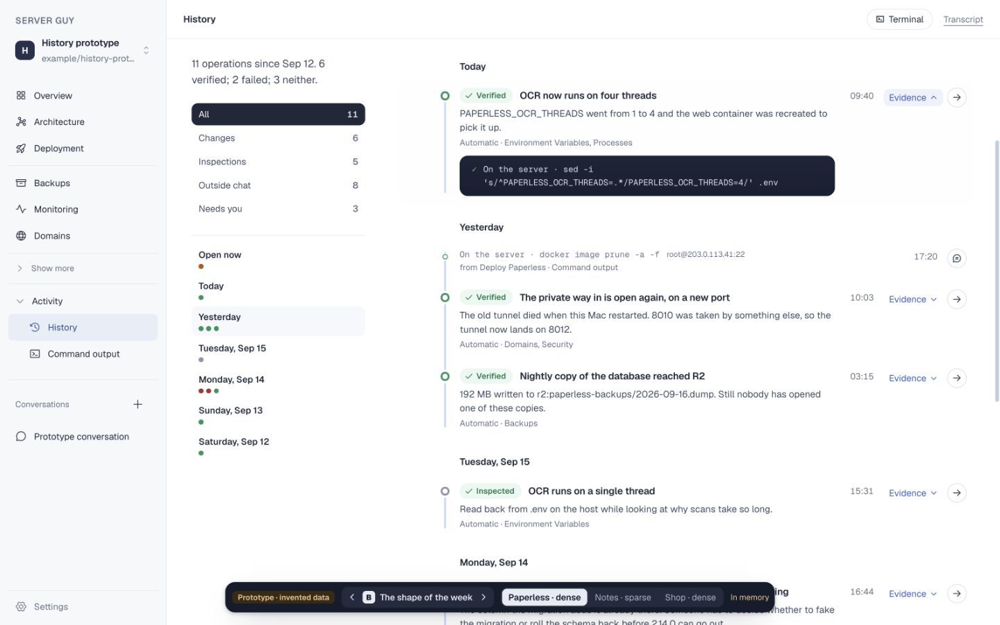
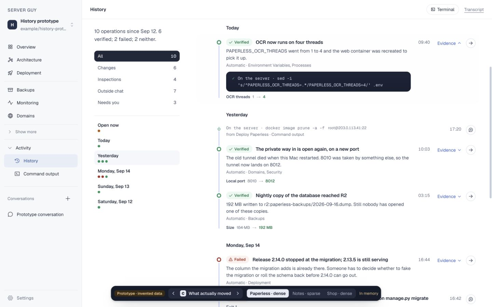

# History light additions

All screenshots use the dense invented Paperless timeline at a 1440 × 900
browser viewport with Evidence open. The shipped comparison is variant A with
its required task-folding toggle off, so it shows the same facts through the
plain chronological line.

## A · Tasks, not rows

| Shipped line | A · folded by Pi run |
| --- | --- |
|  |  |

## B · The shape of the week

| Shipped line | B · outcome strip |
| --- | --- |
|  |  |

## C · What actually moved

| Shipped line | C · before and after |
| --- | --- |
|  |  |
