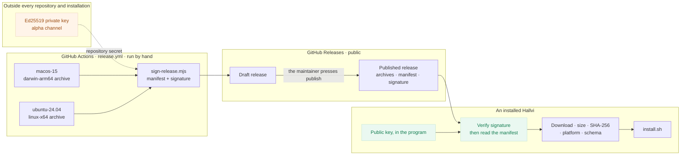

# Publishing a Hallvi release

This is the maintainer's document. To install or update Hallvi, read
[Installing Hallvi](installation.md) instead.

A release is a version, an exact source revision, one prebuilt archive per
supported platform, and one small signed document — the **manifest** — that
names them. An installation looks for releases on the `alpha` channel, reads
that manifest, checks its signature against a public key it ships, and installs
only the bytes the manifest named.

## What trusts what



Two boundaries matter, and they are not the same one.

**Updating** is the one that has to hold without a person. Nothing about a
release is believed before the signature is checked: not the version, not the
platform, not the address to download from. A release source that is taken
over, or an archive replaced in transit, produces a manifest that does not
verify, and the update stops before anything is downloaded.

**Installing for the first time** is a person downloading `install-hallvi.sh`
from github.com over HTTPS and running it. That script carries the release
public key, so it takes the archive's checksum and size from the signed
manifest rather than from a `.sha256` file beside the archive, which whoever
served the archive would also have served.

What it can do with that key depends on the machine. Ubuntu 24.04 ships
OpenSSL 3 and the signature is checked before anything is unpacked. Stock
macOS ships LibreSSL, which cannot load an Ed25519 key, so the check runs
afterwards with the Node.js from the archive — better than nothing, because
the key still comes from the separately downloaded script, and worth stating
plainly, because an archive that lied could lie about this too. The script
says which of the two it did.

The anchor underneath both is GitHub and HTTPS, and the fact that the
repository is public and its source readable.

## Finding out that a release exists

An installed Hallvi looks once an hour, from its worker, and only looks — it
never installs. A development checkout does not look at all; there is nothing
for it to update, and every worktree polling GitHub hourly would be rude.

A look that finds the release it already knows about stops at the listing
rather than downloading and re-verifying the same two assets. A look that
cannot reach the source keeps the answer it had and records why, so the
version line can say when it last tried and what went wrong instead of
quietly showing stale certainty. **Check for updates** forces one regardless.

Installing stays a button. Nothing in the worker starts an update.
After the owner starts one, the interface keeps a visible update notice in the
viewport through download, verification, installation and reconnection. It
shows the recorded phase and result; a completed or failed notice stays until
the owner dismisses it. The version line remains in the sidebar, but is not
the only place progress appears.

## What the owner has to supply

One secret, once.

| What | Where | Notes |
| --- | --- | --- |
| `HALLVI_RELEASE_SIGNING_KEY` | Repository secret, `lustoykov/hallvi` → Settings → Secrets → Actions | The alpha channel's Ed25519 private key, as a PKCS#8 PEM (or that PEM base64-encoded). Its public half is already in [`scripts/release-trust.mjs`](../scripts/release-trust.mjs). |

The private key was generated for this work and is on the owner's MacBook at
`~/.config/hallvi-release/alpha-signing-key.pem`, owner-only. It is in no
repository, no archive and no installation. It was added to the repository as
`HALLVI_RELEASE_SIGNING_KEY` on 20 September 2026, with:

```bash
gh secret set HALLVI_RELEASE_SIGNING_KEY --repo lustoykov/hallvi < ~/.config/hallvi-release/alpha-signing-key.pem
```

The same command replaces it.

Without it the release workflow stops at the signing step and says so. There is
no unsigned fallback: an unsigned release is one no installation would accept,
and publishing it would only look like publishing.

Keep a copy of that file somewhere the Mac's failure does not reach. Losing it
does not endanger installed copies; it means the next release cannot be signed
and the public key in the program has to be replaced, which is itself a release.

## The sequence

**Version.** Raise `version` in `package.json` in a pull request and merge it.
That commit is what a release names. Merging it publishes nothing.

The same pull request writes the release's notes at the top of
[CHANGELOG.md](../CHANGELOG.md), as a `## <version> — <date>` section: a lead
sentence and a bullet per change, in the words an owner would use. They are
what an installation shows under **What's new**, from the `CHANGELOG.md` it
shipped with, and the workflow drafts the release's GitHub notes from the same
section with [`release-notes.mjs`](../scripts/release-notes.mjs). A version
with no notes is refused before anything is built.

```
0.1.0  →  0.1.1-alpha.1  →  0.1.1-alpha.2  …
```

**Build.** Run the **Hallvi release** workflow by hand — Actions → Hallvi
release → Run workflow — giving it the same version. It refuses to go on if
`package.json` on that ref says something else. It builds one archive per
platform on that platform: `macos-15` for Apple silicon, `ubuntu-24.04` for
x64. Each runner proves what it is before it builds, and
[`scripts/package.mjs`](../scripts/package.mjs) downloads the pinned Node.js,
checks its published checksum, installs locked production dependencies and
loads both native modules before it writes the archive. Nothing is
cross-built, and a platform with no runner has no release.

The development dashboard dispatches the checkout's pushed branch and supplies
the exact displayed commit as `expected_revision`. If the branch moves before
dispatch, the workflow refuses before building. Reload to review the new commit;
uncommitted changes are never included. Actions must be enabled in the repository
for either the dashboard or manual dispatch to work. The dashboard reports when
repository Actions are disabled; a maintainer enables them in Settings →
Actions → General before building a draft.

**Verify.** The workflow signs the manifest and then verifies its own
signature with the public key Hallvi ships, so a key that no longer matches is
a failed release rather than an update nobody can install. Run **Verify Hallvi
draft** with the draft version and its exact source revision. It downloads the
draft assets, checks the signature and archive hash, then installs and starts
the service on clean macOS arm64 and Ubuntu 24.04 x64 runners. Both jobs must
pass before publishing. The
[beta walkthrough](beta-walkthrough.md) is the fuller acceptance.

**Publish.** The workflow leaves a **draft** prerelease. GitHub does not serve
a draft to a reader without a token, so nothing discovers it. Pressing publish
is the release.

**Discover.** Installations following `alpha` find it at their next check, or
when the owner presses **Check for updates**. Each checks once an hour at most,
from the last answer in between.

Merging a pull request never reaches any of this.

## The manifest

One file, `hallvi-release.json`, signed byte for byte. Its signature is
`hallvi-release.json.sig`: base64 of the raw Ed25519 signature.

```json
{
  "hallviRelease": 1,
  "channel": "alpha",
  "version": "0.1.1-alpha.1",
  "revision": "<the 40-character commit the archives were built from>",
  "schemaVersion": 18,
  "migratesFrom": [15],
  "releasedAt": "2026-09-20T09:00:00.000Z",
  "notes": "https://github.com/lustoykov/hallvi/releases/tag/v0.1.1-alpha.1",
  "packages": {
    "darwin-arm64": { "file": "…", "url": "https://…", "size": 240339966, "sha256": "…" },
    "linux-x64":    { "file": "…", "url": "https://…", "size": 291400178, "sha256": "…" }
  }
}
```

Every address in it is pinned to that release's tag, so discovery and
installation refer to the same immutable candidate. An installation keeps the
manifest's own bytes while it updates and verifies them again in the program
that does the installing, rather than trusting what the interface read.

`schemaVersion` is the database schema that release needs, and
`migratesFrom` is every schema it can take records from. Both are signed with
the rest of the manifest.

`migratesFrom` has to travel with the release rather than be worked out by the
installation reading it. The migration from one schema to the next is written
in the version that introduces the new schema, so the installation deciding
whether to download it — the older one — cannot have heard of it. Asking that
older program would refuse every forward migration, which is the only
direction there is. `sign-release.mjs` fills the field from
[the list](../scripts/migrations.mjs) in the build being signed, and
`install.sh` checks the claim again from the unpacked archive, against the
real database, before anything is replaced.

A release whose schema differs and whose `migratesFrom` does not name the
installation's is refused before anything is downloaded, naming both schemas.
A release from before this field existed names nothing, and so can take only
records already in its own schema.

There is one list of migrations and both ways of upgrading read it — `npm run
db:upgrade` in a checkout and `install.sh` on an installation, which is what
the updater runs. Each transition names both of its ends as literal numbers,
so raising `schemaVersion` for a new release does not quietly extend an
existing migration to reach it. [The upgrade](installation.md#update)
describes what happens to the records.

## The channel

`alpha` is the only channel. It exists so that "which releases is this
installation willing to see" is a deliberate answer rather than whatever is
newest: a signed release naming a different channel is refused, not ranked.
Releases on it are GitHub prereleases, and discovery accepts prereleases
because that is what the channel is for.

## Testing a release without publishing one

Two settings in an installation's `~/.local/share/hallvi/hallvi.env` point it
at a release source of your own:

| Setting | Effect |
| --- | --- |
| `HALLVI_RELEASE_SOURCE` | The releases index to read, in the shape the GitHub API answers with. Default: `https://api.github.com/repos/lustoykov/hallvi/releases?per_page=20`. |
| `HALLVI_RELEASE_KEY` | The raw Ed25519 public key to trust, base64. It **replaces** Hallvi's key rather than adding to it, and there is no way to turn verification off. |

An installation trusting a key from its own settings says so wherever it offers
an update, in Settings and in `hallvi update`, because that is not the same
promise. [The 20 September proof](testing/2026-09-20-downloads-and-updates.md)
used both against a disposable release source.
