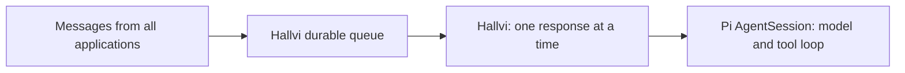
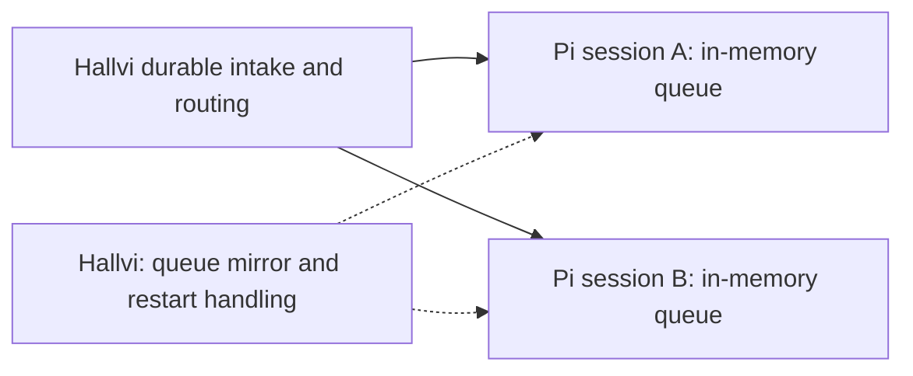
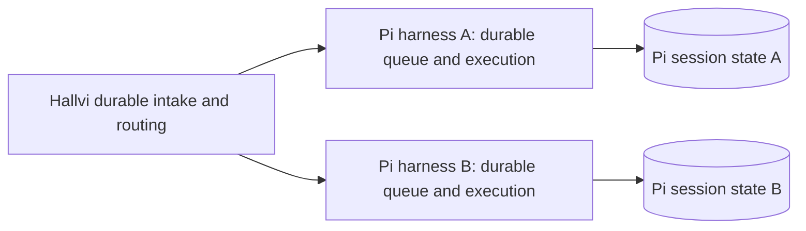
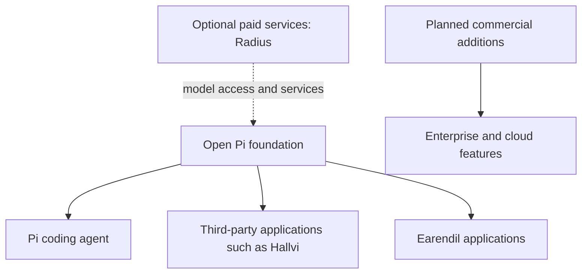

# Hallvi's three runtime designs and Pi's direction

Research date: September 19, 2026. This is explanatory research, not a product
change or deployment acceptance. It follows the [ecosystem audit](2026-09-19-pi-ecosystem-reuse.md).

## The distinction that matters

0.84.4 and 0.85.1 are package versions. `AgentSession` and `AgentHarness` are
different runtime interfaces. The supported coding-agent SDK remains based on
AgentSession in 0.85.1. Choosing AgentHarness is a separate integration decision.
It does not mean moving execution into a Pi-operated cloud service.

All three Hallvi designs already delegate the model/tool loop to Pi. The changes
concern message admission, concurrency, queue identity, cancellation and recovery.

## The three designs

### 1. Current main: Hallvi starts each response

Verified main commit: `4272d404dc051ada3e0d216366fa97abfd9e0ef1`.
`claimNextPiRun()` refuses to claim work while any response is running, and the
worker awaits `executePiRun()` before claiming another. The SDK session is opened
for the response and disposed afterwards; its persisted history remains.

If application A waits for approval, B cannot start a response. This global
serialization is Hallvi's implementation choice, not a Pi limitation.

Evidence: [claim function](https://github.com/lustoykov/hallvi/blob/4272d404dc051ada3e0d216366fa97abfd9e0ef1/src/server/pi-runs.ts#L209),
[worker loop](https://github.com/lustoykov/hallvi/blob/4272d404dc051ada3e0d216366fa97abfd9e0ef1/src/server/pi-worker.ts#L299).

### 2. Fable's 0.84.4 refactor: Pi owns live conversation ordering

The inspected uncommitted branch `claude/pi-operator-architecture-2caaf7` still
uses AgentSession 0.84.4. Its worker routes into multiple live conversations,
subject to per-application and matching-server-address gates. Pi's steering and
follow-up queues choose the next message within a live conversation.

Different applications can progress independently when resource gates permit it.
Hallvi still mirrors Pi's queued messages, matches consumed messages by text,
captures history IDs after persistence, clears queues before abort, and correlates
history with delivery records after restart.

Branch evidence inspected: `src/server/pi-operator.ts`, `pi-worker.ts`,
`pi-sessions.ts`, `pi-conversation.ts`, and `package.json`. This is not a claim
that the branch was merged or deployed.

### 3. Proposed core 0.85.1 integration: Pi also owns durable queued work

Once admitted to Pi, queued input has a native ID that also identifies its eventual
history entry. Pi can cancel by ID, clear its queues through native abort, and
restore queued input and interrupted operation state. Hallvi still needs reliable
handover from its API records to the owning worker. Restoring an operation does
not require automatically executing it; restart policy is still a product choice.

The principal gain over design 2 is durable lifecycle ownership, not additional
application concurrency. Permissions, deployment effects, resource-conflict policy
and evidence/UI records remain Hallvi's.

Sources: [published lane runtime](https://github.com/earendil-works/pi/blob/d981de1229ef899957bbe968bc8dcda02a21f477/packages/agent/src/harness/runtime/lane.ts),
[restoration](https://github.com/earendil-works/pi/blob/d981de1229ef899957bbe968bc8dcda02a21f477/packages/agent/src/harness/runtime/restore.ts).

## Latest proof-of-fit evidence and its limits

Fable reports isolated tests against published 0.85.1 demonstrating queue IDs,
duplicate-text ordering, per-item cancellation, abort, restoration in a new
process, independent sessions and approval hooks. A subsequent experiment reports
that coding-agent's exported ModelRuntime directly satisfies the harness Models
interface, OAuth refresh and compaction share it, and Pi tool definitions work
through an execution-signature adapter. The earlier suggestion that authentication
must be rebuilt was incorrect.

These are Fable's reports, not tests rerun by this research task. No Hallvi harness
integration, real provider authentication or legacy-history import was demonstrated.
The current branch explicitly uses sequential/parallel executionMode and forwards
prepareArguments/constrainedSampling. Their treatment must be established before
claiming the adapter preserves behavior. Tool fields should not silently disappear.

Net simplification is plausible if Pi continues to own tools, authentication and
compaction while the custom queue mirror, delayed ID capture, Stop ordering and
Pi-queue recovery code disappear. A smaller adapter is not proof if it loses
behavior or acquires new maintenance duties elsewhere.

## Development timeline

The earliest identified commit in the current harness-directory history is May 2.
That is evidence of public work, not proof of the first private planning date.

| Date in 2026 | Verified event |
| --- | --- |
| May 2 | [Initial harness foundation](https://github.com/earendil-works/pi/commit/a5b27367d35d2cbcc33baa43b8ff17cf43d8e7ab). |
| June 23 | Armin publicly identifies queues, orchestration and durable sessions as growing priorities in [The Coming Loop](https://lucumr.pocoo.org/2026/6/23/the-coming-loop/). |
| July 27 | [Durable/resumable harness design](https://github.com/earendil-works/pi/commit/e8f9c07153da4814169a91bd93e7d4daa8ca2aad). |
| August 17 | [Replacement of the legacy harness runtime](https://github.com/earendil-works/pi/commit/877c2d0eaaa8a36d27eeeabf54430c863cf96303). |
| August 25–26 | [Durable tools](https://github.com/earendil-works/pi/commit/eb1185d93eec09ceb9369373ac02d31e9ca41785) and [exposed lane operations](https://github.com/earendil-works/pi/commit/89356540fb7318e04e9599a1bc742f5e8f358fe2). |
| September 4–5 | Experimental packaging regression in 0.85.0; 0.85.1 restores the supported-package boundary. |
| September 19 | New server integration remains experimental; format 4 remains pre-stabilization. |

That is approximately four and a half months of evidenced harness work, with the
explicit durable redesign about eight weeks old. It has undergone redesign; this
is not four and a half months on one stable API.

## Why the supported coding agent has not switched

The 0.85.1 changelog explicitly says internal experimental entry points were
inadvertently published in 0.85.0 and caused SDK import failures. They were made
source-only; the supported local SDK and stdio RPC stayed unchanged. The new
server's README labels it experimental, and the harness status documents remaining
contract debt and a storage format that can change before stabilization.

Sources: [0.85.1 changelog](https://github.com/earendil-works/pi/blob/3c75b2747965e8d69ad9e17cbe788b2e33bf4d99/packages/coding-agent/CHANGELOG.md#0851---2026-09-05),
[maintainer explanation of the packaging failure](https://github.com/earendil-works/pi/issues/9132#issuecomment-5551064842),
[experimental server](https://github.com/earendil-works/pi/blob/3c75b2747965e8d69ad9e17cbe788b2e33bf4d99/packages/server/README.md),
[implementation status](https://github.com/earendil-works/pi/blob/3c75b2747965e8d69ad9e17cbe788b2e33bf4d99/packages/agent/docs/harness.md#09-implementation-status).

Inference: maintaining the existing CLI/SDK while stabilizing the new runtime and
integration is the best-supported explanation. No maintainer migration date or
statement that enterprise strategy delays the switch was found.

## Why Pi is pursuing this

Technical purpose is explicit: durable conversation and operation state should
survive interruption; applications need predictable queues, recovery, branching
and observations. This supports software that lives beyond a terminal process.
The [July design goals](https://github.com/earendil-works/pi/blob/e8f9c07153da4814169a91bd93e7d4daa8ca2aad/packages/agent/docs/harness.md#1-goals)
describe those needs; Armin's [June article](https://lucumr.pocoo.org/2026/6/23/the-coming-loop/)
connects durable sessions and queues to the changing role of harnesses while
emphasizing comprehensibility and human control.

Infrastructure for other applications is also explicit. In [Building Pi With Pi](https://lucumr.pocoo.org/2026/5/24/pi-oss/),
Armin describes maintaining common coordination solutions as a platform for
Earendil and others. That is consistent with Hallvi's preference to reuse upstream
behavior, although it does not guarantee a stable integration exists today.

Commercial intent is explicit at company level. [RFC 0015](https://rfc.earendil.com/0015/)
describes a venture-backed, for-profit public benefit corporation, an MIT core,
future Fair Source additions and proprietary/cloud offerings. Users building
products with Pi are explicitly among the people it intends to serve.

[Mario's April 8 announcement](https://mariozechner.at/posts/2026-04-08-ive-sold-out/)
confirms planned enterprise/cloud additions and a desire to fund a sustainable
team while retaining the MIT core. It also says Earendil's own products use Pi
and inform its development. Those statements establish intent, not proof of
commercial success or a promise that every future related product is open source.

Earendil's [Lefos announcement](https://earendil.com/posts/announcing-pi-and-lefos/)
describes a collaborative email agent. [Radius](https://radius.earendil.com/)
is currently labeled early alpha and its [docs](https://radius.earendil.com/docs)
describe credit-based model access, routing and related services. Neither adopting
the open harness nor this research requires buying Radius. No reviewed source
establishes revenue, profitability or that the durable harness was built solely
for enterprise customers.

## Implication for Hallvi

Pi's direction fits the user's intention: reuse common agent mechanics and retain
the deployment product. Proceeding with a bounded integration can establish
whether this particular release achieves that. The acceptance question is whether
Hallvi removes lifecycle responsibilities while preserving the Pi-owned facilities
and product behavior it needs. The upstream transition is still evolving; package
publication alone does not prove stability or net maintenance savings.
