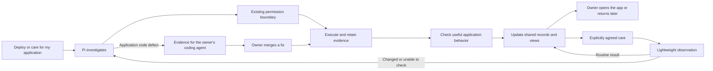

# How Hallvi can become a better operator for software you own

Research date: **29 September 2026**. Final source review: `261cd33ffc1123e1f953b29fe1dcddae0489de44`, package `0.1.1-alpha.7`, Pi packages `0.87.1`. The performance experiment used the earlier baseline `793352378be1b89a7ee7863f9e2b1396cb0a017a`; the measured execution-reader implementation is unchanged between these revisions.

**Status: product research and proposed experiments.** This document does not change [Product](../../PRODUCT.md), the [operator design](../operator-design.md), or the [Roadmap](../../ROADMAP.md). It is contributor research, never instructions for Pi operating a user's application.

## Recommendation

**Make Hallvi exceptionally good at the complete ownership of a small, stateful application: deploy it, keep it usable, understand changes, and recover its data.** Prioritize people building or running useful software who do not want operating it to become another job. Solo builders and small teams are the initial audience already named in Product; stronger demand from particular subgroups still needs validation.

An application operator carries out deployment and maintenance, checks the results, and retains the knowledge needed for later work. For Hallvi, the concrete example is Paperless: get it running, establish where its documents and database live, verify an upload can be processed and retrieved, make an update understandable, and demonstrate that a named backup can recover a selected document. That is a much stronger demonstration of value than a long list of commands the agent can execute.

**Conversational infrastructure operation is already a competitive baseline.** Railway documents an agent that creates resources and investigates projects; Umbrel's new beta MCP integration explicitly supports OpenClaw and Hermes. Hallvi should make its application-specific knowledge, evidence, return experience and recovery useful enough that someone who already owns a general agent still wants Hallvi. This is a positioning recommendation, not proof of an exclusive advantage. [Railway agent](https://docs.railway.com/cli/agent), [Umbrel, updated 27 September 2026](https://umbrel.com/support/advanced/connecting-ai-agents).

My proposed order is:

1. Finish the external-user beta walkthrough already on the roadmap. Fix observed friction and measure useful outcomes.
2. Make returning to an application fast and understandable: responsive history, a working way in, and a concise account of what changed.
3. Prove one quiet ongoing-care loop and one complete application recovery path.
4. Build on that foundation with learned procedures, existing-stack adoption, update rehearsal and adoption of the newly merged interface for other agents.

The strongest long-term product promise to test is: **“Your software runs on your server. Hallvi knows how it works and helps keep it working.”** Avoid promising unattended reliability before the corresponding checks and recovery have been demonstrated.



This diagram explains the proposed experience. It does not introduce a workflow engine, automatically activate care, or add a permission mode.

## What the research establishes

I examined official documentation, source code, design accounts and original user reports across personal agents, self-hosting, managed deployment, incident response, productivity, home automation, private networking, credential recovery and backup tools. Technical capability claims below come from primary sources. Customer comments establish what that person reported, not prevalence or causality.

Hallvi was checked against its product documents and selected current source paths. One isolated performance experiment exercised its actual execution-history reader. **No live Hallvi deployment, competitor account journey, representative user interview study, or comparative reliability benchmark was run.** The UX proposals concern behavior and information needs; they are not a screenshot-based visual audit. Current website documentation is a 29 September snapshot; older issues remain dated evidence of a failure class.

Use three confidence levels when reading the recommendations:

- **Established:** a documented mechanism, current code behavior, or the bounded measurement recorded here.
- **Supported hypothesis:** a plausible Hallvi benefit grounded in that evidence, still needing a product experiment.
- **Exploratory:** an opportunity whose adoption, frequency or willingness to pay is largely unknown.

### Hallvi already has valuable foundations

| Foundation in this checkout or its dated evidence | What the opportunity actually adds |
| --- | --- |
| Main Pi operator, native queue/steer, concurrent application and read-only side conversations | Better comprehension and useful handoff; another agent owner is unnecessary. |
| Searchable saved information shared with application views | Better correction, retrieval and reuse of operational knowledge; avoid a second memory store. |
| Execution evidence, approvals, interrupted outcomes and Continue/Stop | More concise explanations of consequences and uncertainty; avoid approval replay machinery. |
| GitHub source transfer and branch-triggered deployments | Better verification and repeated-release experience; automatic deployment is already present. |
| Application request CLI: `apps`, `exec`, `wait`, `inspect`, merged in PR #241 | Prove useful delegation from coding agents and improve discovery; building the initial CLI is already done. |
| Private access, public domains/direct addresses, access observations | Easier return-to-use and reconnect; reachability checking is already present. |
| Application backup/restore records, controller protection and a recovery kit | Complete and repeat the recovery journey; “add backups” is an inaccurate recommendation. |
| Sidebar that grows with recorded application content; restrained status language | Improve the next useful action; do not propose progressive disclosure as absent. |
| Local diagnostics and a separate Pi worker | Measure and remove redundant read/serialization work before replacing infrastructure. |

Sources: [Roadmap](../../ROADMAP.md), [current design language](../../src/components/hallvi/DESIGN.md), [Pi owner](../../src/server/pi-owner.ts), [conversation projection](../../src/server/pi-conversation.ts), [deployment watch](../../src/server/deployment-watch.ts), [request CLI](../cli.md), [Backups](../../src/components/hallvi/backups-page.tsx), [diagnostics](../../src/server/diagnostics.ts). Dated deployment/restore reports establish their stated trials, not universal current support. Some older architecture prose still describes earlier concurrency and package versions; the inspected source/package manifest takes precedence for those details.

### The useful lessons from other products

| Product or niche | Specific documented pattern | What I would transfer to Hallvi |
| --- | --- | --- |
| **OpenClaw** | Persistent sessions, saved progress, and heartbeat results that can remain silent. | Continuity a user can understand after returning; background work that does not demand constant attention. [Progress](https://docs.openclaw.ai/tools/progress-card), [heartbeat](https://docs.openclaw.ai/gateway/heartbeat). |
| **Hermes Agent, Nous Research** | Reusable skills loaded on demand; bounded memory; scheduled pre-checks that can skip the model. | Reuse a successful application-specific procedure after checking its prerequisites; spend model work on changes and ambiguity. [Skills](https://hermes-agent.nousresearch.com/docs/user-guide/features/skills), [memory](https://hermes-agent.nousresearch.com/docs/user-guide/features/memory), [scheduling](https://hermes-agent.nousresearch.com/docs/user-guide/features/cron). |
| **Meta Muse** | Visible background activity, editable memory, long-running goals, structured decisions and contextual task suggestions. | Expose what Hallvi has agreed to do and help users discover one useful next job. A new Goals tab or avatar is not required to get that benefit. [Design account](https://introducing.muse.ai/). |
| **Coolify / Dokploy** | Ordinary Docker/Compose operations; distinct controller, database and volume protection; explicit backup limitations. | Preserve familiar configuration and explain exactly which application data is recoverable. [Coolify Compose](https://coolify.io/docs/applications/builds/docker-compose), [Dokploy volumes](https://docs.dokploy.com/docs/core/volume-backups). |
| **Railway / Render / Vercel** | Reviewable changes, preview environments, integrated observations and prominent rollback. Preview topology, current data and previous code remain different things. | Make the effects of a change legible; prove a stateful upgrade and its recovery limits. [Railway changes](https://docs.railway.com/deployments/staged-changes), [Render previews](https://render.com/docs/preview-environments), [Vercel rollback](https://vercel.com/docs/instant-rollback). |
| **YunoHost / Umbrel** | App-oriented discovery and maintenance; YunoHost package tests cover more than installation; Umbrel exposes selective recovery. | A few useful, honestly evidenced starting examples and eventual recovery of one lost item. [YunoHost tests](https://doc.yunohost.org/dev/packaging/test/), [Umbrel Rewind](https://umbrel.com/support/backups-and-recovery/using-rewind). |
| **Linear** | Fast local interaction, incremental synchronization, priority attention and unread-only notification digests. | Instant interaction with saved facts, efficient change delivery, and a short return brief. Copy the principle at Hallvi's scale. [Sync design, 18 August 2026](https://linear.app/now/rebuilding-delta-sync-read-path), [notifications](https://linear.app/docs/notifications). |
| **Home Assistant** | Execution traces with step evidence and run-time configuration; actionable notifications with documented stale-action pitfalls. | An explanation of why Pi acted, and notifications that lead to the current state of a problem. [Traces](https://www.home-assistant.io/docs/automation/troubleshooting/), [actions](https://companion.home-assistant.io/docs/notifications/actionable-notifications/). |
| **Tailscale** | A short path from connection to an accessible service, with explicit separation between private and public sharing. | Make opening the application work from the owner's actual device; do not require networking vocabulary. [Service access](https://tailscale.com/docs/how-to/connect-to-devices), [Serve/Funnel design](https://tailscale.com/blog/reintroducing-serve-funnel). |
| **incident.io / Sentry Seer** | Early evidenced findings; explicit investigation and coding-agent handoff stages. | Reduce time to useful information and carry a reproducible problem across the operating/code boundary. [Investigation change, 22 September 2026](https://incident.io/changelog/investigations-are-2x-faster), [Seer API](https://docs.sentry.io/api/seer/start-seer-issue-fix/). |
| **1Password / restic / Temporal** | Independently recoverable access, explicit verification depth, and careful treatment of an external action with no recorded result. | Usable recovery material, bounded claims, and inspection before repeating uncertain work. [Emergency Kit](https://support.1password.com/emergency-kit/), [restic checks](https://restic.readthedocs.io/en/stable/045_working_with_repos.html#checking-integrity-and-consistency), [Temporal activity semantics](https://docs.temporal.io/activity-definition#idempotency). |
| **Cleric / Resolve / Qovery** | Operational memory, attributable investigation APIs, and infrastructure access from agents are already competitive themes. | Verify that retained knowledge improves outcomes and make Hallvi usable from where people build. Their marketing does not establish Hallvi-sized ROI. [Cleric](https://cleric.ai/blog/the-self-improving-ai-sre), [Resolve API](https://docs.resolve.ai/resolve-rest-api), [Qovery deployment](https://www.qovery.com/product/deploy). |

**Muse identity and availability:** this research means Meta's personal agent launched on 8 September 2026, powered by Muse Spark. Today's small-business announcement describes new capabilities inside Muse and states US/Canada availability. It is not proof of availability everywhere. Meta's technical launch post described Confidential VM as forthcoming; I found no basis here to call that generally shipped. Its security design also must not be reduced to “add a second model that checks commands.” [Launch](https://about.fb.com/news/2026/09/introducing-muse-personal-ai-agent/), [29 September update](https://about.fb.com/news/2026/09/introducing-muse-small-business/), [technical account](https://research.meta.ai/blog/security-and-safety-for-ai-agents-our-approach-with-muse).

### What users appear to value

The recurring themes in the selected original reports were useful recurring work, retained context, fewer trips to terminals, integrated evidence and recoverable ownership. These are hypotheses about appeal, not a representative explanation of why entire communities like a product.

- OpenClaw owners describe messaging a persistent agent to pull GitHub code and deploy Docker software, and supplying support investigations with useful context. The same discussion includes people mostly configuring the agent itself. The lesson is to measure work removed after setup. [First-person use cases](https://www.reddit.com/r/openclaw/comments/1v2e5kr/what_do_you_use_openclaw_for_actual_use_case/).
- Hermes owners describe repeated workflows improving through retained procedures. A separate critical account praises background shell work but reports long-session continuity problems. Reusing context is valuable when it remains relevant and recoverable. [Use cases](https://www.reddit.com/r/hermesagent/comments/1sgvxju/im_curious_what_are_your_top_3_use_cases_for/), [mixed long-session report](https://www.reddit.com/r/hermesagent/comments/1ub121l/hermes_is_unusable_for_long_sessions_and/).
- A Muse implementer describes a bounded support role and useful engineer handoff; the public example uses synthetic customer data and does not establish mature outcome metrics. [Original account](https://www.reddit.com/r/MetaAI/comments/1wrj13v/i_stopped_using_muse_like_a_chatbot_and_gave_her/).
- A May 2026 Coolify request asks to import already-running stacks because recreating setup is difficult. An April 2025 Dokploy request asks for project import/export for recovery and moving hosts. Both support testing adoption and portability, not a claim of broad switching demand. [Coolify #10164](https://github.com/coollabsio/coolify/discussions/10164), [Dokploy #1733](https://github.com/Dokploy/dokploy/issues/1733).
- Railway's own feedback thread contains praise for integrated observability, alongside requests for more compact, useful presentation. Parts of the thread are historical; current docs supersede old missing-feature requests. [Original feedback](https://station.railway.com/feedback/observability-dashboard-51871a24), [current documentation](https://docs.railway.com/observability).
- A January 2026 Dokploy report described a success message followed by an unusable restored installation. It is closed, unreplicated here, and not a current bug claim. It is a useful reason to verify the recovered application's behavior. [Dokploy #3413](https://github.com/Dokploy/dokploy/issues/3413).

## Ranked opportunities

The ordering weighs current product fit, concrete evidence and smallest useful scope. Scope is relative, not an engineering estimate. A new owner walkthrough remains the gate before broad feature expansion.

| Order | Opportunity | Relationship to Hallvi | Smallest scope / confidence in benefit |
| --- | --- | --- | --- |
| 1 | Fast history and responsive return visits | Current code improvement | Focused read-path work; high mechanism confidence, real-world impact to measure. |
| 2 | Open/reconnect as a complete action | Extend private access | One previously verified route; high usefulness hypothesis. |
| 3 | Clear current work and compact change/result explanation | Refine existing UI/evidence | One deployment and one interruption; high clarity hypothesis. |
| 4 | A concise return brief | Extend existing records | Up to three meaningful changes; medium demand confidence. |
| 5 | A usable coding-agent handoff | Complete an explicit product boundary | One copyable evidence packet; high fit, demand to observe. |
| 6 | One quiet, visible care commitment | Complete a deferred direction | One check, one failure, one recovery; high long-term fit. |
| 7 | A recovery rehearsal an owner can understand | Complete existing recovery promise | One real app and named copy; high value when data matters. |
| 8 | Learn useful operational procedures | Extend existing knowledge | One repeated operation; medium benefit confidence. |
| 9 | Adopt an already-running Compose stack | New application-intake experience | One stack without redeploying; medium adoption confidence. |
| 10 | Rehearse a stateful update | New use of restore primitives | One requested version change; high technical value, usage uncertain. |
| 11 | Prove the existing CLI's value to other agents | Adoption of newly merged capability | One external coding-agent journey; medium distribution confidence. |

### 1. Make the interface fast by avoiding work that has not changed

**Established finding:** each open chat's SSE route calls `chatSnapshot` every 500 ms. The snapshot asks the worker for a transcript, reads presented information, calls `listExecutions`, joins evidence and is serialized for comparison. `listExecutions` synchronously enumerates, reads, parses and sorts all execution JSON files for the application, including calls from other conversations. Unchanged state is suppressed only after that work. [SSE route](../../src/app/api/applications/[applicationId]/chats/[chatId]/events/route.ts), [snapshot](../../src/server/pi-conversation.ts), [reader](../../src/server/operator-execution.ts).

There is already a native-history cache in `pi-owner.ts`, keyed by the session tip and latest operation result at the final review revision. Therefore, “Hallvi rereads all Pi history from disk every half-second” would overstate the finding. The execution files, projection and serialization remain a concrete place to investigate. [Existing cache](../../src/server/pi-owner.ts).

**Isolated measurement, 29 September 2026:** actual `listExecutions`, Node 22.23.2, Apple M4 Pro, macOS arm64, five warm-up reads and 40 timed samples per fixture. All records were synthetic, in a separate database/config/account directory; no model, remote server or user data was used. Filesystem cache was warm. Measurements are milliseconds, rounded.

| Records | Output characters per record | Read p50 / p95 | Read + serialize execution array p50 / p95 |
| --- | --- | --- | --- |
| 10 | 4,096 | 0.30 / 0.55 | 0.37 / 0.61 |
| 100 | 4,096 | 2.22 / 3.38 | 2.65 / 3.66 |
| 1,000 | 4,096 | 24.44 / 28.11 | 29.37 / 32.34 |
| 1,000 | 20,000 | 36.59 / 39.95 | 76.44 / 82.58 |

This is **not a full snapshot, multi-tab, browser, production or SQLite contention benchmark**. It shows avoidable synchronous cost growing with history. Ten open streams can request 20 snapshots per second; multiplying that by a single-call measurement is only an illustrative workload estimate, not an observed load test.

**Smallest useful change to investigate:** cache completed execution records with correct invalidation across the worker/web process boundary; refresh only changed or running records; share unchanged application data across readers. Retain a fresh authoritative snapshot on reconnect. Then measure whether snapshot revision checks, incremental streaming, lazy loading older output, or transcript rendering work are still needed. Keep durable message acceptance and approval state authoritative; an optimistic UI must not claim that an execution succeeded.

Linear demonstrates the value of incremental synchronization and postponing large payload work until needed. Hallvi does not need Linear's distributed indexing architecture. Similarly, `better-sqlite3` documents worker threads for slow queries but says ordinary workloads often work well in the main thread. **Keep SQLite unless profiling demonstrates a database problem.** [Linear](https://linear.app/now/rebuilding-delta-sync-read-path), [better-sqlite3](https://github.com/WiseLibs/better-sqlite3/blob/master/docs/threads.md).

**Validate:** compare 1, 5 and 10 open long-history chats; measure snapshot p50/p95, event-loop delay, idle CPU, bytes sent and browser input responsiveness. Include an approval, new output and reconnect so faster reads cannot conceal important changes. No measured speedup is claimed until an implementation is compared with the baseline.

### 2. Make Open work after the owner comes back

**Proposed experience:** the user clicks the existing application action. If the previously established private route needs reopening, Hallvi offers a clear Reconnect action and uses its saved target. It distinguishes a missing tunnel, an unreachable controller/server and an unresponsive app only when the evidence supports that diagnosis.

Today reopening is an explicit Pi tool call; a free-form conversation and model round trip can be unnecessary work for an unchanged route. Tailscale's distinction between network connectivity and the actual service is a useful pattern. [Current private access](../../src/server/private-access.ts), [development access contract](../development.md#private-application-access), [Tailscale service access](https://tailscale.com/docs/how-to/connect-to-devices).

**Smallest version:** one user-initiated reconnect for an already known route. This requires an explicit review of the current tool/permission contract; it must not silently restart software, publish an app, change a firewall or widen the fixed observation exceptions. Automatic tunnel supervision is a separate later choice. Do not require Tailscale as a new dependency.

**Validate:** return after closing the tunnel, restarting the controller and accessing a remote controller from the laptop. Measure time from Open to usable app and the number of model interactions. The important endpoint is the browser on the owner's device, not merely the controller's successful HTTP probe.

### 3. Reduce uncertainty early and explain consequential changes

Hallvi already streams activity and retains command output. Improve the useful information in that stream: “I found the Compose definition; this app also needs PostgreSQL; I need one private value” gives the owner actionable knowledge before the deployment finishes. A compact current-work explanation should survive reload, distinguish waiting from working, and never manufacture completion percentages.

At handover, answer: **what changed, what was checked, what runs now, and what remains unknown?** During approval, connect the exact action to its target and consequence. After interruption, summarize the last confirmed result and the unknown action before the existing Continue/Stop controls. For example: “The image was built. The connection dropped during restart. Continue will inspect the running version.” This extends existing projections; retired receipt machinery need not return.

OpenClaw documents saved progress cards. incident.io describes releasing early findings only when they are evidenced, new and useful to the next action; its reported speed improvement is vendor-measured and is not a Hallvi forecast. Home Assistant traces retain the configuration and steps from the actual run. [OpenClaw progress](https://docs.openclaw.ai/tools/progress-card), [incident.io](https://incident.io/changelog/investigations-are-2x-faster), [Home Assistant traces](https://www.home-assistant.io/docs/automation/troubleshooting/).

**Validate:** can an unfamiliar owner explain the current state, the decision and the verified outcome without reading the full terminal? Record time to first useful finding separately from total task duration. Keep exactly Always ask / Hallvi decides / Bypass; clearer presentation adds no new approval gate.

### 4. Give returning owners a short account of what matters

**Proposed experience:** “Your update is live. The first attempt failed; the second passed the recorded checks. One backup decision is waiting.” Up to three meaningful items, each linked to its evidence; no generated report when nothing meaningful changed. Acknowledging the brief does not resolve an issue.

Use existing records to collapse a failure and its established recovery into the current consequence. Later, notifications should update one problem and bring the owner back to its current state, so an old email cannot present a dead approval. Linear's unread-only digests and Home Assistant's stale-action lessons are useful precedents. [Linear](https://linear.app/docs/notifications), [Home Assistant](https://companion.home-assistant.io/docs/notifications/actionable-notifications/).

**Smallest version:** on-screen return summary for one application, based on the owner's last visit and recorded changes. Keep detailed History one click away. **Validate:** after several days away, can the owner correctly identify the serving release and outstanding action within 30 seconds? Thirty seconds is a proposed usability test, not a benchmark established by this research.

### 5. Make Hallvi a useful partner to the coding agent

Hallvi's boundary around application business logic is sensible. Make that boundary helpful: **Copy for my coding agent** should deliver the deployed revision, impact, reproduction, bounded redacted logs, timestamps, what was tried, uncertain hypotheses and an observable acceptance check.

Example: “Upload succeeds, but OCR jobs fail on this revision. PostgreSQL answers; the worker reports this exception. Fix acceptance: upload a new PDF and find its text in search.” After the owner merges the repair, ordinary release verification repeats that check. A command finishing or a PR merging does not resolve the operational problem by itself.

Sentry Seer's explicit handoff stages and Resolve's background investigations demonstrate a useful separation between requesting work and receiving a meaningful result. [Seer API](https://docs.sentry.io/api/seer/start-seer-issue-fix/), [Resolve API](https://docs.resolve.ai/resolve-rest-api).

**Smallest version:** copyable Markdown from a requested investigation. No automatic error ingestion, direct messaging or integrations with every coding product. **Validate:** can the receiving agent begin without reconstructing the Hallvi conversation, and can Hallvi later verify the original failure is fixed? Do not expand Pi into general code editing.

### 6. Prove one quiet ongoing-care loop

An ongoing-care commitment states **what will be checked, where it runs, when it runs, what happened last, when it is due next, and when the owner will be interrupted**. “I'll keep an eye on it” should correspond to something inspectable and stoppable.

Start with one useful responsibility, such as checking that an agreed backup completed. Distinguish the backup job, its observed result and a restore test. Healthy runs update the existing view quietly. Repeated failure updates one problem; a meaningful change or decision earns an interruption. A failed check must remain distinct from a failed app and from a healthy app.

Hermes documents a pre-check that can skip the model entirely. OpenClaw suppresses routine heartbeat acknowledgments. Google's SRE guidance supports alerts that are actionable and tied to user-visible symptoms. [Hermes scheduling](https://hermes-agent.nousresearch.com/docs/user-guide/features/cron), [OpenClaw heartbeat](https://docs.openclaw.ai/gateway/heartbeat), [Google SRE](https://sre.google/sre-book/monitoring-distributed-systems/).

**Smallest version:** one check, bounded follow-up effort, visible cadence/freshness, pause control, and the existing Pi owner for investigation. Choose an external delivery channel after the useful events are clear. Scheduled jobs on the server and observation by Hallvi have different availability: a sleeping laptop cannot deliver care that depends on its controller. Existing Ubuntu/service installation may supply the always-on location; no new hosted platform is necessary to test the loop.

**Boundary:** this completes a deferred direction. Background collection is not an implicit expansion of Product's closed list of page-bound observations. Installed checks, standing intent, retries and the existing permission modes need an explicit design consistent with that contract. No fourth mode or new general workflow engine is proposed.

**Validate:** healthy period, one true failure, recovery, missed run, unreachable host and controller downtime. Measure useful detections, missed problems, owner interruptions and model usage per application-week. A low token count that misses the problem is not success.

### 7. Make recovery a demonstrated user outcome

Hallvi's existing distinction between copies and restoration is a product strength worth finishing. The meaningful result is: “This named copy opened privately; the chosen document could be retrieved and its content matched.” State the copy time, included database/files/configuration, application revision, test date and what was not checked.

Dokploy's volume backup documentation limits that path to named volumes and discusses consistency during live writes. Restic distinguishes metadata checks from reading backed-up bytes. Neither fact alone establishes that an application works after restore. [Dokploy](https://docs.dokploy.com/docs/core/volume-backups), [restic](https://restic.readthedocs.io/en/stable/045_working_with_repos.html#checking-integrity-and-consistency).

**Smallest version:** take one existing backup path through actual remote storage, restore one named copy in isolation and verify one meaningful behavior. Reuse Pi's general tools and the current backup projections. Disable outbound email/webhooks and conflicting jobs in the rehearsal. Explain capacity, duration and any new resource cost before arranging it; a tiny test app does not need this ceremony by default.

Separately, make the existing controller recovery kit understandable without the original controller: which copy/key it belongs to, where the copy lives, what independent access is required and the next step on a blank machine. 1Password and Home Assistant both make independently held recovery material concrete. Do not create a second recovery format or claim that decrypting an archive proves a replacement controller works. [1Password](https://support.1password.com/emergency-kit/), [Home Assistant kit](https://www.home-assistant.io/more-info/backup-emergency-kit).

**Validate:** actual data and useful application behavior, elapsed recovery time, missing dependencies, and the precise boundary between application restoration and controller replacement. Only later consider an agreed periodic rehearsal.

### 8. Learn procedures that actually improve the next operation

The useful version of self-improvement is measurable reuse. After a difficult operation, preserve an application-specific record containing when the procedure applies, its prerequisites, successful steps, pitfalls, evidence and the verification that made it count. Load it when relevant and check whether the app version, paths or assumptions changed.

Hermes's skill system offers a concrete model of on-demand procedures. Cleric likewise emphasizes learning from operational investigations, but its reported productivity gains are vendor claims and should not become Hallvi forecasts. [Hermes skills](https://hermes-agent.nousresearch.com/docs/user-guide/features/skills), [Cleric](https://cleric.ai/blog/the-self-improving-ai-sre).

**Smallest version:** one repeated operation stored through `save_information`; let the owner inspect, correct or retire consequential knowledge. Do not add a skill marketplace, vector-database project, second memory store or a quota to save something after every task. Retiring a belief does not erase execution history. A remembered procedure is guidance, never authority; repository/log content must not become an owner instruction.

**Validate:** repeat the operation with unchanged prerequisites, then with a changed version/path. Compare unnecessary tool calls, failed attempts, model usage, owner corrections and verified success. Correctly declining to reuse stale knowledge is a good outcome. Existing memory is established; the improvement from this reuse policy is still a hypothesis.

### 9. Adopt an application already running on a server

“I already run Paperless here. Help me maintain it.” This is a different acquisition path from “deploy this repository.” Hallvi already connects existing machines; the proposed extension is adopting a populated application without requiring its owner to reconstruct or redeploy it.

**Smallest version:** owner identifies one Compose stack; Pi reads its source/configuration, services, data and access, then produces a useful application view. Verify that discovery did not restart or rewrite the stack. Scope subsequent changes to that selected app. Existing proxy conventions and service names remain usable when they work. The Coolify import request is direct evidence of this job's friction, not proof of its market size. [User request](https://github.com/coollabsio/coolify/discussions/10164).

**Validate:** a few real owners can establish useful understanding and one maintenance action without unplanned downtime or manual format conversion. Keep arbitrary legacy Linux fleets and multi-host orchestration outside the first experiment.

### 10. Rehearse a stateful update before touching the live application

“Can I update this version without losing my documents?” Use an isolated restored copy to apply the target version and verify a real behavior. A previous image, current database and old database are not interchangeable rollback targets. Render explicitly documents that rollback does not revert current disk state, and its preview environments do not automatically copy datastore contents. [Render rollback](https://render.com/docs/rollbacks), [previews](https://render.com/docs/preview-environments).

**Smallest version:** on demand, one application, named copy, pinned target image/source and evidence of the result. Reuse the recovery path; suppress external effects in the clone; check host headroom; retain the ordinary owner decision about the real update. Do not turn every commit into an expensive production-data clone or promise blanket zero downtime for single-host Compose.

**Validate:** useful checks in the clone, correct diagnosis of an incompatible change, and a clear statement of what could be undone on the live app. This follows a sound restore journey; it is not a new beta prerequisite.

### 11. Prove the existing CLI's value to other agents

The distribution opportunity is to meet builders in their existing agent. A coding agent asks Hallvi to deploy a revision, waits or learns that the owner must act, and receives bounded evidence. The main Hallvi operator still owns changes. External agents must not become independent writers using a second set of deployment commands.

**Already implemented:** `hallvi apps`, `exec`, `wait` and `inspect` merged in PR #241 on 29 September. The CLI sends an ordinary request to the main Pi conversation, follows the operation that accepted it, and returns bounded, redacted evidence. Approval/input and interrupted work return to Hallvi's UI. The contract distinguishes a completed answer from a successful operational outcome. Its initial scope is an explicitly named loopback controller; remote access, MCP and interactive attachment remain deferred. [CLI contract](../cli.md), [request client](../../scripts/controller-client.mjs), [outcome projection](../../src/server/requests.ts).

**Smallest next experiment:** ask a builder to use this interface from their existing coding agent, with one concise worked example and an existing application. Record where the caller needs extra context and whether it can explain the verified result. Improve documentation or the returned evidence only where that exercise exposes friction. This is an adoption and usability proposal, not a request to rebuild the CLI. MCP remains a transport to evaluate later.

Railway supports CLI/MCP/skills, and Umbrel has agent-specific connection instructions. Those sources establish both a competitive threat and a plausible channel; neither establishes that Hallvi must immediately ship every transport. [Railway for agents](https://docs.railway.com/agents), [Umbrel](https://umbrel.com/support/advanced/connecting-ai-agents).

**Validate:** one coding-agent-to-Hallvi deployment with a failed check and an approval wait. The caller should correctly explain what is running and what remains unresolved using only the returned result. The roadmap records prior retained-application checks for the merged CLI; this research did not rerun them or establish adoption. The proposed external-user exercise should not bypass the beta gate.

## Additional ideas worth retaining

| Idea | Useful first experiment | Constraint / evidence |
| --- | --- | --- |
| **A few app-oriented starting points** | Three to five examples already exercised with Hallvi; show source, tested version/date and useful behavior. Enter the same conversation. | Test discovery, not an app-store build. YunoHost's lifecycle testing shows the maintenance obligation. [Packaging](https://doc.yunohost.org/en/dev/packaging/). |
| **A contextual next job** | Suggest one action grounded in the app: finish a requested domain, explain uploads, or release the next revision. Easy dismissal. | Muse designers report a discovery problem; Hallvi can test the idea without a new Ideas tab. Care nudges stay proportionate. [Muse design](https://introducing.muse.ai/). |
| **Faster, less disruptive builds** | Measure fetch/build/pull/migrate/start/verify; reuse a correctly identified existing image or GitHub Actions build. | Coolify documents overload during source builds. Do not begin by building a dedicated build-server fleet. [Build overload](https://coolify.io/docs/troubleshoot/server/crash-during-build). |
| **Useful application diagnostics** | For a requested investigation, correlate a bounded set of app logs, errors/resource samples and recent changes. | Command output is not the app's own logs. Pi can already inspect via shell; the new value is coherent retrieval/presentation. Retained background collection needs explicit scope. [Google SRE](https://sre.google/workbook/monitoring/). |
| **Capacity and cost advice** | Explain current measured headroom and known provider cost; suggest a change only with observed pressure or waste. | Do not invent per-app allocation on a shared host or extrapolate costs from tiny samples. Price freshness and sample duration must be visible. Exploratory demand. |
| **Recover one lost item** | Open a restored copy and recover one document via the app's normal download/export path. | Preserve newer production data; arbitrary row merging is outside the initial scope. [Umbrel Rewind](https://umbrel.com/support/backups-and-recovery/using-rewind). |
| **A portable application handover** | Export redacted configuration identities, data locations, procedures, dependencies and recovery limitations; then separately prove a move. | The artifact is not itself a backup. Keep secret material in the protected recovery path. [Dokploy portability request](https://github.com/Dokploy/dokploy/issues/1733). |
| **Convenient access away from the controller** | Test the existing remote-install journey before adding an optional private-access integration. | Controller authentication and the owner's actual device matter. Never solve this by exposing the current loopback controller publicly. [Hallvi installation](../installation.md), [Tailscale sharing](https://tailscale.com/blog/reintroducing-serve-funnel). |
| **A managed controller as a service** | Interview owners who want care but do not want a controller machine; prove one hosted-control/owner-runtime journey only if demand appears. | Coolify documents this product pattern. Model authentication, operational access, service reliability and willingness to pay remain unanswered. No pricing claim follows from this research. [Coolify](https://coolify.io/docs/core/how-coolify-works). |
| **Warmer, more useful personality** | Keep the established mascot and calm tone; use specific acknowledgments of accomplished work and explain waits clearly. | Measure comprehension and interruption tolerance. Streaks, anthropomorphic promises and extra animation do not demonstrate better operations. This is a low-confidence delight experiment. |

## What I would avoid

- Competing with general personal agents on connector count or turning Hallvi into another general coding assistant.
- A large app catalog, plugin marketplace or automatic learning exchange before a few repeated operational procedures prove useful.
- An enterprise monitoring dashboard, Kubernetes platform, multi-host failover or distributed workflow engine for the initial audience.
- More mandatory questionnaires, settings or care warnings for the first tiny app. Hallvi's current proportionate-care direction is appropriate.
- Always-running model deliberation, unbounded repair loops, or implicit new permissions derived from remembered conversation.
- Calling every task completion “verified,” every old observation “broken,” or every backup “recoverable.”
- Replacing SQLite or implementing full local-first replication before the narrower read-path measurements justify it.

There are concrete cautionary precedents: historical OpenClaw heartbeat/tool-loop and expired-approval reports, and Hermes reports of duplicated memories and stale compacted intent. They are closed or version-specific reports, not present-day product defect claims. They support bounded work and evidence-aware continuity, not a new defensive framework for every imagined failure. [OpenClaw #21597](https://github.com/openclaw/openclaw/issues/21597), [#64664](https://github.com/openclaw/openclaw/issues/64664), [Hermes #30220](https://github.com/NousResearch/hermes-agent/issues/30220), [#35344](https://github.com/NousResearch/hermes-agent/issues/35344).

## How to choose the next investment

Run small observational experiments; this research does not justify a numerical ROI ranking or a new calendar commitment.

| Experiment | Observe | Continue when |
| --- | --- | --- |
| **Existing beta gate**: a non-owner installs the exact candidate and deploys useful software | Time to usable app, failed setup steps, owner interventions, whether they return successfully | The actual failure points are clear and a second person can succeed with less help. |
| **Return journey**: return after a restart and a failed-then-successful release | Time to working access, correct understanding, model calls needed simply to reopen | The owner can use the app and name the current state without reconstructing chat. |
| **Performance**: long histories with 1/5/10 open chats | Tail latency, event-loop delay, idle CPU, payloads and input responsiveness | A targeted change removes repeated work without losing current approvals/output. |
| **Handoff**: one real code defect passed to a coding agent | Clarification requests, repeated investigation, verification after the merged release | The packet is enough to act and the original behavior can be checked again. |
| **Care and recovery, after beta**: one agreed check and one named backup | Useful detection, missed checks, interruptions, restored data and elapsed recovery | It works during the promised availability window and states its remaining limits accurately. |
| **Adoption/distribution**: an existing Compose owner and a builder using another agent | Setup burden, successful first operation, reason to use Hallvi again | They can articulate value beyond convenient chat and actually return to delegate work. |

The most useful long-term measure to test is **verified application-weeks with little owner intervention**, paired with failures, lost data, monitoring coverage and recovery success. Do not count an unobserved week as a healthy week or optimize notifications down by suppressing genuine trouble. For initial activation, measure a real useful behavior and a successful return, not merely a green HTTP response or the number of messages sent.

The strongest demonstration would follow one ordinary application through deployment, real use, a later release, a deliberately contained failure, and recovery of the user's chosen data in an isolated rehearsal. Use the same records and operator throughout. That would make the product's value and limits concrete enough to judge, while exposing what deserves investment next.

## Performance experiment reproduction

The experiment used `npm ci` under Node 22 in an isolated checkout at `793352378be1b89a7ee7863f9e2b1396cb0a017a`. A scratch `.mts` script set `HALLVI_DB_PATH`, `HALLVI_CONFIG_DIR` and `HALLVI_PI_CONFIG_DIR` to new task-owned directories **before importing product modules**, initialized the schema with `pushTestDatabase`, and used `insertApplication` to create one app per case. It wrote UUID-named execution JSON files with valid succeeded-call metadata, increasing timestamps and an ASCII `output` of the size in the table.

The measured calls were the unmodified product reader and, separately, that reader followed by `JSON.stringify`:

```ts
for (let i = 0; i < 5; i++) listExecutions(app.id);
for (let i = 0; i < 40; i++) {
  let started = performance.now();
  const records = listExecutions(app.id);
  readTimes.push(performance.now() - started);
  if (records.length !== count) throw new Error("Fixture count mismatch");
  started = performance.now();
  JSON.stringify(listExecutions(app.id));
  readAndSerializeTimes.push(performance.now() - started);
}
```

Each timing array was sorted; nearest-rank p50 and p95 were selected with index `Math.ceil(n * p) - 1`. File totals were 44,920; 449,290; 4,493,890; and 20,397,890 bytes. Results were recorded at `2026-09-29T12:44:22.967Z`. Synthetic database/files were removed after measurement; no preview, worker, deployment or scheduled task was started. This methodology intentionally isolates one cost and must not be used as a total application latency claim.
