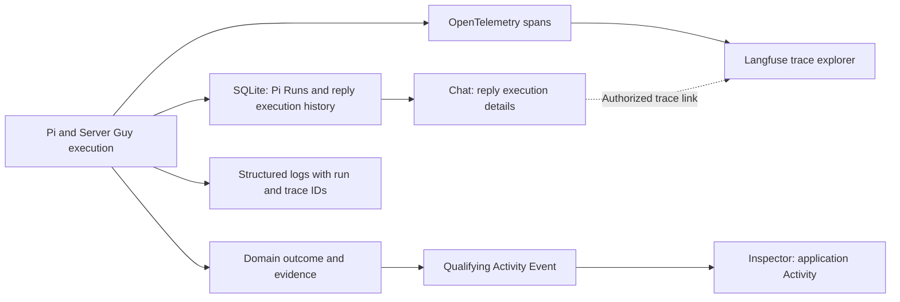

# Action history and tracing

Status: implemented in [PR #16](https://github.com/lustoykov/server-guy/pull/16). Its first slice added reply execution history and optional tracing; its 2026-09-06 follow-up applied the Application Activity correction below: reply details moved beside each Chat reply, the feed was restricted to application events, and repository-verification invalidation is recorded. Later Operations remain future scope; remaining work belongs in the [roadmap](../../ROADMAP.md#action-history-and-tracing).

Application Activity answers **what happened to this application?** Reply execution details answer **how did Server Guy produce this answer?** Keep both inspectable in their appropriate surfaces. Sharing diagnostic signals or storage does not make every execution step an Activity Event.

## Application Activity inclusion rules

**Agreed product rule, 2026-09-06:** record meaningful outcomes without turning every implementation step into a separate Activity item. [CONTEXT.md](../../CONTEXT.md) owns the term; this section owns inclusion criteria. These rules supersede earlier directions to put every reply or tool call in the Activity tab.

An event qualifies when it records at least one of:

1. A meaningful change to an application's established identity, requirements, configuration, or authority.
2. A verification milestone or material change in its observed operational condition.
3. A meaningful stage or outcome of consequential operational work, including an approval requirement, failure, or verified recovery.

The review question is: **would this help someone understand how the application reached its current setup or condition, or what consequential work is happening to it?** A database write, tool invocation, or model response alone does not qualify.

### Decisions and Activity are separate records

- A newly saved Decision produces one requirement-saved event.
- Replacing a Decision produces one requirement-changed event describing old and new values, rather than two redundant feed items.
- Proposing, reading, or repeating an existing Decision produces no new Activity event.
- A Decision stores the requirement; its Activity Event records that the requirement was saved or changed. Other flows produce events without creating Decisions.

### Emit events from the operation

Choose the event's product meaning when implementing a flow. The code responsible for that flow emits it at the relevant outcome boundary; Pi may initiate the flow, but does not classify its own prose or call a generic activity-logging tool to establish what happened.

For a local domain change, commit the change and its success event together. A rollback must not leave a success event. External effects require their own recorded outcomes and verification; a local transaction or a successful tool return cannot prove that a deployment or recovery succeeded. Failed consequential operations may deserve Activity even without a successful change. A failed ordinary reply stays with that reply's execution details.

For each new event, specify the affected application/subject, the exact trigger and outcome, the actor/source where known, and the supporting record or evidence. The same domain change should produce the same event whether initiated through chat, a form, or a future external agent. Do not duplicate an outcome merely because several layers observe it. Group meaningful lifecycle events under their operation; retain low-level steps as supporting execution details.

### Flow inventory

This is an inclusion guide, not a new implementation backlog. Add events as their actual product flows are built.

| Flow | Events that qualify | Boundary |
| --- | --- | --- |
| Application creation | Application workspace created, including initial repository/environment/authority context | One creation event; no duplicate events for each initialization write. |
| Decisions | Requirement saved or replaced | Emit only for committed records, not staged proposals or lookups. |
| Repository verification | Repository identity/access verified; explicit recheck completed; check failed; access restored when supported by evidence | Include checked identity/revision and time. A failed check does not always establish lost access. |
| Verification invalidation | Prior repository verification invalidated by a connection change or disconnect | Record the transition once; stale verification does not prove access was lost. A view refresh is not another transition. |
| Application Contract and readiness | Contract established/materially revised; candidate submitted for verification; conformance passed or failed | Later flow. Internal reads, model drafts, and intermediate coding steps stay in execution detail. |
| Launch Plan | Reviewable plan established or materially revised | Later flow. Describe meaningful changes to topology, cost, or intended effects, not every model revision. |
| Application authority and approvals | Authority changed; concrete operation awaiting approval; approval granted, rejected, or invalidated | Later flow. Distinguish an approval from execution or success. |
| Deployment Host | Host provisioned/adopted; readiness verified; setup failed | Later flow. Distinguish resource creation from readiness. |
| Domain Setup | Domain control verified; routing changed; HTTPS verified; setup blocked or failed | Later flow. Repeated propagation checks remain evidence. |
| Runtime and configuration | Runtime, database, persistence, configuration, or secret references established/changed | Later flow. Never include secret values. |
| Backups and restoration | Protection configured/changed; backup completed/failed; restoration attempted and its verified outcome | Later flow. Group routine runs so scheduled work does not overwhelm the feed. |
| Releases and Deployment | Deployment started/failed/completed; Release verified and made current; rollback attempted and verified | Later flow. Build success, running containers, and a Verified Release are distinct facts. |
| Health, incidents, and alerts | Material health transition; Incident Case opened; recovery attempted/verified; incident resolved | Later flow. Attach alert delivery/failure to the incident; unchanged background probes remain Observations. |
| Drift | Out-of-band Change recorded/detected; drift accepted or reconciled | Later flow. Link the affected resource and supporting evidence. |
| Remediation and handoff | Bounded repair handed off; Candidate Fix returned; accepted/rejected after verification | Later flow. External-agent integration remains deferred; worker completion does not prove recovery. |
| Launch progress | Phase completed/reopened; Application Launch completed and handed over | Later flow. Do not emit on every Gate Check recomputation. |
| Cost monitoring | Configured threshold crossed or material discrepancy detected | Later flow. Ordinary price lookups and saving a budget sentence do not establish threshold enforcement. |

### Exclusions and scope

- Greetings, ordinary answers, streamed text, model generations, tool invocations, compaction, model retries, and reply failures/cancellations belong with the Chat's execution details and optional traces.
- Chat creation/archive belongs with Chat history, not application Activity. Rows recorded for these before the correction stay stored but are excluded from the feed.
- Read-only lookups and unchanged background observations do not produce individual feed items. An explicit verification milestone may qualify even though it changes no external resource.
- Installation-wide ChatGPT/model settings, GitHub account setup, tracing configuration, and routine credential refresh are not copied into every application's feed. Record an application-specific consequence, such as verification invalidation, when it occurs.
- Removing an application is meaningful, but today's prototype removes its workspace/history. A surviving deletion record would need an installation-level history; do not add that facility solely for this correction.
- Validation errors before an operation is accepted stay with the form/chat. Record a consequential accepted operation's failure at its own boundary, with an honest outcome and evidence.

## Reply execution and tracing

Keep the existing Pi Run identity and inspectable local execution history. Trace the path from accepting a chat request through Pi execution, domain validation, database commit, and rebuilding the Operator View. Pi remains the direct runtime. Local diagnostic storage is not the inclusion rule for the application feed.

The [Pi adapter](../../src/server/pi.ts) reopens each Chat's native JSONL history. Its SDK emits response, tool, compaction and retry lifecycle events. The worker records these alongside its own context and save boundaries. SDK response timings are not individual HTTP request timings; preparation and first-byte delays can lie outside response events. Pi events alone cannot prove a domain change was committed.

For “My hosting budget is at most €30/month,” the reply's expanded execution details explain:

```text
Chat execution
├─ Request accepted → queued → worker started
├─ Load current app context
├─ Prepare native conversation and configured model
├─ Pi execution
│  ├─ Model response → looks up saved requirements and requests propose_decision
│  ├─ propose_decision → proposal collected
│  └─ Model response → final answer
├─ Server Guy validates the proposed Decision
├─ Database commit → messages, Decision, and Activity Event saved
└─ Application Activity → requirement-saved event, if committed
```

The existing [domain path](../../src/server/phase-one.ts) can reject a proposal after the Pi tool succeeds, for example when a replacement Decision is already superseded. Reply execution details show both outcomes: proposal collected; change rejected; no Decision saved. This does not create a requirement-saved Activity event.

## User experience

| Surface | What the user sees |
| --- | --- |
| Application Activity | Qualifying domain events with subject, timestamp, outcome, and supporting record/evidence links. Meaningful operation lifecycle events stay grouped. |
| Chat reply details | A collapsed **Reply details** row under each Server Guy reply, summarizing the outcome, work time and step count; expanded, it shows queue versus work time, ordered steps with outcomes, retry lineage, links to requirements saved by that reply, and nested **Technical details**. An unsuccessful attempt states that nothing was saved and that any draft above it is unfinished text. |
| Evidence and optional Langfuse | Source-attributed operational evidence and selected diagnostic metadata. Reply telemetry omits prompts, answers, raw tool payloads, and errors. Offer **Open in Langfuse** only when configured; access still requires project authorization. |

Keep technical output collapsed by default and preserve the user's selected Inspector tab. Follow the existing [technical detail renderers](../user-journeys/01-application-launch.md#technical-detail-renderers). Activity supplies meaningful historical facts; Evidence supplies technical depth. Model-authored explanations remain distinguishable from recorded outcomes. This view exposes execution evidence, not private model reasoning.

While a reply is running, show its last recorded step and state with that reply. After reload or reconnect, reconstruct local history from SQLite. A retry must remain distinguishable and linked to the preceding attempt. Missing or truncated telemetry is labeled as such; it must not turn an unknown outcome into success or add an unrelated application Activity item.

## Records and telemetry



- **SQLite owns durable local records.** Keep application Activity Events distinct in meaning and presentation from reply execution diagnostics. Reuse Pi Run identity for diagnostic correlation; do not introduce another execution coordinator or a second Run status. Keep accumulated message revisions; do not persist one Activity Event per token.
- **OpenTelemetry connects timed steps.** Carry application, Chat, and Pi Run IDs through worker execution, model/tool steps, validation, and commit. Correlate spans and logs with trace/span IDs. A trace ID is diagnostic identity, not a replacement for the durable run or Operation ID.
- **Langfuse provides deeper inspection.** Export nested model/tool spans and explicitly instrument domain steps. Capture provider/model and reported usage; label calculated cost as an estimate, not a ChatGPT subscription charge. Missing usage or cost stays unavailable rather than zero.
- **Sentry covers application errors at external release.** Correlate errors with the same run context when available. It is not required for this first local slice.

Save successful domain changes and their Activity Events atomically. If that transaction rolls back, persist the run failure/rejection separately so the failed attempt remains inspectable. On worker restart, use the durable-run interruption policy; do not infer completion from an unfinished span or repeat a possible effect to fill a trace gap.

Telemetry export is asynchronous and optional. An unavailable exporter must not fail or repeat an otherwise completed action, erase local history, or block local inspection. Sampling and retention may reduce diagnostic detail; durable product history must not depend on them. Do not make a Langfuse account, a collector service, or a new dashboard a prerequisite for local use.

Apply payload selection before local diagnostic storage or export. Exclude credentials, OAuth codes, authorization headers, prompts, answers, tool arguments/results and raw errors entirely. Existing user-facing records and native histories are unchanged by this telemetry policy. Scope history reads through the existing application/Chat checks. This remains a local single-user prototype, not a new multi-tenant authorization layer. Keep Langfuse credentials server-side and never create public trace links automatically.

## Configuration and data boundaries

Storage and presentation are deliberately separate. Each reply's execution history is stored as one `chat-execution` row in the Activity table, keyed by its Run ID, but that row is read only through `run-history.ts`, delivered with the Chat's Runs, and never returned by the application feed; no migration was needed for the correction. Verification invalidation is recorded by `withGithubConnectionTransition` around the GitHub setup operations (reuse, device sign-in, disconnect): it compares the saved connection ID before and after the operation and, for each application whose latest repository check passed under the previous ID, records one event whose ID is derived from that Observation, so retried or concurrent requests, reads and refreshes cannot add a second item. Token renewal keeps the ID and records nothing.

```dotenv
SERVER_GUY_TRACING=1
LANGFUSE_PUBLIC_KEY=your-project-public-key
LANGFUSE_SECRET_KEY=your-project-secret-key
LANGFUSE_BASE_URL=https://cloud.langfuse.com
LANGFUSE_PROJECT_ID=your-project-id
```

Keep these in `.env.local`, never Git. Use your project's region or self-hosted HTTPS base URL. Restart the worker after changing configuration. Set `SERVER_GUY_TRACING=0` to stop future exports; this does not delete existing Cloud traces or local history. The project ID enables authenticated deep links; it is not an access credential.

- `run-history.ts` stores one `chat-execution` Activity row per Run, using that Run's ID. Its existing `detail` column holds a bounded structured payload, so this slice needs no schema change or data migration. Run status/timestamps are joined from `pi_runs`, not copied into a second state machine.
- At most 128 steps are retained per reply. Further steps are counted as omitted. Each step has a fixed label, timing, outcome and an allowlisted set of numeric usage fields/model identifiers. No token-level activity rows or unbounded error blobs.
- Requirement links and the completed save step are written in the same transaction as the reply. Failure/rejection history is saved separately after rollback. Cancellation/restart closes unfinished steps as incomplete, never successful. Crashes can lose diagnostic spans without changing these durable facts.
- The OTel provider is private to the worker, with explicit parent contexts and no global HTTP/SDK auto-instrumentation. Only the `server-guy` scope is exported. Local history, spans and the completion log share Run/trace/span IDs. The worker batches export and flushes on graceful shutdown; the live-eval runner also flushes before cleanup.
- Langfuse may display API-list-price estimates automatically. They are **not ChatGPT subscription charges**. Missing token usage stays absent, not zero. Payload omission is deliberate even if Langfuse suggests adding input/output.
- Live evals require their existing separate opt-in. Browser fixtures force tracing off and strip inherited telemetry variables; ordinary deterministic tests never need Cloud or provider credentials.

The product does not claim that opening the browser caused an exported span or that a trace was delivered merely because a link exists. Export is best-effort; a trace ID is shown only when export is enabled. Reply details reach the Chat through the same saved-state stream as messages and Runs (one snapshot with messages, Runs, execution histories and application Activity), so they survive refresh and reconnects, and the Inspector preserves the selected tab during updates.

## Acceptance scenarios

Verified on 2026-09-06 with deterministic domain tests (`tests/application/integration/activity-events.test.ts`, `run-history.test.ts`, `pi-decisions.test.ts`, `pi-crash-boundaries.test.ts`), component tests for the reply details and the feed, and the `activity-history` desktop journey. The earlier per-reply Activity tests were replaced, not kept as evidence.

| Scenario | Required evidence |
| --- | --- |
| Ordinary reply or requirement lookup | Reply execution remains inspectable in Chat; no application Activity item is added. |
| Successful Decision | One saved/changed event per committed Decision change; a replacement has one old-to-new event, with no extra per-reply item. Refresh preserves history. |
| Tool succeeds, domain rejects | Chat execution shows completed proposal and rejected save; no saved-Decision Activity claim or partial domain write. |
| Reply timeout, cancellation, or worker crash | Terminal/interrupted state survives reload with that reply; incomplete spans do not appear completed or create application Activity. |
| Browser disconnect and reply retry | Reconnection reconstructs history without duplicate rows; retry history remains attributable to its Chat attempt. |
| Application creation and repository verification | Existing meaningful events remain; explicit rechecks preserve their result and evidence. |
| GitHub connection changes or disconnects | Affected prior verification is recorded as invalidated once; no unsupported access-loss claim. Re-rendering does not duplicate the event. |
| Chat creation/archive | Chat administration remains visible in its own context and adds no application Activity item. |
| Export disabled or unavailable | Local execution and inspection still work; absent diagnostic detail is explicit. |
| Sensitive payload | Synthetic secrets never appear in stored diagnostic payloads, exported spans/logs, or the Inspector. |

Verify the history with deterministic Pi/domain fixtures, then use one explicitly enabled real-Pi run to confirm actual model/tool spans reach the configured Langfuse project. A working exporter alone is not acceptance of the user-facing history.

## Later scope and references

As Operations are implemented, extend tracing through policy, approval, provider request, receipt, and independent verification. Success still comes from durable records and fresh evidence. Managed-application infrastructure logs, general analytics dashboards, and on-demand dashboard generation are outside this first slice.

- [Domain vocabulary](../../CONTEXT.md) and [observability learning target](../learning/stack-with-server-guy.md#observability-learning-target).
- [OpenTelemetry traces](https://opentelemetry.io/docs/concepts/signals/traces/).
- [Langfuse instrumentation](https://langfuse.com/docs/observability/sdk/instrumentation) and [usage/cost tracking](https://langfuse.com/docs/observability/features/token-and-cost-tracking).
