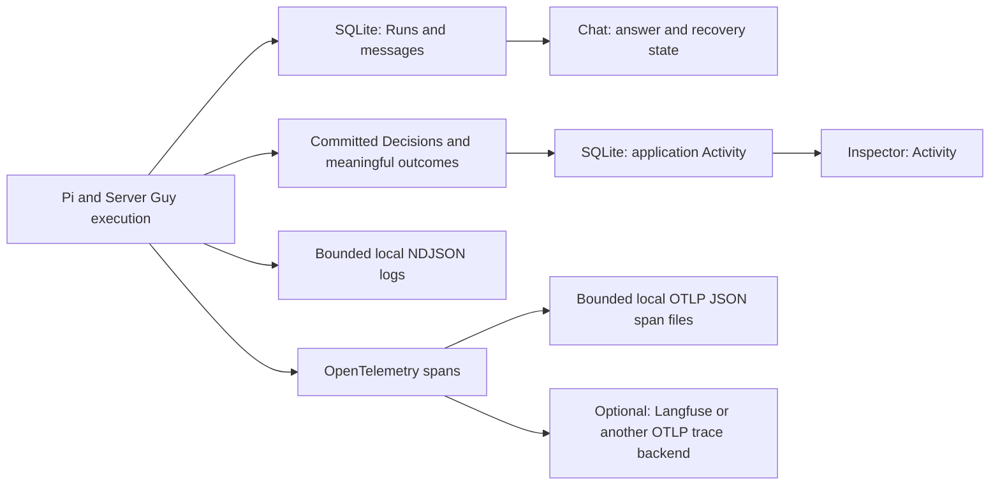

# Action history and tracing

Status: implemented in [PR #16](https://github.com/lustoykov/server-guy/pull/16). The final 2026-09-06 correction keeps meaningful application Activity, ordinary Chat with recovery states, bounded local diagnostic logs, and optional trace export. It removes the earlier Reply details panel and detailed execution-history database writes. Later Operations remain future scope; remaining work belongs in the [roadmap](../../ROADMAP.md#action-history-and-tracing).

Application Activity answers **what happened to this application?** Diagnostic logs and traces help operators investigate **how Server Guy handled a request**. SQLite stores the product's authoritative state. Diagnostics support investigation and can be incomplete; they do not establish product outcomes.

## Application Activity inclusion rules

**Agreed product rule, 2026-09-06:** record meaningful outcomes without turning every implementation step into a separate Activity item. [CONTEXT.md](../../CONTEXT.md) owns the term; this section owns inclusion criteria. These rules supersede earlier directions to put every reply or tool call in the Activity tab.

An event qualifies when it records at least one of:

1. A meaningful change to an application's established identity, requirements, configuration, or authority.
2. A verification milestone or material change in its observed operational condition.
3. A meaningful stage or outcome of consequential operational work, including an approval requirement, failure, or verified recovery.

The review question is: **would this help someone understand how the application reached its current setup or condition, or what consequential work is happening to it?** A database write, tool invocation, or model response alone does not qualify.

### Decisions and Activity are separate records

- A newly saved Decision produces one requirement-saved event.
- Replacing a Decision produces one requirement-changed event describing old and new values, rather than two redundant feed items.
- Proposing, reading, or repeating an existing Decision produces no new Activity event.
- A Decision stores the requirement; its Activity Event records that the requirement was saved or changed. Other flows produce events without creating Decisions.

### Emit events from the operation

Choose the event's product meaning when implementing a flow. The code responsible for that flow emits it at the relevant outcome boundary; Pi may initiate the flow, but does not classify its own prose or call a generic activity-logging tool to establish what happened.

For a local domain change, commit the change and its success event together. A rollback must not leave a success event. External effects require their own recorded outcomes and verification; a local transaction or a successful tool return cannot prove that a deployment or recovery succeeded. Failed consequential operations may deserve Activity even without a successful change. A failed ordinary reply stays in Chat as a failed attempt, with diagnostic context in local logs.

For each new event, specify the affected application/subject, the exact trigger and outcome, the actor/source where known, and the supporting record or evidence. The same domain change should produce the same event whether initiated through chat, a form, or a future external agent. Do not duplicate an outcome merely because several layers observe it. Group meaningful lifecycle events under their operation; retain low-level steps in diagnostic logs and optional traces.

### Flow inventory

This is an inclusion guide, not a new implementation backlog. Add events as their actual product flows are built.

| Flow | Events that qualify | Boundary |
| --- | --- | --- |
| Application creation | Application workspace created, including initial repository/environment/authority context | One creation event; no duplicate events for each initialization write. |
| Decisions | Requirement saved or replaced | Emit only for committed records, not staged proposals or lookups. |
| Repository verification | Repository identity/access verified; explicit recheck completed; check failed; access restored when supported by evidence | Include checked identity/revision and time. A failed check does not always establish lost access. |
| Verification invalidation | Prior repository verification invalidated by a connection change or disconnect | Record the transition once; stale verification does not prove access was lost. A view refresh is not another transition. |
| Application Contract and readiness | Contract established/materially revised; candidate submitted for verification; conformance passed or failed | Later flow. Internal reads, model drafts, and intermediate coding steps stay in execution detail. |
| Launch Plan | Reviewable plan established or materially revised | Later flow. Describe meaningful changes to topology, cost, or intended effects, not every model revision. |
| Application authority and approvals | Authority changed; concrete operation awaiting approval; approval granted, rejected, or invalidated | Later flow. Distinguish an approval from execution or success. |
| Deployment Host | Host provisioned/adopted; readiness verified; setup failed | Later flow. Distinguish resource creation from readiness. |
| Domain Setup | Domain control verified; routing changed; HTTPS verified; setup blocked or failed | Later flow. Repeated propagation checks remain evidence. |
| Runtime and configuration | Runtime, database, persistence, configuration, or secret references established/changed | Later flow. Never include secret values. |
| Backups and restoration | Protection configured/changed; backup completed/failed; restoration attempted and its verified outcome | Later flow. Group routine runs so scheduled work does not overwhelm the feed. |
| Releases and Deployment | Deployment started/failed/completed; Release verified and made current; rollback attempted and verified | Later flow. Build success, running containers, and a Verified Release are distinct facts. |
| Health, incidents, and alerts | Material health transition; Incident Case opened; recovery attempted/verified; incident resolved | Later flow. Attach alert delivery/failure to the incident; unchanged background probes remain Observations. |
| Drift | Out-of-band Change recorded/detected; drift accepted or reconciled | Later flow. Link the affected resource and supporting evidence. |
| Remediation and handoff | Bounded repair handed off; Candidate Fix returned; accepted/rejected after verification | Later flow. External-agent integration remains deferred; worker completion does not prove recovery. |
| Launch progress | Phase completed/reopened; Application Launch completed and handed over | Later flow. Do not emit on every Gate Check recomputation. |
| Cost monitoring | Configured threshold crossed or material discrepancy detected | Later flow. Ordinary price lookups and saving a budget sentence do not establish threshold enforcement. |

### Exclusions and scope

- Greetings, ordinary answers, streamed text, model generations, tool invocations, compaction, model retries, and reply failures/cancellations are not application Activity. Chat retains answers and reply states; local logs and optional traces retain selected diagnostic metadata.
- Chat creation/archive belongs with Chat history, not application Activity. Rows recorded for these before the correction stay stored but are excluded from the feed.
- Read-only lookups and unchanged background observations do not produce individual feed items. Pi's `get_application_status` read ([spec](application-status-tool.md)) is a `get_application_status` step in local logs and optional spans, nowhere in the feed. An explicit verification milestone may qualify even though it changes no external resource.
- Installation-wide ChatGPT/model settings, GitHub account setup, tracing configuration, and routine credential refresh are not copied into every application's feed. Record an application-specific consequence, such as verification invalidation, when it occurs.
- Removing an application is meaningful, but today's prototype removes its workspace/history. A surviving deletion record would need an installation-level history; do not add that facility solely for this correction.
- Validation errors before an operation is accepted stay with the form/chat. Record a consequential accepted operation's failure at its own boundary, with an honest outcome and evidence.

## Product records and diagnostics



- **SQLite owns product state.** `pi_runs` retains accepted requests, lifecycle status/timestamps, retry lineage and safe user-facing failures. Messages, Decisions and meaningful Activity remain durable. The UI reconstructs these after refresh or reconnect. There is no detailed execution-history table in the current schema and no second coordinator or diagnostic Run status.
- **Pi's native history supports conversation continuity.** The existing per-Chat JSONL history is separate from diagnostic logs. It contains conversation/tool content and follows its existing privacy and lifecycle rules. Do not treat it as metadata-only telemetry or reconstruct it from diagnostic logs.
- **Local logs support debugging.** Fixed lifecycle and step events carry Run, Chat and application IDs, timings, outcomes, allowlisted model/usage metadata and safe failure categories. They work with tracing disabled and can be read with a text editor, `jq`, or an agent. They are bounded operational records, not a complete searchable product timeline.
- **Local traces connect timed steps.** Completed OpenTelemetry spans are appended to `spans.ndjson`, one standard OTLP JSON envelope per line, including IDs, parent relationships, timestamps, status and selected attributes. This works with remote export off. Optional export sends the same spans directly to Langfuse or a configured OTLP/HTTP trace endpoint. Trace/span IDs correlate with local logs. No account, Collector, or separate service is needed for ordinary self-hosted use.

For “My hosting budget is at most €30/month,” Pi may propose a Decision before Server Guy validates it. The proposal step succeeding does not establish that the requirement was saved. Only the database transaction can commit the reply, Decision and requirement-saved Activity together. The successful save diagnostic is emitted **after the outer transaction commits**. If validation or commit fails, the product records the failed attempt separately and no requirement-saved event remains.

The [Pi adapter](../../src/server/pi.ts) emits response, tool, compaction and retry signals. The worker adds context and save boundaries. SDK response timings are not individual HTTP request timings; preparation and first-byte delays can lie outside response events. This instrumentation exposes selected execution evidence, not private model reasoning.

## User experience

| Surface | What the user sees |
| --- | --- |
| Chat | Answers, queued/working state, failed/cancelled/interrupted attempts, unfinished drafts and retry where allowed. No Reply details panel or new diagnostics viewer. Archived Chats remain readable and read-only. |
| Application Activity | Meaningful domain outcomes with subject, timestamp and supporting evidence. An ordinary answer, lookup, cancellation or retry adds no event. |
| Record and Evidence | Current saved requirements and source-attributed verification evidence. Users can understand application outcomes without Langfuse. |
| Local diagnostic files | Operator/developer investigation using correlated, bounded metadata. Reading files does not require a service. |
| Optional trace backend | Deeper model/tool timing and usage inspection for developers/operators. Export settings and credentials stay server-side. |

Preserve the selected Inspector tab during updates. Model-authored explanations remain distinguishable from recorded outcomes. Keep cancellation and retry attached to the attempt; do not replay possible external effects merely to complete a trace.

## Configuration and data boundaries

### Local logs

Logs are enabled independently of tracing. By default they live beside the configured database in `diagnostics/replies.ndjson`: for the default database, `.server-guy/diagnostics/replies.ndjson`. Set `SERVER_GUY_LOG_DIR` to use another directory. Each file rotates at 1 MiB and retains three archives (`replies.ndjson.1` through `.3`), approximately 4 MiB total. Keep the directory private and writable by the Server Guy process. Restart the app and worker after changing environment settings.

```dotenv
# Optional: otherwise use diagnostics/ beside SERVER_GUY_DB_PATH.
SERVER_GUY_LOG_DIR=/path/to/private/server-guy-logs
# Independent of local logging; disabled by default.
SERVER_GUY_TRACING=0
```

Search by the durable Run ID, for example:

```sh
jq 'select(.runId == "your-run-id")' .server-guy/diagnostics/replies.ndjson*
```

Rotation and crashes can remove events or leave a start with no end. A missing end means diagnostics are incomplete, not that the operation failed or had no effects. Consult authoritative Runs, messages, Decisions and Activity before retrying consequential work. Deleting an application does not erase its entries from shared rotated diagnostic files; retention removes those naturally. Native content-bearing conversation history remains separate.

At most 128 steps per Run are recorded; further steps are counted as omitted. No per-token events or unbounded error blobs. Selection happens before writing or export: omit prompts, answers, tool arguments/results, credentials, OAuth codes, authorization headers, private reasoning and unrestricted error text. Safe failures expose bounded categories and numeric HTTP status codes where available, not arbitrary provider payloads. Errors without recognized structured status or codes remain `unknown`. Missing usage remains absent rather than zero.

Local write, rotation and export failures are best effort and cannot fail a reply, roll back a committed Decision, add Activity or trigger a retry. Logs may be unavailable when the configured directory cannot be written. The logger and exporter are not durability guarantees; product state does not depend on them.

### Optional export

For Langfuse, use ignored `.env.local` settings:

```dotenv
SERVER_GUY_TRACING=1
LANGFUSE_PUBLIC_KEY=your-project-public-key
LANGFUSE_SECRET_KEY=your-project-secret-key
LANGFUSE_BASE_URL=https://cloud.langfuse.com
```

Use your project's region or self-hosted HTTPS base URL. Alternatively, configure a full OTLP/HTTP trace endpoint:

```dotenv
SERVER_GUY_TRACING=1
OTEL_EXPORTER_OTLP_TRACES_ENDPOINT=https://your-backend.example/v1/traces
# Optional, standard OTLP headers; never commit actual credentials.
OTEL_EXPORTER_OTLP_TRACES_HEADERS=authorization=your-encoded-value
```

An explicit trace endpoint takes precedence over Langfuse settings. Keep keys server-side and restart both the server and worker with the same environment after changes. Settings reports this server’s configuration, not a delivery check. Destination display omits URL credentials, paths and query strings. `SERVER_GUY_TRACING=0` stops future remote exports; local logs and completed spans continue to be saved. The OTel provider is private to the worker; it uses explicit parent contexts and no global HTTP/SDK auto-instrumentation. The worker batches export and flushes on graceful shutdown. A trace ID does not prove delivery.

OpenTelemetry logs and traces are different signals. `replies.ndjson` is an ordinary event log, not an OpenTelemetry logs export. `spans.ndjson` contains completed spans serialized by the official OTLP JSON serializer. Each file rotates separately at 1 MiB with three archives. Local writes happen when a span ends, independently of remote export, and can fail without failing a reply. A crash can lose unfinished spans; rotation can remove part of a trace. These files are a local diagnostic archive, not a durable sending queue: no replay, delivery tracking or automatic import into Langfuse. Langfuse may display API-price estimates, which are not ChatGPT subscription charges. Payload omission applies to both local and remote outputs.

Browser fixtures disable export and isolate diagnostic files alongside disposable databases. Live model evals retain their separate explicit opt-in.

### Database compatibility

The current schema remains prototype version **6**. Existing v6 databases need no diagnostic migration. Historical `chat-execution`, `chat-created` and `chat-archived` rows in `activity_events` remain stored but are excluded from the feed.

Development databases use the current schema only. Recreate disposable databases from incompatible prototype versions, including the abandoned version-7 history-table branch. There is no special version-7 runtime compatibility, migration, copying or reconstruction.

Verification invalidation remains in `withGithubConnectionTransition`: changing or disconnecting a saved connection records one event per prior successful repository Observation. Token renewal keeps the connection ID and emits nothing; refresh cannot duplicate the event. Pending Runs retain their existing recovery policy: queued work stays queued and a restarted worker marks in-flight attempts interrupted.

## Acceptance scenarios

Use disposable deterministic fixtures for the following boundaries. Current run results belong in the [acceptance guide](../testing/phase-one-acceptance.md#latest-verification).

| Scenario | Required evidence |
| --- | --- |
| Ordinary answer or lookup | Chat shows the answer without Reply details; no application Activity item. |
| Saved/replaced Decision | One event per committed change; replacement records old → new once; reload preserves it. |
| Tool succeeds, domain rejects or commit rolls back | No partial domain write, saved Activity claim or successful-save diagnostic. Failed attempt remains in product state. |
| Cancel, timeout or restart | Durable terminal/interrupted state and safe recovery; unfinished diagnostics do not claim success. |
| Browser reconnect/retry | No duplicate user message or Activity; retry retains its original Run lineage. |
| GitHub connection transition | Invalidation once per prior Observation, no unobserved access-loss claim. |
| Chat creation/archive | No Activity event; archived transcript remains readable and read-only. |
| Remote export disabled | Local event logs and complete ended spans still exist; ordinary product behavior works. |
| Unwritable logs, failed rotation or failed exporter | Product outcomes are unchanged and no automatic retry is introduced. |
| Retention and privacy | File/step bounds hold; synthetic private content never enters logs or spans. |
| Prototype schema | v6 remains current; incompatible disposable development databases are recreated. |

## Later scope and references

Extend correlation through policy, approval, provider requests, receipts and independent verification as those Operations are implemented. Do not add a local diagnostics viewer, analytics database, Collector or monitoring service without a concrete product requirement. Managed-application infrastructure logs are outside this first slice. Sentry remains a later external-release concern.

- [Domain vocabulary](../../CONTEXT.md) and [observability learning target](../learning/stack-with-server-guy.md#observability-learning-target).
- [OpenTelemetry signals](https://opentelemetry.io/docs/concepts/signals/).
- [Langfuse OpenTelemetry integration](https://langfuse.com/integrations/native/opentelemetry).
