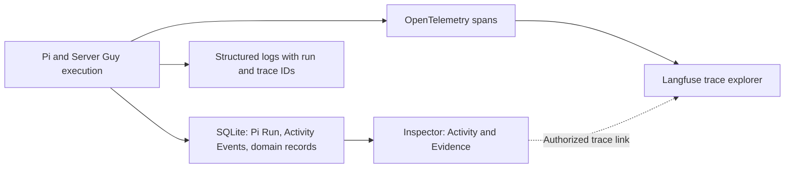

# Action history and tracing

Status: implemented in the Activity/tracing slice, after durable requests and native Pi sessions. This document describes the current boundary; later Operations remain future scope.

Users should be able to inspect what Server Guy attempted, what each step returned, and what actually changed. Start with one chat execution and extend the same view as external Operations arrive. Delivery order and implementation status belong to the [roadmap](../../ROADMAP.md#action-history-and-tracing).

## First slice

Reuse the planned durable Pi Run, Activity Events, and existing Inspector. Trace the path from accepting a chat request through Pi execution, domain validation, database commit, and rebuilding the Operator View. Pi remains the direct runtime.

The [Pi adapter](../../src/server/pi.ts) reopens each Chat's native JSONL history. Its SDK emits response, tool, compaction and retry lifecycle events. The worker records these alongside its own context and save boundaries. SDK response timings are not individual HTTP request timings; preparation and first-byte delays can lie outside response events. Pi events alone cannot prove a domain change was committed.

For “My hosting budget is at most €30/month,” the expanded history explains:

```text
Chat execution
├─ Request accepted → queued → worker started
├─ Load current app context
├─ Prepare native conversation and configured model
├─ Pi execution
│  ├─ Model response → looks up saved requirements and requests propose_decision
│  ├─ propose_decision → proposal collected
│  └─ Model response → final answer
├─ Server Guy validates the proposed Decision
├─ Database commit → messages, Decision, and Activity Event saved
└─ Live Activity snapshot → link to the saved requirement
```

The existing [domain path](../../src/server/phase-one.ts) can reject a proposal after the Pi tool succeeds, for example when a replacement Decision is already superseded. Show both outcomes: proposal collected; change rejected; no Decision saved.

## User experience

| Depth | What the user sees |
| --- | --- |
| Collapsed Activity | A concise action summary, timestamp, and current or terminal result. |
| Expanded execution | Ordered steps with actor/tool, start/end or elapsed time, concise result, retries, and links to the affected records. Distinguish queue time from execution time. |
| Evidence | Redacted inputs/outputs, errors, correlated logs, and trace detail. Offer **Open in Langfuse** only when configured and the viewer has access. |

Keep technical output collapsed by default and preserve the user's selected Inspector tab. Follow the existing [technical detail renderers](../user-journeys/01-application-launch.md#technical-detail-renderers). Activity supplies meaningful historical facts; Evidence supplies technical depth. Model-authored explanations remain distinguishable from recorded outcomes. This view exposes execution evidence, not private model reasoning.

While work is running, show the last recorded step and its state. After reload or reconnect, reconstruct history from SQLite. A retry must remain distinguishable and linked to the preceding attempt. Missing or truncated telemetry is labeled as such; it must not turn an unknown outcome into success.

## Records and telemetry



- **SQLite owns product history.** Reuse Pi Run identity rather than introducing another execution store. Store meaningful lifecycle/tool outcomes with stable ordering and references to affected Decisions, Observations, and later Operations. Keep accumulated message revisions; do not persist one Activity Event per token.
- **OpenTelemetry connects timed steps.** Carry application, Chat, and Pi Run IDs through worker execution, model/tool steps, validation, and commit. Correlate spans and logs with trace/span IDs. A trace ID is diagnostic identity, not a replacement for the durable run or Operation ID.
- **Langfuse provides deeper inspection.** Export nested model/tool spans and explicitly instrument domain steps. Capture provider/model and reported usage; label calculated cost as an estimate, not a ChatGPT subscription charge. Missing usage or cost stays unavailable rather than zero.
- **Sentry covers application errors at external release.** Correlate errors with the same run context when available. It is not required for this first local slice.

Save successful domain changes and their Activity Events atomically. If that transaction rolls back, persist the run failure/rejection separately so the failed attempt remains inspectable. On worker restart, use the durable-run interruption policy; do not infer completion from an unfinished span or repeat a possible effect to fill a trace gap.

Telemetry export is asynchronous and optional. An unavailable exporter must not fail or repeat an otherwise completed action, erase local history, or block the Inspector. Sampling and retention may reduce diagnostic detail; durable product history must not depend on them. Do not make a Langfuse account, a collector service, or a new dashboard a prerequisite for local use.

Apply payload selection before local diagnostic storage or export. Exclude credentials, OAuth codes, authorization headers, prompts, answers, tool arguments/results and raw errors entirely. Existing user-facing records and native histories are unchanged by this telemetry policy. Scope history reads through the existing application/Chat checks. This remains a local single-user prototype, not a new multi-tenant authorization layer. Keep Langfuse credentials server-side and never create public trace links automatically.

## Configuration and data boundaries

```dotenv
SERVER_GUY_TRACING=1
LANGFUSE_PUBLIC_KEY=your-project-public-key
LANGFUSE_SECRET_KEY=your-project-secret-key
LANGFUSE_BASE_URL=https://cloud.langfuse.com
LANGFUSE_PROJECT_ID=your-project-id
```

Keep these in `.env.local`, never Git. Use your project's region or self-hosted HTTPS base URL. Restart the worker after changing configuration. Set `SERVER_GUY_TRACING=0` to stop future exports; this does not delete existing Cloud traces or local history. The project ID enables authenticated deep links; it is not an access credential.

- `run-history.ts` stores one `chat-execution` Activity row per Run, using that Run's ID. Its existing `detail` column holds a bounded structured payload, so this slice needs no schema change or data migration. Run status/timestamps are joined from `pi_runs`, not copied into a second state machine.
- At most 128 steps are retained per reply. Further steps are counted as omitted. Each step has a fixed label, timing, outcome and an allowlisted set of numeric usage fields/model identifiers. No token-level activity rows or unbounded error blobs.
- Requirement links and the completed save step are written in the same transaction as the reply. Failure/rejection history is saved separately after rollback. Cancellation/restart closes unfinished steps as incomplete, never successful. Crashes can lose diagnostic spans without changing these durable facts.
- The OTel provider is private to the worker, with explicit parent contexts and no global HTTP/SDK auto-instrumentation. Only the `server-guy` scope is exported. Local history, spans and the completion log share Run/trace/span IDs. The worker batches export and flushes on graceful shutdown; the live-eval runner also flushes before cleanup.
- Langfuse may display API-list-price estimates automatically. They are **not ChatGPT subscription charges**. Missing token usage stays absent, not zero. Payload omission is deliberate even if Langfuse suggests adding input/output.
- Live evals require their existing separate opt-in. Browser fixtures force tracing off and strip inherited telemetry variables; ordinary deterministic tests never need Cloud or provider credentials.

The product does not claim that opening the browser caused an exported span or that a trace was delivered merely because a link exists. Export is best-effort. The Activity tab reconstructs current history through the same saved-state stream used by chat and preserves the selected tab during updates.

## Acceptance scenarios

| Scenario | Required evidence |
| --- | --- |
| Successful Decision | Ordered model/tool/domain steps lead to the committed Decision; refresh preserves the history and record link. |
| Tool succeeds, domain rejects | Tool success remains visible beside the rejection; no saved-Decision claim or partial domain write. |
| Timeout, cancellation, or worker crash | The recorded terminal/interrupted state survives reload; incomplete spans do not appear completed. |
| Disconnect and retry | Reconnection reconstructs durable history without duplicate rows; retry history remains attributable to its attempt. |
| Export disabled or unavailable | Local execution and inspection still work; absent diagnostic detail is explicit. |
| Sensitive payload | Synthetic secrets never appear in stored diagnostic payloads, exported spans/logs, or the Inspector. |

Verify the history with deterministic Pi/domain fixtures, then use one explicitly enabled real-Pi run to confirm actual model/tool spans reach the configured Langfuse project. A working exporter alone is not acceptance of the user-facing history.

## Later scope and references

As Operations are implemented, extend tracing through policy, approval, provider request, receipt, and independent verification. Success still comes from durable records and fresh evidence. Managed-application infrastructure logs, general analytics dashboards, and on-demand dashboard generation are outside this first slice.

- [Domain vocabulary](../../CONTEXT.md) and [observability learning target](../learning/stack-with-server-guy.md#observability-learning-target).
- [OpenTelemetry traces](https://opentelemetry.io/docs/concepts/signals/traces/).
- [Langfuse instrumentation](https://langfuse.com/docs/observability/sdk/instrumentation) and [usage/cost tracking](https://langfuse.com/docs/observability/features/token-and-cost-tracking).
