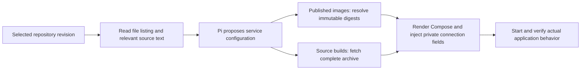

# Paperless deployment intake — 10 September 2026

This records a bounded local acceptance pass, not a claim that Paperless has completed the supported lifecycle. The target is the official Paperless-ngx 3.1.3 release, source commit `d48663e9ebaadc4b413a6ca3bc88cb5fbc4e468e`. Existing deployed applications have not been changed.

## What the real application exposed

The production deployment-intake path initially rejected the official GHCR image. After resolving that, its executable-archive reader rejected the upstream repository because file content exceeded 64 MiB. Neither restriction is a requirement of running the published image.

The updated path supports public Docker Hub and GHCR images and inspects the exact revision's file listing and selected text files. The planner is given all 1,484 file paths at this revision. Complete source archives are still required when any service builds from source; bounded, potentially redacted inspection text never becomes a build bundle.



The production registry resolver returned this Linux amd64 image and Docker successfully pulled that exact manifest:

```
ghcr.io/paperless-ngx/paperless-ngx@sha256:ad7059ba2e2bd1cdfd66509651ee6127862a80acf0a8a4462709ad5427f181c4
```

Explicit `docker.io/valkey/valkey:9-alpine` and shorthand `alpine:3.23` also resolved successfully. These are live registry checks, not registry mock assertions. Arbitrary/private registries remain outside this change.

The real configured Pi planner then inspected the source and declined to submit a plan. Its report identified two further gaps:

- Paperless expects PostgreSQL connection components, including `PAPERLESS_DBPASS`; the managed connection could only supply a complete URL.
- Document ingestion needs an authenticated multipart upload and asynchronous task polling. The existing HTTP checks accept JSON and do not provide authentication headers or multipart files.

Managed connection bindings now support `url`, `host`, `port`, `database`, `username` and `password`. The consumer chooses its environment-variable names. Existing URL bindings retain their behavior; a plan can set `postgres.variable` to null when using component bindings. These are connection properties, not application-name rules.

## Verification boundary

The trial uses an isolated controller database and the owner's existing authorized Pi model connection. It does not copy or operate the existing applications' deployment records. The source checkout is read-only upstream evidence. Only a disposable acceptance account and synthetic PDF documents were used. The stack runs locally at `127.0.0.1:3278` using the production Compose renderer, with loopback port mapping and Linux amd64 execution on the local Docker engine.

A second planner pass permits an honestly labelled startup-only plan, with authenticated ingestion explicitly reserved for a separate acceptance operator. Passing startup or a login-page check must not be reported as proof of document processing, preservation, backup or recovery.

## Observed local results

- The real configured Pi model (`openai-codex/gpt-5.6-sol`, high effort) produced the deployment plan after the intake changes. PostgreSQL 18 receives the controller-generated password; Paperless receives its documented individual database fields. Its official image retains the bundled web server, consumer, scheduler and Celery worker, with a separate private Valkey broker.
- The first authenticated multipart upload created document 1. Its processing task succeeded, searching its unique token returned the document, and downloading the original matched SHA-256 `57b5584089a0d2f359e17aaca769cc631145954cb5a0e30d9644f3c38dcf109a`.
- Recreating the application and broker changed both container IDs while leaving PostgreSQL running. The original document's searchable text and downloaded PDF remained unchanged.
- At 13:31 UTC the acceptance operator stopped only this disposable stack's broker. A live Pi planning session inspected actual container states and bounded redacted logs, then restored startup in one execution through a local Compose adapter. It did not need a configuration change.
- After recovery, a fresh upload created document 2, its background task succeeded, its unique text was searchable, and its downloaded original matched SHA-256 `fc905933c622af0fb832abb40737b0618d874f4a0ab195f2687a797efdbe8328`.

The recovery adapter permits only the existing local stack, versions, volumes, private values and loopback exposure. It uses the production planner and Compose renderer, with fixed local Docker commands in place of remote execution. This demonstrates live-model diagnosis and actual application recovery; it is not proof of the product's remote SSH transport, operation queue, scoped-release enforcement or lost-reply reconciliation. The authenticated PDF checks run outside the product's existing HTTP verifier. Evidence and private trial scripts are under ignored `tests/results/paperless`; generated credentials are under the isolated controller's private state directory.

## Version upgrade

A second isolated local stack started with the official 3.1.2 image at source revision `ca98dffbd2daa4c9551a4eb94719ef1a07bbdf2c`, resolved to Linux amd64 digest `141dc5d5f15124355523722dc87e141552badd86dccf952d242e63b813906cb6`. A synthetic document completed ingestion, became searchable and downloaded unchanged. The same stack then updated to the 3.1.3 image recorded above, keeping its private settings and named volumes.

The application container changed from `f67787f4470e` to `520ebf2a08f2`; PostgreSQL retained container `fc0d88b1dd01`. The existing document remained searchable and its original SHA-256 remained `8248bfc859628a0b019879bd17a8b145418886a2bd065e57f3b6f51d7c081425`. A fresh document ingested after the upgrade also completed processing, search and an unchanged original download. Evidence is under ignored `tests/results/paperless-upgrade`. This exercises actual image replacement with retained application data through the production Compose renderer and a local adapter; it does not exercise the remote release queue or prove a database migration can be reversed.

Paperless's workers are bundled in its upstream image. This case does not exercise separate source builds or shared mounts between distinct application containers. Backup/restore, rollback and remote deployment recovery remain unproved for Paperless. General authenticated application verification is the next capability needed to bring this acceptance into the normal product flow. Generalized backups must capture PostgreSQL and persistent files together with all their writers accounted for; accepting the image name or backing up only its database would not meet that requirement.

## Code verification

Opus implemented focused tests, extending existing cases where possible, and reports 996 default tests passed with 19 opt-in skips. Codex reviewed the changes and independently ran the registry, repository-inspection and service-deployment tests: 53 passed, plus both planner tests. The existing opt-in Docker release proof also passed all three cases on this candidate, including separate builds and shared volumes, retained data across updates, lost-reply reconciliation and Linux locking. That synthetic application proof is separate from the Paperless observations above. The registry-hostname ambiguity and a potential 3,000-entry listing regression found in review were corrected; deployment inspection retains the existing execution reader's 20,000-entry ceiling. Source builds still require complete archives. TypeScript, the production build and changed-file lint/format passed. This statement applies to this candidate's checks, not CI or every optional suite.

Upstream references: [3.1.2 release](https://github.com/paperless-ngx/paperless-ngx/releases/tag/v3.1.2), [3.1.3 release](https://github.com/paperless-ngx/paperless-ngx/releases/tag/v3.1.3), [pinned Compose](https://github.com/paperless-ngx/paperless-ngx/blob/d48663e9ebaadc4b413a6ca3bc88cb5fbc4e468e/docker/compose/docker-compose.postgres.yml), [pinned database settings](https://github.com/paperless-ngx/paperless-ngx/blob/d48663e9ebaadc4b413a6ca3bc88cb5fbc4e468e/src/paperless/settings/custom.py).
