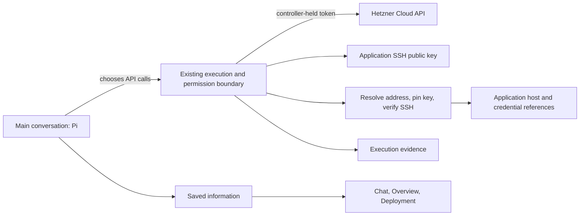

# Hetzner provisioning checkpoint — 12 September 2026

Implemented on `codex/hetzner-provisioning`, pending review and merge. This follows the accepted storage checkpoint, PR #55 (`95b3829`). Application deployment remains the next checkpoint.

## Result

Pi inspects the repository and chooses a server using the live provider catalog. `hetzner_request` is a general Cloud REST request tool with GET, POST, PUT and DELETE; the controller supplies the token on a fixed API origin. It does not choose a size, region, image or deployment sequence for Pi. The unused fixed `smallestHostOffer` selector and retired creation-error classification were removed.

`server_public_key` creates or reuses one application SSH key on the controller and returns only its public half. Pi can register it with the provider and supply its ID in server creation. `connect_server` resolves a Hetzner server's address by its provider ID, pins the ED25519 host key, verifies SSH access and only then saves the connection and provider/account references. Provider responses redact returned passwords, private keys and tokens before they reach Pi, native transcripts or execution records. The tools use the existing execution/permission mechanism, including live inline approval and decline; side conversations do not receive them.

Existing-machine setup also stays in the main conversation: give the owner the public key to install through their trusted terminal, obtain address/user/port and the host-key fingerprint, verify it, then save the connection. No private-key or password entry through chat and no standalone attachment form.

## Verification

- 15 focused tests across provider requests, server access, Pi tool registration and execution approvals: passed. They exercise response redaction, fixed-origin requests, no retry after lost responses, private-key persistence/permissions, provider identity resolution, failed SSH/fingerprint checks leaving the application connection unchanged, declines, three modes and side-chat restrictions. Provider mutations and SSH success in these tests are simulated; SSH key generation is real.
- TypeScript, production build, and ESLint/Prettier on changed code passed. The stale `.next` cache from the previous local checkout was moved aside; it contained types for deleted routes. Dynamic filesystem tracing of runtime SSH storage was excluded from the build.
- Real configured Pi, isolated SQLite/config/native history, real Docker repository workspace and real Hetzner GET requests: succeeded in six model calls. Pi inspected `docker/getting-started-app` at `6b025fc53bc7b9bef435d6b09bcd1da5a871c9cc`, discovered Node/Express and default SQLite persistence, read server types/pricing/locations/images, and saved one recommendation referenced in chat, Overview and Deployment with four execution references.
- The dated recommendation was CX23 in Helsinki, €5.49/month plus €0.50 for public IPv4, totaling €5.99/month for that account's API pricing. This is proof of live price inspection, not a permanent price or spending authorization. The proof harness rejected all non-GET provider requests. An earlier run correctly recorded repository inspection as unavailable while Docker was starting; the subsequent run verified it once Docker was ready.
- No provider resources or keys were created, no real remote SSH connection was established by this checkpoint, and no application was deployed. Those claims require the owner's provisioning trial and the separate deployment checkpoint.

## Try it

Open Docker Getting Started's main conversation and ask: “Inspect this repository, recommend a suitable Hetzner host with its total cost, and stop before creating it.” For the actual provisioning trial, continue with the selected host and ask Pi to prepare it and stop after SSH verification. The selected permission mode applies; Always ask shows each pending provider/connection call inline, Pi decides can ask when a decision is needed, and Bypass does not add a provider-specific gate.

After connecting, inspect the saved preparation outcome and execution evidence. Refresh and open Overview or Deployment to see the same saved information. A connected host is not a deployed or healthy application.

## Limits

This slice connects Hetzner servers through public IPv4 and ED25519 SSH host keys. Hetzner's first connection pins the key seen at the address returned by the authenticated provider API; it does not independently verify that key through the provider console. A supplied fingerprint is checked, and existing-machine setup requires one. Subsequent connections use the pinned key and strict checking.

Pi owns action polling, investigation after a lost result and any correction through general requests/commands. There is no automatic create retry, durable approval replay or new recovery workflow. Docker/software installation, named application secrets, deployment, backups and monitoring are subsequent work.

Provider references: [Cloud API](https://docs.hetzner.cloud/reference/cloud), [SSH connection guidance](https://docs.hetzner.com/cloud/servers/getting-started/connecting-to-the-server/).
