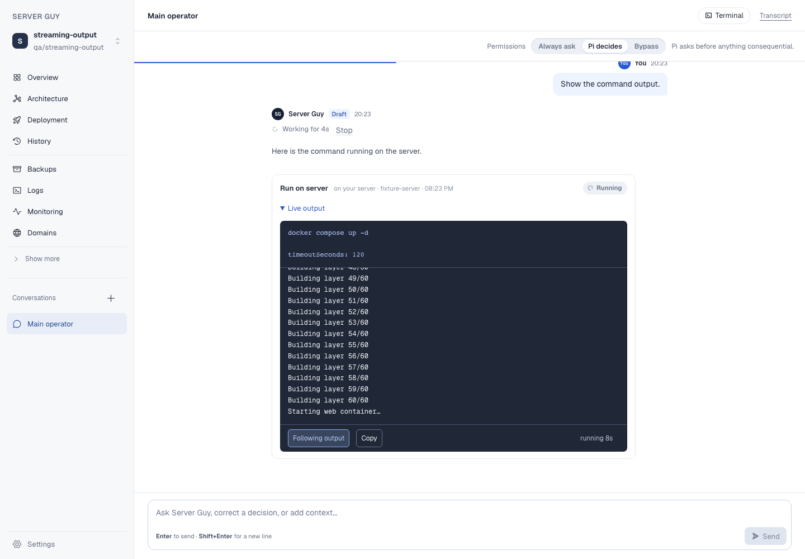
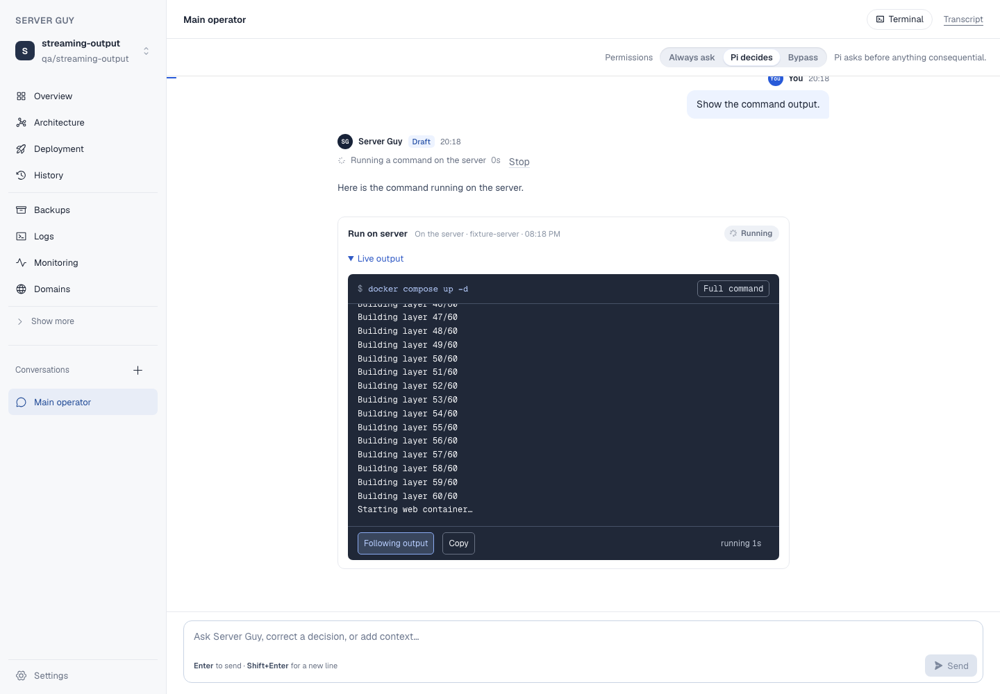
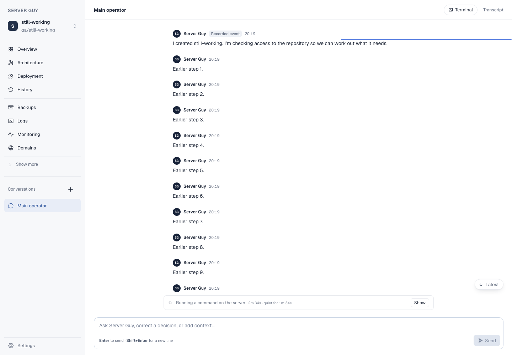

# Clear chat execution

15 September 2026. Branch `claude/cp2-chat-execution`, stacked on
`claude/cp1-recovery-correctness` (`d771872`). Checkpoint 2 of the sequenced
review, at the four priorities review asked for first: the double terminal,
where a command actually runs, what a quiet turn is doing, and the stuck
"still working" state.

Everything here is synthetic. No real application, server or account was
touched.

## The double terminal

`StreamingOutput` rendered the command and the output as two `<pre>` elements
inside one dark box, each with its own height and its own scrollbar. Two
clipped dark panes stacked together read as two terminals running two things,
and the pane a reader came for was the lower half.

The command is now a caption: one line, and the first line that *acts* rather
than `set -euo pipefail`. Everything else — the rest of the script, and the
settings that travelled with the payload — sits behind a disclosure that says
what it is about to show. A command still awaiting approval opens its full
text, because there the command is the thing being decided.

| Before (main `45db310`) | After |
|---|---|
|  |  |

Copy, follow/pause, exit status, redaction and access to the full text are
unchanged.

## Where a command ran

The console printed "on your server" over every `server_bash` call and the
recorded target verbatim over everything else, so a container on this Mac, an
SSH tunnel this Mac holds open and a call to Hetzner all arrived as prose to
decode — and the one thing that can break the application read like the rest.

`pi-activity.tsx` carried a *second* copy of the same idea with a third set of
words, so the same call said "on your server" in the transcript and something
else on the card beside it. There is now one table, read by the console
header, the activity transcript and the list lines:

| | |
|---|---|
| `server_bash` | On the server · *the address, with the login on hover* |
| `bash` `powershell` `write` `edit` `read` `grep` … | In the repository copy · an isolated container on this Mac |
| `open_server_port` `server_public_key` `connect_server` `check_public_access` | On this Mac |
| `hetzner_request` | At Hetzner |
| `set_domain_record` | At the DNS provider |
| `save_information` and its siblings | In Server Guy's records |
| anything else | nothing at all, rather than something plausible |

## What a turn in flight is doing

"Working for 6m 12s" was the whole announcement, whatever was happening. The
line now reads the records, most actionable first:

| Evidence | What it says |
|---|---|
| An execution awaiting approval | "Waiting for you to approve a command" — and it is marked as waiting on the reader |
| A running execution | "Running a command on the server · 6m 40s · quiet for 3m 50s" |
| A running tool call with no execution card | "Working in Server Guy's records · 4s" |
| Nothing running, no reply text yet | "Waiting for the model" |
| Nothing running, reply text arriving | "Writing the reply" |
| Message queued | "Waiting to start" |

No branch estimates progress, counts steps or names a stage nothing wrote
down. Silence under twenty seconds is the gap between two lines and is not
reported as silence.

## "Pi is still working in this conversation"

The backend refuses a second message while a turn is queued or running. The
owner met that sentence *after* typing, having read a finished-looking answer
and scrolled past a backup request Server Guy had started for itself. The
guard is correct and is unchanged; what was missing is that nothing said so
where the typing happens.

The same sentence now sits above the composer — but only while the turn is off
screen, because with it in view this is one sentence twice. That is the rule
the outstanding-secret chip already followed, so both now share one hook
rather than two copies of an `IntersectionObserver`.



## Evidence

| Acceptance criterion | Result | Where |
|---|---|---|
| One command is one terminal | pass | `streaming-output.spec.ts`: asserts exactly one `<pre>` in the terminal, the caption's text, and the disclosure opening and closing. |
| The full command stays inspectable | pass | same spec: the disclosure reveals the payload including `timeoutSeconds: 120`; Copy still carries command and output. |
| Long output, reading position, follow, exit status, refresh | pass | same spec, unchanged cases. |
| The machine is named from the recorded target | pass | same spec asserts `On the server · fixture-server` with `root@fixture-server:22` on hover; `execution-text.test.ts` covers each tool class and that an unknown tool says nothing. |
| A running command says where and how long it has been quiet | pass | `still-working.spec.ts`; `run-activity.test.ts` covers all six branches. |
| An unapproved command outranks everything and says who it waits on | pass | both of the above. |
| One turn's records never describe another's | pass | `run-activity.test.ts`. |
| The composer says what is running, and only when it is off screen | pass | `still-working.spec.ts`: absent with the turn in view, present once scrolled away, and "Show" returns to it. |
| A finished turn accepts the next message, and after a reload | pass | `still-working.spec.ts` sends a second message, asserts the reply and that no error bar appears, then reloads. |
| The secret chip still behaves after sharing the hook | pass | `still-working.spec.ts`, second case. It had no browser coverage before this. |

## Found on the way

- **Elapsed time could never survive hydration.** The shell reads its clock
  with `useState(() => Date.now())`, which runs once on the server and again in
  the browser, so a turn more than a second old rendered "2m 32s" over "2m 34s"
  and React discarded the subtree. Latent on main and invisible except as a
  console error; the fixture here has a turn 200 seconds old, which is what
  surfaced it. The number is client-only now.
- **Both specs guarding this surface were red on main `45db310`.**
  `pi-transcript.spec.ts` looked for "File reads" where the component says
  "1 file read". `streaming-output.spec.ts` asserted the command pane held
  exactly `docker compose up -d` when it also held `timeoutSeconds: 120`.
  Verified on a baseline worktree at `45db310`. Both are repaired here; the
  "before" screenshot above needed the second one relaxed locally in that
  throwaway worktree to reach its screenshot line, which was then reverted.

## Commands

```
npm test                       974 passed, 3 skipped
npm run build                  ok
npm run lint                   2 pre-existing errors, see below
npx playwright test still-working streaming-output pi-transcript
                               4 passed
npm run test:e2e:smoke         3 passed, 3 failed — the same three that fail
                               on main 45db310, verified in a baseline worktree
```

`npm run lint` reports two errors, both `pi-activity.tsx` "Cannot access refs
during render", on code this branch does not change. `secrets.spec.ts` needs
an acceptance server on `:3410` that is not running here, so it did not run.

## Not in this checkpoint

The rest of checkpoint 2 — failure explanation and retry, the verified
**Open app** action at the end of a deployment, version and access in the
stable Deployment view, and treating a busy local tunnel port as routine —
is not done yet. Deployment completion overlaps checkpoint 5's Deployment
work and is best done with it.
