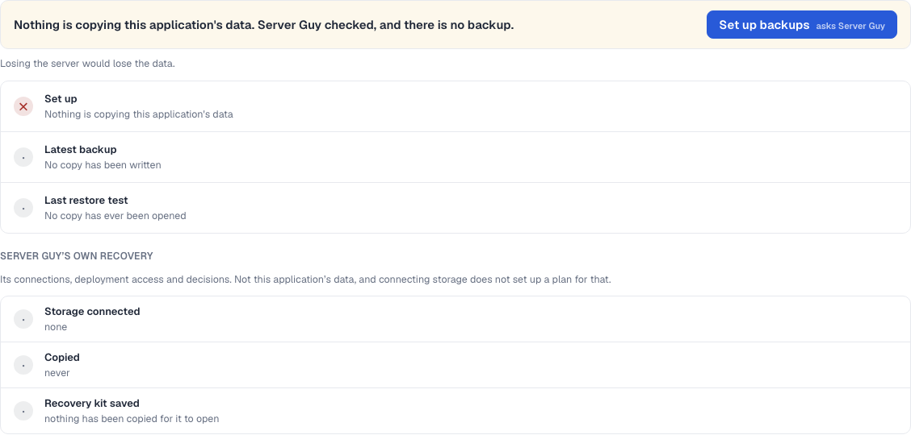

# One journey, across the five destinations

15 September 2026. Branch `claude/cp7-journey` (`051844d`), stacked on
`claude/cp6-backups` and `claude/cp5-deployment-history-logs`, which carries
Codex's `96c3525`. Checkpoint 7.

Two kinds of evidence here, and they are labelled apart throughout. Synthetic
means scenario records built by `tests/fixtures/scenario-records.ts`.
Integration means the records Pi actually wrote about the owner's own
Paperless application, read from a copy of their database. Nothing in the
owner's runtime was started, stopped or written to.

## How the integration check was done

`sqlite3 .backup` took a copy of the owner's database into a scratchpad, and
this branch's build ran against the copy on its own port. The controller on
port 3000 kept running and was never touched; no credential file was copied,
and the SSH key directory was deleted from the copy before anything read it.
No resource was bought and no model was called.

The owner's records cover the first three steps of the journey and say plainly
that the last two never happened:

| Step | Evidence | What the records say |
|---|---|---|
| Set up | integration | A host reachable over SSH, firewalls allowing inbound SSH only, three ports established private, four volumes, a generated PostgreSQL password and a signing key |
| Deploy | integration | Paperless-ngx 3.1.3 from commit `9cea0811`, three services, images pinned by digest |
| Open the application | integration | A private SSH tunnel, recorded, with the tunnel currently closed |
| Back up | **absent** | One record, `presence: absent`, whose own check failed: no backup destination, no window, no scheduled job |
| Restore in isolation | **absent** | No restore test has ever been recorded for this application |

The last two steps are unavailable, not unverified. Producing them would mean
buying storage and running a real backup against the owner's application, and
neither is authorized. **The existing evidence for those two steps is the
BookStack trial** in `docs/testing/2026-09-11-bookstack-audit.md`, which
proved a copy, a restore and a booting restored instance on the Linux host
rig. It predates this branch, so it verifies the capability, not this
branch's wording of it.

## What the integration data found

**A real defect, and it was the reason for doing this.** With a plan whose own
check failed and no copy ever taken, Backups read *"The attempt 5 h ago
failed"*. Nothing attempted a backup. The projection knew that the failed
record was a plan and not a copy, and threw the distinction away one line
before the page used it. Fixed in `051844d`; the failed check keeps its place
on Set up, where the plan is the subject.



**Checkpoint 6's absent-plan fix holds on real records.** The owner's
`backup-plan` record carries `presence: "absent"`, which is exactly the shape
that used to count as a plan. It now reads *Nothing is copying this
application's data*.

**Checkpoint 5's access fix holds on real records.** The Deployment header and
the release card both read the same probe: *The tunnel is closed* beside *Ask
Pi to reopen it*, and *Reopen access* rather than a link to an address that
does not answer.

**Checkpoint 5's History filter holds on real records.** Ten rows, and the
summary counts them exactly: three verified, four failed, three neither.

## The visual pass

Overview, Architecture, Deployment, History, Backups and Command output, at
1280 and 1440, measured rather than looked at: every element checked against
its own box, every element against the viewport, the page against sideways
scroll, and the page's own statements about access against each other.

| Checked | Result |
|---|---|
| Sideways scroll on the page | none, at either width |
| Elements past the right edge | none |
| Overlapping content | none |
| Clipped or truncated text | two, both deliberate: the repository name under a fixed-width sidebar has `text-overflow: ellipsis`, and a failed timeline marker's ping ring is drawn at `inset: -3px` on an unclipped element |
| More than one terminal | never; one per page |
| Stale pinned secret or approval cards | none. The one approval card on Backups is the live offer to connect storage, correct while none is connected |
| Contradictory access states | none. Header and release card agree on every page that mentions access |

## Not fixed, and why

**Backups says the same thing twice.** The stages lead with *Nothing is
copying this application's data*, and the calendar below opens a second
headline, *No copy off the server is on record*, with its own separate ask.
Two leads and two asks for one fact. Resolving it means deciding what the
calendar is for once a direction is chosen, which is the owner's decision
tomorrow.

**One screen carries four sizes of the same kind of text.** Paragraphs on
Backups measure 12.5, 13, 14 and 15 px; the small print across Architecture
and Deployment measures 11, 11.5, 12, 12.5 and 13. Each page is internally
consistent and the pages disagree with each other. A type scale is a design
decision, not a defect to patch here.

**Apostrophes are mixed.** Roughly 640 straight against 38 files using curly,
and both appear on the Backups page at once. Normalising is a mechanical
change across the whole product and belongs in its own commit.

**Provider API paths reach the reader.** Deployment's story prints
`/servers?label_selector=server-guy-application=<id>` as the detail under
"With the provider". Pre-existing, and rewriting it means deciding what a
provider call should be called.

```
npm test        1005 passed, 3 skipped
npm run build   ok
npx tsc         clean
npm run lint    2 pre-existing errors (pi-activity.tsx), unchanged
```
