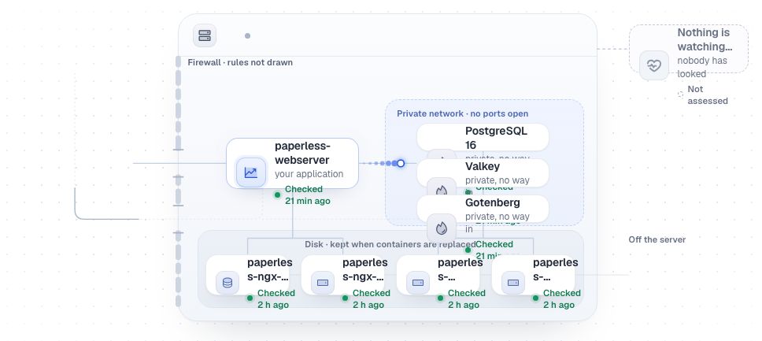
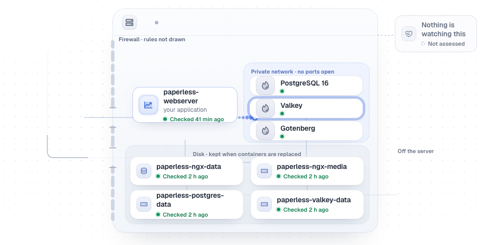

# Diagrams that hold their labels, and a typography question answered

15 September 2026. Branch `claude/cp4-diagrams-wording`, from `f12ac02`.
Checkpoint 4: the Architecture map, the Overview thumbnail, the font-size
question, and the wording those two surfaces carry.

Everything here is synthetic. `Scenario · Paperless-ngx` was added to the
scenario fixtures: three backing services, four data locations, and the names
an upstream Compose file actually uses rather than short ones invented to fit.

## What was wrong

Both diagrams place their boxes as percentages of a fixed 1120×500 canvas. The
boxes therefore shrink with the content and with the window; the text inside
them does neither. Four data locations made each box 124 units wide — about
105px at 1280 — and the names did not.

Measured on the fixture, before:

| | 1280 | 1440 |
|---|---|---|
| cards holding more content than their box | **9 of 9** | 5 of 9 |
| worst case | service card 35px tall, 103px of content | |
| names rendered in full | 5 of 9 | 5 of 9 |
| cards escaping their region | 1 | 1 |

The service cards overlapped each other inside the private zone; the volume
names rendered as `paperless…`, four times; `Disk · kept when containers are
replaced` was written over by the first row of volumes.

## What changed

**The canvas has a height the model decides.** The shelf grows to hold its
rows, the server card grows to hold the shelf, and the canvas grows to hold
the server. A box keeps the size its label needs however many neighbours
arrive, instead of every box shrinking until the text leaves it.

**Data locations wrap.** Two to a row past three of them, rather than a fifth
column nothing can be read in.

**Services keep a floor.** `share()` would not go below 28 units; it will not
go below 46 now, which is what a name and its reading-dot need.

**A short box says less rather than overflowing.** Where the layout genuinely
has to be tight, the card keeps its name and its state dot and drops its
sentence. The full reading is in the inspector, one click away, which has
room for it.

**The thumbnail shows topology, not a paragraph.** It drew one of three
services, printed four long container ids at a third of their usual size, and
let all of it out of the server card. It now draws every service, cuts a label
to the box it actually has, and past two data locations shows tiles with their
state and a count — `4 data locations`.

| Before (`f12ac02`) | After |
|---|---|
|  |  |

After, at both widths:

| | 1280 | 1440 |
|---|---|---|
| cards holding more content than their box | **0** | **0** |
| names rendered in full | **9 of 9** | **9 of 9** |
| cards overlapping another card | 0 | 0 |
| cards escaping their region | 0 | 0 |
| thumbnail label collisions | 0 | 0 |
| card name font size | 14px | 14px |

The font size is in that table deliberately: the brief asked for this not to
be solved by making text smaller, and it was not. Nothing in this change
alters a font size anywhere.

## The typography question

**No product inconsistency exists between launch paths.** Measured at the same
revision, the same viewport and the same zoom, `localhost:3560` and
`127.0.0.1:3560` are identical on every value that decides how large text
looks:

| | `127.0.0.1` | `localhost` |
|---|---|---|
| root / body | 16px / 16px | 16px / 16px |
| page heading | 24px | 24px |
| map card name | 14px, Geist 600 | 14px, Geist 600 |
| reading line | 11.5px | 11.5px |
| navigation | 13px | 13px |
| fonts loaded | Geist 100–900, Geist Fallback | Geist 100–900, Geist Fallback |
| device pixel ratio, zoom | 1, 1 | 1, 1 |

Identical at 1280 and at 1440 too, and identical at 2× device pixel ratio. So
**no CSS was changed for this**, which is what the brief asked for in the
absence of evidence.

What the difference actually was is in the same measurement. At 1440 a card is
246px wide and its name renders 18px tall — one line. At 1280 the same card is
211px and the same name renders 36px — two lines. The type is the same size in
both; the box around it is 14% smaller and the text is 100% bigger relative to
it. That reads as "the font is bigger on this one", and the repair for it is
the layout work above rather than a font rule.

## Wording

Three changes on the surfaces this checkpoint owns, each fixing a thing that
was wrong rather than a synonym:

| Before | After | Why |
|---|---|---|
| "Nobody has looked yet" | "Not checked yet" | 130px of text in a 129px column, so it rendered "Nobody has looked ye…" — an ellipsis in the one column whose job is to be scanned. |
| "Ask Pi what protects this" | "Check backups" | Names the job, not the model. One of the plain labels the review asked for. |
| "nothing has looked" (sidebar note) | "not checked yet" | The same state now reads the same way in the sidebar and on Overview. |

The distinction these phrases exist to protect — nobody having checked is not
the same as there being nothing — survives all three.

## Evidence

| Criterion | Result | Where |
|---|---|---|
| Paperless-like topology, multiple services and four data locations | pass | `Scenario · Paperless-ngx` in the scenario fixtures. |
| Full diagram at 1280 and 1440 | pass | Zero overflow, overlap, escape or truncation at both. |
| Miniature at 1280 and 1440 | pass | Zero label collisions; every service drawn; nothing outside the server card. |
| Long names | pass | Names up to `paperless-postgres-data` render in full at both widths. |
| Selected state | pass | Unchanged; the selected service still draws its ring (see the after screenshot). |
| Refresh | pass | The layout is derived from the model on every render; no stored geometry. |
| Text not shrunk to fit | pass | Card name font is 14px before and after, at both widths. |
| Typography across launch paths | investigated, no change | Table above. |

```
npm test          974 passed, 3 skipped
npm run build     ok
```

One regression guard changed. `architecture-multi-service.test.tsx` pins the
one-service case to the design's original coordinates; the application card is
the single box that moved, because it held a name, a description and a reading
in room for two of them and `paperless-webserver` pushed its own status line
out of the bottom. The service position and the volume slots the guard exists
for are untouched, and its comment now records why that one wire leaves from a
new edge.

## Limits

- Desktop only, as the brief scopes it. No mobile or tablet pass.
- The thumbnail truncates a long application name (`paperless-web…`). The full
  name is on Architecture, which the whole thumbnail is a button to open.
- No rig was compared, because none is running here; the launch-path
  measurement covers `localhost` against `127.0.0.1` at one revision.
