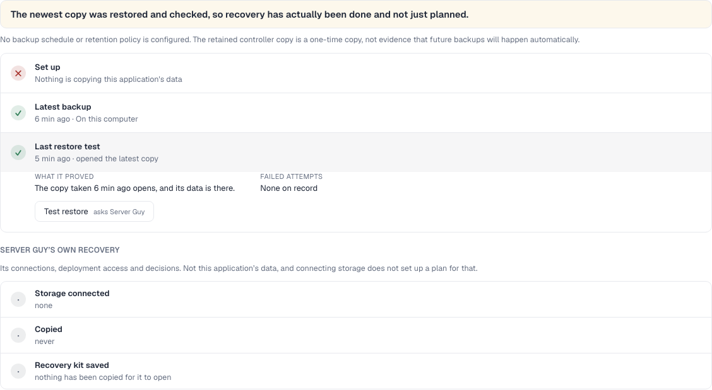

# A backup, a restore and the copy it proves, on local resources

15 September 2026. Branch `claude/cp7-journey`, on main `740e361`.

The owner's own application has no backups, so the last two steps of the
journey could not be read off their records. This produces them instead, on
disposable local resources, through the paths the product actually uses. No
provider was called, nothing was bought, and no owner data or credential was
copied.

## What was real and what stood in

| Part | Here |
|---|---|
| The application | **Local.** PostgreSQL and a second service with an uploads volume, as a Compose project inside a Linux container on this Mac |
| Its data | **Synthetic.** Three rows written into a `notes` table, and one file, `receipt.txt`, sha256 `ecb05b19…` |
| The controller | **Real product code**, from this branch, in an isolated rig with its own database and config directory |
| Pi | **Real**, on the owner's already-configured model connection, read in place. One message, one run |
| The provider | **Stood in.** `tests/rig/stand-ins/hetzner.ts` "creates" a server at this machine. No Hetzner call was made |
| SSH | **Stood in.** `tests/rig/bin/ssh` runs each command in the Linux container. The product's own key, host-key pinning and options are unchanged |
| Object storage | **Not used.** The copy went to the controller, which is a destination the product has; `destination-kind` is `controller`, not `off-site` |

## The journey

**The archive was made on the server.** `pg_dump -Fc` and a tar of the uploads
volume, over the same transport the controller uses for every other command.

**The copy was taken by the product.** `fetchBackupCopy` in
`src/server/backup-store.ts`, the function behind Pi's `fetch_backup_copy`
tool. It asked the host for the file's size and digest, pulled it over the
pinned SSH connection, and measured what arrived: 1,335 bytes,
sha256 `353900c6…`, `destination-kind: "controller"`, with the caveat the
function returns about what that destination does and does not survive.
`listBackupCopies` then showed it held.

**It was restored in isolation.** A second PostgreSQL container with its own
empty volume, no published ports and its own label, on the same host. The
running application was not touched. `pg_restore` loaded the dump.

**The contents were verified, not assumed.** Three rows came back, with the
same text in the same order. The uploads archive extracted to `receipt.txt`
with sha256 `ecb05b192f30b87113be51a690540541e46bd8fcf2caed926bccf975cafb6029`,
byte-identical to the file on the running application.

**A live Pi recorded it, and named the copy.** One message, one run. It wrote
three records: the copy, the restore test, and a `backup-plan` with
`presence: "absent"` saying nothing is scheduled. The restore test carries

```
restored-copy = notes-backup-copy-20260915T202515Z
```

which is exactly the id of the backup-copy record it wrote alongside it. **This
is the first time anything has observed a live Pi writing `restored-copy`.**
Codex has been carrying it as an open item since checkpoint 1, because a
restore that does not name its copy can only say recovery has worked at some
point, never that the copy being kept now is good.

**The page read it back.** Those records, through this branch's projection:



"Last restore test · opened the latest copy" is the identity resolving: the
projection matched the restore's `restored-copy` against the copy's subject id
rather than comparing two clocks.

## What the live run found

The page led with **"The last backup attempt failed"** directly above a stage
saying the latest backup succeeded six minutes ago. Nothing had attempted a
backup. What failed was the `configured` check on the record saying there is no
plan, and the verdict was still reading a failed plan check as a failed copy,
which is the same mistake the stage was fixed for earlier today.

Fixed in this commit, in three parts. A failed check on a plan says the plan is
not working, not that an attempt failed. A record stating the plan is *absent*
is answered by the absence, and never by a sentence implying a plan exists. And
a successful copy written after a failed check is the newer news of the two.
The limit line also printed a raw ISO timestamp at the reader; it says "taken 6
min ago" like everything else.

## The precise missing capability

**No product tool creates an application backup, and none restores one.** The
tools are `fetch_backup_copy`, `list_backup_copies` and `prune_backup_copies`:
they move and count a file that something else made. Making the archive and
restoring it are `server_bash` scripts Pi writes each time, so the steps are
not a capability with a contract, and nothing but Pi's own record says what
they did.

`scripts/scheduled-backups/runner.py` is a real engine with a documented
contract that does all of it, including an isolated restore that boots the
restored application. Nothing in `src/` installs, invokes or reads it, and its
own contract says it is not the prescribed workflow for the current design.

**The controller is not off-site.** `destination-kind: "controller"` survives
losing the application's server and depends on this Mac. An `off-site` copy
still needs object storage, which this proof did not use.

```
npm test        1018 passed, 3 skipped
npm run build   ok
npx tsc         clean
npm run lint    2 pre-existing errors (pi-activity.tsx), unchanged
```

## Cleanup

The rig, its Linux host container, its MinIO, the disposable application and
every restored container are all under `tests/results/rig/` and Docker names
beginning `sg-cp7-` or `notes-`. Nothing outside them was created.

## Final review

Codex inspected the retained local database and confirmed the restore record's `restored-copy` matches the saved backup-copy subject. A focused regression also reproduced an older failed copy incorrectly overriding a newer successful copy in the stage; the stage now follows the newer result. The backup stage, verdict and Deployment hierarchy checks pass together, 57 tests. This does not add real SSH or object-storage verification to the local stand-ins described above.
