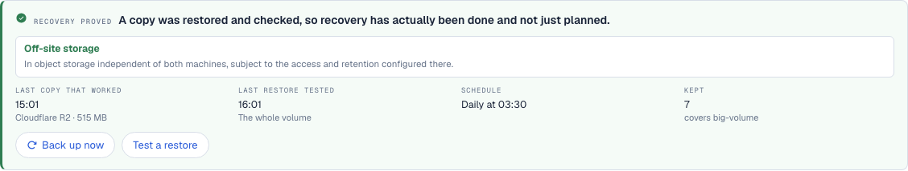
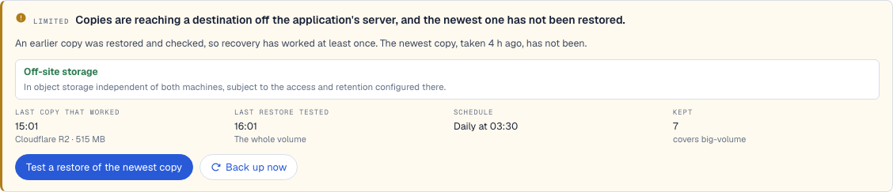
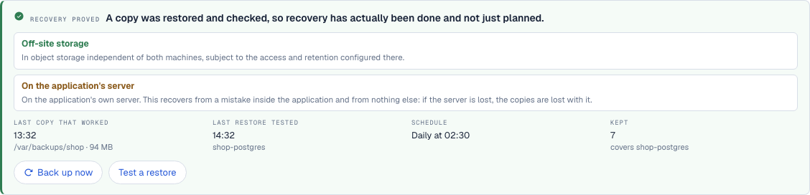
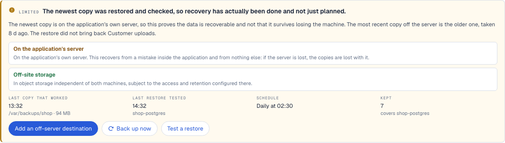

# Recovery correctness and truthful backup facts

15 September 2026. Branch `claude/cp1-recovery-correctness`, from main
`45db310`. Four defects found by review, each of the same kind: a record read
as saying something it never said.

No real credential was rotated, no provider was called, and the owner's
application and controller were not touched. Every value in this report is
synthetic.

## What was wrong, and what it cost

| | Found | Cost |
|---|---|---|
| 1 | `captureControllerPayload` swept `deployments`, `backup-schedules` and `backup-destinations` and not `secrets` | A recovered controller had every deployment and none of the passwords they authenticate with. The archive opened and every digest matched, so nothing said so. |
| 2 | `settleChange(false)` restored the old value, deleted the new one, and left the new one's provenance | After a part-way failure — the database took the password, the config write failed — rolling back deleted the only password the database accepts. And an owner-typed value came back labelled `generated`, which is the one origin `revealSecret` reads back to the screen. |
| 3 | `backups-records.ts` merged plan destinations with copy destinations, and decided restore proof by timestamp | A plan naming object storage made a copy beside the application read as off-site. Making copy B and restoring older copy A read as "recovery proved" over B. |
| 4 | "Connecting off-host storage protects your application's data and Server Guy together" | Connecting storage starts the controller's own copies. It does not discover, configure, run and verify a plan for the application's data. |

## What changed

**The secret store travels in the archive.** One name added to the capture
list, and the restore path already put it in the right isolated place. The
recovery passphrase is still outside the thing it opens.

**A credential change has three endings, not two.** `established` discards the
old value, `reverted` discards the new one, and each needs proof. `unresolved`
discards nothing and needs none: both values stay sealed, both stay exported
to `server_bash` as `$NAME` and `$NAME_PREVIOUS`, the credential keeps saying
a change is part-way through, and Pi is told to go and ask the service which
password it has. The predecessor now carries its own origin, establishment
time and revision, so reverting restores the record and not only the bytes.
The tool description that told Pi to roll back "whenever you are not sure" now
says to leave it unresolved.

**A plan is not a copy and a clock is not a copy's identity.** Plan
destinations and copy destinations are separate; `offsite` is read from copies
alone. A restore test carries `restored-copy`, the id of the backup-copy it
opened, and only that copy is proved by it. A copy that records no destination
class reads as unclassified rather than as "on the application's own server".
Coverage is subtracted from what records state — a plan naming a database
covers the volume its files live in, through the map's `disk` edge — and a
hole in it is named in the verdict's limit.

**The connection band says what connecting storage does.** It starts Server
Guy's own copies. The application's data is a separate job with its own plan,
reusing the same connection.

## What review found after the first pass

Codex reviewed the change and ran two independent checks. Both still read
`restore-verified` with no limitation, because restore proof had become
specific to a copy while **destination and coverage were still aggregated
across all of them**. Same class of bug, two fields further on.

| Sequence | What it said | Why |
|---|---|---|
| Newest copy is local; an older copy is off-site; the newest is restored | "Recovery proved", `limit: null`, `next: null` | `offsite` was read from the union of every copy's class, so yesterday's off-site copy answered the off-server question for a copy written today. |
| The plan is widened to include uploads; every existing copy holds only the database | the coverage warning cleared | Coverage was computed from the plan's current `covers`, so widening the plan retroactively "added" uploads to archives already written. |
| The plan predates the copy, and neither the copy nor its restore records contents | "Recovery proved", `limit: null`, `next: null` | Found on the second pass. My fix for the row above let the plan answer when nothing else could, gated on the plan being *newer* than the copy — so an older plan went on counting as evidence. |

Both are fixed by keeping the evidence on the record that carries it:

- A copy holds its own destination class and its own recorded coverage. The
  verdict asks about **the newest copy**, not the set. An older copy that did
  reach off the server is stated as its own recovery point — "the most recent
  copy off the server is the older one, taken 8 d ago" — which is useful and
  is not a claim about the newest.
- Coverage is answered only by a record that speaks to the newest copy: what a
  restore of it actually brought back, or what that copy recorded capturing.

A second review pass found the remaining half of that. My first fix let the
plan answer when neither did, guarded by a timestamp — the plan had been
restated after the copy was written — and an older plan therefore still
counted as evidence. It is not evidence at any age. A plan says what copies
are meant to contain, and being older than a copy does not promote intent into
evidence; it only means the intent is old.

So there are three answers and not two, and the third is not a weaker version
of the others:

| What answered | What the page says |
|---|---|
| A restore of the newest copy | "The restore did not bring back Customer uploads." Warning. |
| The copy's own record | "The newest copy does not include Customer uploads." Warning. |
| Nothing | "No record says what that copy contains." Not a warning. |

The third keeps the successful restore exactly as it was — the restore
happened and proved what it proved — and adds only that its extent was never
written down. It does not claim data is missing, does not downgrade the tone,
and does not ask for another backup. It offers to look inside the copy that
already exists. The plan's own gap is still worth saying in the one place it
is the only thing there is: a schedule with no copy yet, where what the plan
leaves out is what the first copy will leave out.

## Evidence

| Acceptance criterion | Result | Where |
|---|---|---|
| Generated and owner-supplied credentials survive capture, decrypt and isolated restore, and resolve without being displayed | pass | `controller-protection.test.ts`, "carries the application secret store". Compares with `sameSecret`; no value is asserted as text. Restored to `<target>/payload/config/secrets`, read through `SERVER_GUY_CONFIG_DIR`. |
| The sealed file in the archive is still sealed | pass | same test: neither plaintext appears in the restored JSON. |
| Provenance survives restore | pass | same test: the owner value stays `origin: "owner"` and `revealSecret` still refuses it. |
| The passphrase is not in the archive | pass | same test: no `recovery-key.json` entry. |
| A real database accepts a replacement password, then client configuration fails, and the accepted credential is not lost | pass | `credential-change.docker.test.ts`, real PostgreSQL 16 in Docker. `ALTER ROLE` over the container's own address (its loopback is `trust`, so a loopback test would prove nothing), the old password then refused, a deliberate non-zero step, `unresolved`, both values still exported, the new one authenticates, `established`. |
| Reverting after the service took the new value is a lock-out | pass, as a counterfactual | same file, second case: the stored value is refused by the real database and the accepted one is gone. This is what the old tool description told Pi to do. |
| Rollback provenance | pass | `application-secrets.test.ts`, "provenance across a rollback". |
| A local copy plus an unexecuted offsite plan | pass | `protection-verdict.test.ts`, "an off-site plan over a same-server copy does not claim a transfer", and on screen below. |
| An old-copy restore after a newer copy was created | pass | `protection-verdict.test.ts`, "a restore of an older copy does not verify a newer one, whatever the clock says". |
| Incomplete required-data coverage | pass | `protection-verdict.test.ts`, "what the plan leaves out" (three cases, including the database-dump indirection and the volume nobody wrote down). |
| An older off-site copy does not vouch for a newer local one | pass | `protection-verdict.test.ts`, "evidence belongs to the copy that carries it". Review's first sequence; it returned `limit: null, next: null` before. |
| A widened plan does not add data to copies already taken | pass | same suite, three cases: the copy recorded its coverage, the restore recorded what it brought back, and neither did. Review's second sequence. |
| A copy that does hold the data is not warned about | pass | same suite, "clears the coverage warning once a copy actually holds the data" — the fully evidenced success, retained. |
| Unrecorded coverage is stated as unknown, not as missing data, at any plan age | pass | same suite, "says coverage is unrecorded, whether the plan is older or newer". Runs both plan ages. Asserts the restore stays `restore-verified`, that the limit names no data, and that the action offered is "Check what the copy holds" rather than another backup. |

Each new test was run against the pre-change behaviour to check it actually
catches the defect, by reverting the fix in memory with an `enforce: "pre"`
Vite transform rather than editing any file. All four credential cases and the
archive case failed on the old code and pass on the new.

## Seen, not only asserted

The same scenario database was served through two builds at once: this branch
on `:3520` and main `45db310` on `:3521`. Same records, same page.

| | Before (main) | After |
|---|---|---|
|  | "Recovery proved — a copy was restored and checked" over a newest copy nothing has opened |  |
|  | "Recovery proved", with no limitation, over a newest copy that is on the application's own server and holds no uploads |  |

The second pair also shows two smaller repairs. The plan's off-site intention
is now stated as intention, below the destination that copies actually
reached. And the primary action and the always-available action stopped being
the same button a word apart: "Test a restore of the newest copy" no longer
appears beside a vaguer "Test a restore".

The connection band's sentence is in
[controller-band-before.png](2026-09-15-recovery-correctness/controller-band-before.png)
and
[controller-band-after.png](2026-09-15-recovery-correctness/controller-band-after.png).

`Scenario · overclaimed` was added to the scenario fixtures for this, and now
carries both of review's sequences at once: a plan that means to write
off-site, an off-site copy from last week, a newer copy beside the
application, a restore of that newer copy, and an uploads volume no copy
holds. Before, that read "Recovery proved" with nothing else to say. Clearly
synthetic, in the isolated scenario database, never near a real application.

## Commands

```
npm test                                    961 passed, 3 skipped
SERVER_GUY_DOCKER_TESTS=1 npx vitest run \
  --config tests/application/vitest.config.mjs credential-change
                                            2 passed, real PostgreSQL
npm run build                               ok
npm run lint                                1 pre-existing error, see below
npm run test:e2e:smoke                      3 passed, 3 failed, see below
```

## What this does not establish

- **No real provider.** The archive round trip uses a local HTTP stand-in for
  the bucket. The real Cloudflare R2 upload on record is
  [2026-09-15-controller-protection.md](2026-09-15-controller-protection.md)
  and predates the secret store being in the copy.
- **No replacement controller was activated.** The restore is verified as an
  isolated quarantined directory whose secrets resolve, which is what the
  recovery command promises. Activation stays the manual boundary in
  [scripts/controller-backups/README.md](../../scripts/controller-backups/README.md).
- **Pi has not been observed writing `restored-copy`.** The tool guidance asks
  for it and the projection reads it; no live model run has been made against
  this revision. Existing restore records without it read as "a restore was
  tested, and no record says which copy it opened", which is true of them.
- **Three browser smoke cases fail, and failed identically on main `45db310`
  in a baseline worktree built for the comparison**: `applications-home`,
  `operator-information` and `typed-information`. They are pre-existing and
  unrelated to this change.
- **One lint error is pre-existing**: `pi-activity.tsx:302`, "Cannot access
  refs during render", on a file byte-identical to main.
