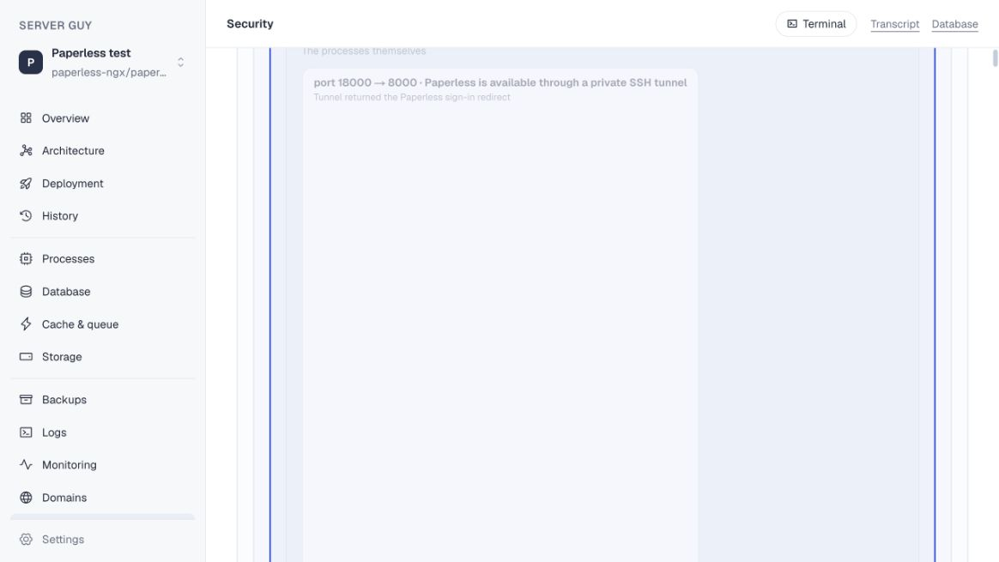
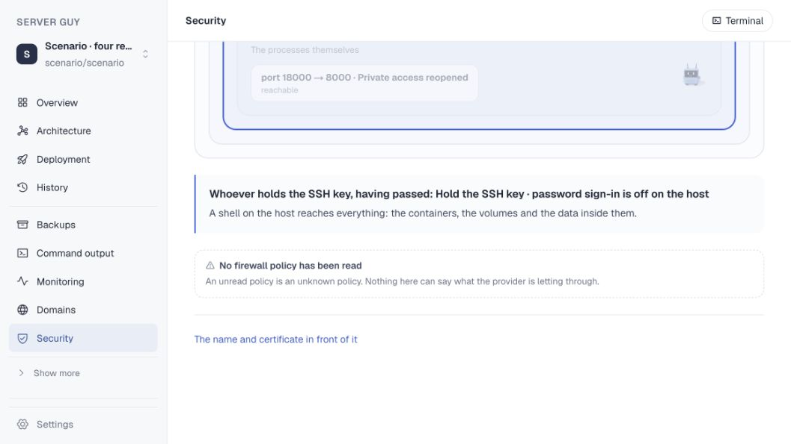

# A 42px mascot that grew to fill the page

16 September 2026. Branch `claude/security-scroll`, from main `88690ab`.

Sol reproduced runaway scroll on Security: after selecting **On the server**
and scrolling once, the workspace measured 7,718,401px tall. This is the
smallest fix for it, with the reproduction and the numbers.

## What was happening

Three rules, each reasonable alone.

`.axri-guy` gave the mascot a width and no height. `.axls .mascot-scene` and
its canvas are both `height: 100%`. And `MascotScene` observes its host, then
calls `renderer.setSize(width, height)`, which writes the measurement onto the
canvas element.

So the canvas took its height from the host, and the host, having none of its
own, took its height back from the canvas. Each measurement was larger than
the one before it. `.axri-items` uses `align-items: stretch`, so the card
beside it grew to match, and the page grew with them.

It only runs away when the mascot is the tallest thing on its flex line. While
a taller card sits beside it the row has a definite height and the loop cannot
start, which is why the page looks fine until a ring's items wrap.

## The reproduction

The scenario database, at Sol's 1164x655 with device pixel ratio 2, on the
Security page of `Scenario · four releases`, with the mascot put on its own
flex line the way a wrapped ring puts it there.

| | Mascot | Canvas buffer | The card holding it |
|---|---|---|---|
| Before | **1,050px** | 1400x2100 | **1,544px** |
| After | 42px | 1400x84 | 536px |

The initial commit accidentally attached the same image under both names. The
review replaces them with independently captured evidence below. These use
**different application records** and are not a pixel-matched before/after comparison.




The scenario page clips its content, so the growth shows in the card rather
than in a scroll height. On the owner's application, where that container
scrolls, the same feedback is what reached 7.7 million pixels.

## The fix

Four CSS declarations, no new observer and no refactor. See the [sizing diagram](../architecture/mascot-size.html).

The canvas is taken out of flow, `position: absolute; inset: 0`, so it can
never size the box that sizes it. That closes the loop for every mascot in the
product rather than this one.

`.axri-guy` and `.axca-guy` were the two hosts with a width and no height, and
both now have both. Every other mascot host already had one.

## Verified

The following suite results and 1280/1440 measurements were reported by Opus.

Security at 1280 and 1440, on two scenarios, selecting a ring and scrolling:
the mascot stays 42px, the content stays one viewport, and the mascot still
renders rather than collapsing to nothing.

```
mascot 42px · content 900px · document 900px · visible true    (4 of 4 checks)
npm test        1019 passed, 3 skipped
npm run build   ok
```

Independent Sol visual review on the isolated port 3640 preview also passed.
At an actual content viewport of 1058×595, selecting a ring and scrolling
left the workspace bounded at 1,127px (539px visible). The Security mascot
and canvas remained 42×42px and visibly rendered. A Backups spot-check
confirmed its shared mascot canvas remained visible and bounded at 70×70px.
The screenshots above show the original owner-app failure and this isolated
review; normal page scrolling remains possible.

## Noted for the Security redesign

The same screen shows four levels of nested rectangles: your network, on the
server, inside the private network, and a card inside that. That is the
structure the redesign is meant to replace; it is not part of this fix.
