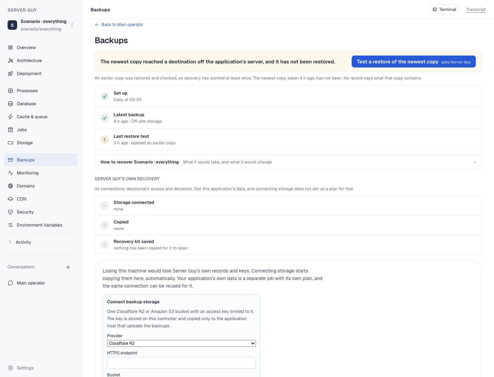
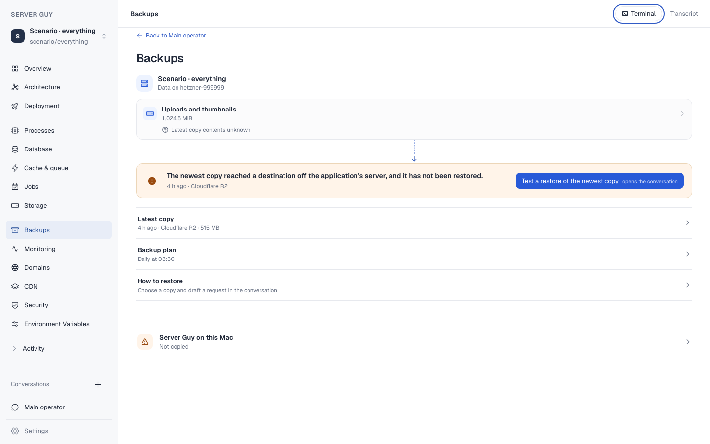
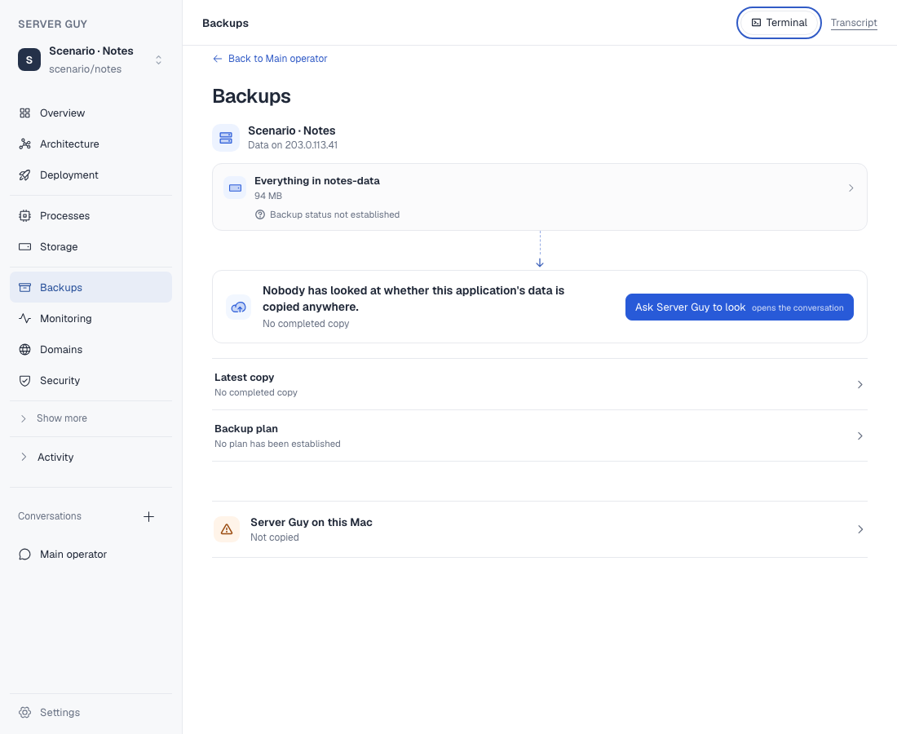
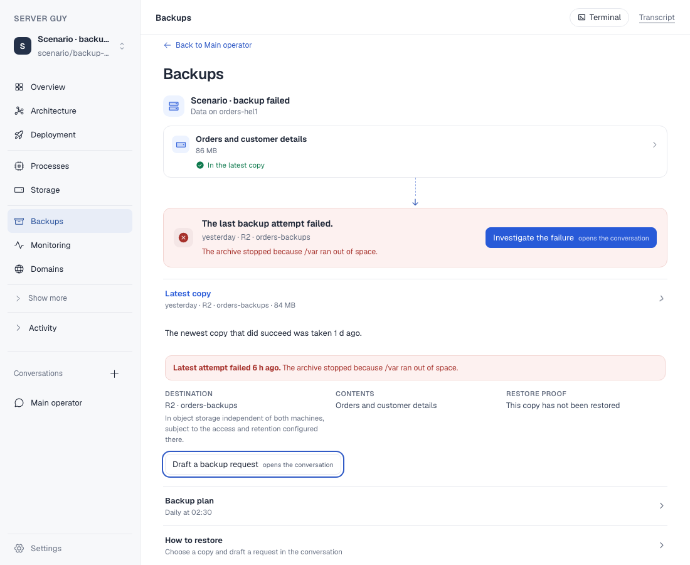

# Application-first Backups

On 17 September 2026 the selected application-first Backups direction replaced
the clinical three-stage status board in the product. The data an application
actually keeps is now the first object on the page. Each item is selectable and
states whether the latest successful copy is known to contain it. The page then
connects that application and host to one compact operational summary, with the
plan, copy evidence and recovery controls behind consistent disclosures.

The record projection did not change its evidence boundary: plans remain
intent, completed copies remain evidence of copied bytes, and a restore proves
only the exact copy it names. A failed copy now carries its recorded body into
the view so an operational reason is not replaced by a destination or size.

## Seen before and after

Both sides use the isolated `Scenario · everything` record database. The
baseline is `origin/main` at `0c83551`; the candidate is the product branch
served on port 3870. The older selected prototype remains separate on port
3846 and was not used as runtime evidence for this page.

| Before: parallel status rows | After: application → data → copy situation |
| --- | --- |
|  |  |

## Sparse and failed states

| Nobody has checked | A real backup attempt failed |
| --- | --- |
|  |  |

The sparse case initially exposed a contradiction during review: the summary
said nobody had checked while the data item said it was not in a plan. The item
now says `Backup status not established` unless a real plan or established
absence supports the stronger claim.

## Visual and interaction review

The isolated scenario server was checked at 1100 and 1440 CSS pixels with the
sparse Notes fixture, the dense Everything fixture, the existing overclaimed
fixture and a focused failed-copy fixture. The review opened a data item, all
application disclosures and the smaller Server Guy disclosure; it also tabbed
through the page to inspect focus.

- No document or body horizontal overflow occurred at either width.
- No browser console errors occurred.
- Keyboard focus remained visibly outlined on native buttons and selects.
- Long paths, destination descriptions and the recovery-storage form remained
  within the content measure.
- The actual failure reason stays visible in the compact summary. The last
  successful copy remains available separately and is not relabelled as the
  failed attempt.

## Checks

Run with Node.js 22.23.2, the project's required major version:

```text
npm test -- --run backup-stages controller-protection-view protection-verdict
56 passed

npm run lint
passed; 13 existing warnings, no errors

npm run build
passed; existing Turbopack dynamic-filesystem tracing warnings remain
```

The production build first failed under the machine's Node.js 26 because the
locked `node-pty` binary was built for Node 22. Re-running the unchanged build
with Node.js 22 passed. Dependencies were not changed.

## Boundary

The screenshots use saved-information fixtures, not a provider or live host.
They prove the production page renders those record combinations truthfully;
they do not prove a backup upload, retention policy or restore on a real
provider. The page's backup and restore buttons still draft work in the
conversation. They do not claim that clicking the page directly performs a
restore. Server Guy's own controller copy remains a separate expandable
section and never establishes protection for the application.
