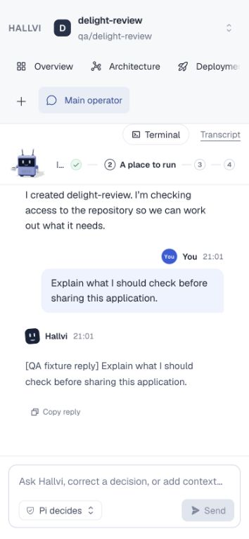
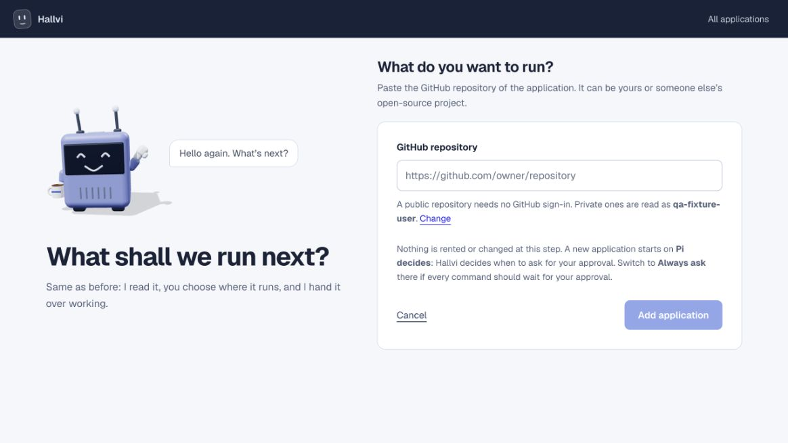
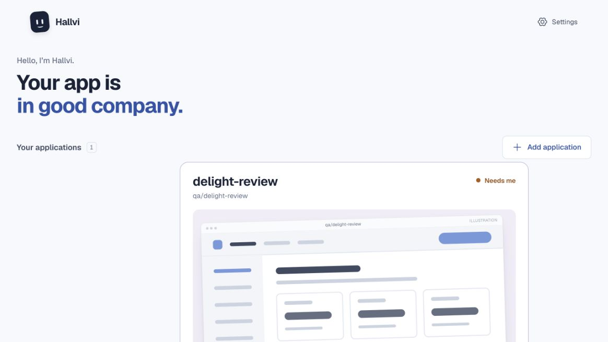

# Everyday interactions — 18 September 2026

Candidate: `codex/delight-pass`, based on `00b790ab` (PR #137). This report and
its images belong to the same implementation change.

The review used an isolated local app with the actual routes, SQLite records,
and worker, but synthetic model and provider responses. It establishes UI and
conversation behavior, not a fresh real-host deployment or an update to the
owner’s installed service.

## What changed

Completed Pi replies have a quiet Copy reply action below the answer. Copy
success is visible; clipboard denial gives a recoverable instruction. Sending
returns focus to the composer, and Return to a destination focuses its active
navigation control. The Show action respects reduced motion.

Settings and GitHub recovery retain application and conversation identity;
returning preserves the unsent draft. A disconnected public repository can use
Check again without first connecting an account. Adding a second application
omits the first-run ownership and deployment lesson.

Home uses the latest decisive state judgment for each subject alongside its
current checks. A passed check cannot hide a recorded limitation or failure;
an informational note cannot clear one. A newer verified state can clear an
older judgment, while a historical event cannot become current state.

## Visual evidence

The completed reply keeps its copy action available without hover. The mobile
composer remains inside the viewport.

Returning users keep the same repository form without repeating the ownership
primer or three deployment steps. First-time users still receive both.

The same warning-plus-passed-check fixture read Fine before this change and
Needs me afterwards. No real application health is asserted by this image.

## Verification

- Ten selected browser journeys passed across the initial run and focused
  reruns: the smoke suite, draft/context continuity, queued follow-ups, late
  response handling, transcript persistence and GitHub reconnect/return.
- Twenty-four focused application checks passed, including current warnings,
  recovery, historical events, failed-check precedence and an informational note
  following a failure; existing chat recovery and setup-return checks passed.
- Production build, TypeScript and formatting passed. Lint has zero errors and
  thirteen pre-existing warnings; changed code also passed focused ESLint.
- The synthetic disconnected public repository was checked again through the
  visible action without signing in; the notice cleared after success.
- Independent read-only review found the informational-note masking case; it
  was fixed and re-reviewed. Browser review placed Copy after the visible Pi
  transcript rather than ahead of it.

The GitHub browser case contained two stale pre-existing expectations: that a
public repository required sign-in and that recovery always requested a
connection. They now match the existing anonymous-read behavior and verify
return to the original draft. No provider credentials or owner data were used.

The next work is the [public self-service beta preparation](../../ROADMAP.md#public-self-service-beta-preparation),
not another general feature or cosmetic pass.
