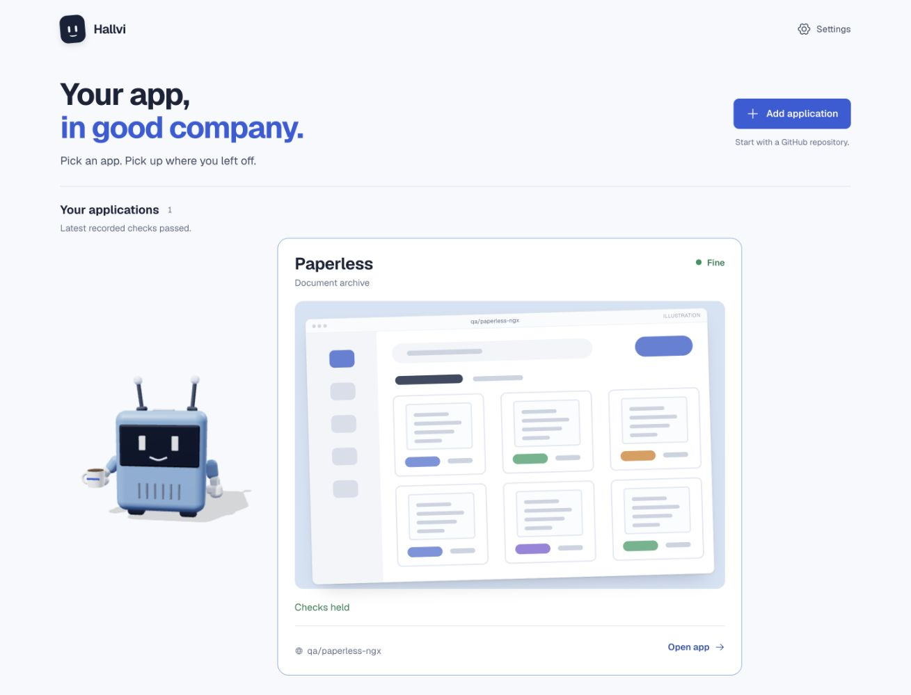

# Applications home polish — 18 September 2026

Candidate `5004f7d4`, based on `a83db53e`, in [PR #139](https://github.com/lustoykov/hallvi/pull/139). Captures show the
implementation in this change; later tracking edits do not change the tested UI. The isolated local app uses synthetic application
records and provider responses; the illustrated previews are not screenshots of
running deployments.

The welcome now keeps its heading and continuation copy together. A solid blue
Add application action sits beside it on desktop and below it on mobile. The
short collection summary sits beside the applications rather than across the
hero. Caretakers occupy less vertical space, preview colors are stronger, and
Open app replaces More. Status projections, app identity and navigation targets
are unchanged. New entries say no deployment is recorded rather than repeat the
New badge; empty-state copy no longer promises that every action awaits approval.

A new app, a current limitation and a recent passed check retain distinct states.
The top summary names only the states needing context; each card keeps its full
condition.

The welcome, add action and collection stack at a measured 354 CSS pixels with
no horizontal overflow. The automated journey also exercises search and opening
the selected app at 390 pixels.

The single-application composition remains intact. This image’s check is
synthetic; it establishes no live Paperless deployment claim.

Verification: the existing applications-home browser journey passed (first-run
arrival, desktop collection links, narrow-screen search, selected navigation,
and repeat add). Eleven focused application/status tests, TypeScript, production
build and formatting passed. Lint has no errors and thirteen existing warnings.
The component design reference owns the layout rules; ROADMAP tracks this
increment. No dependency, new workflow or live service change is included.
