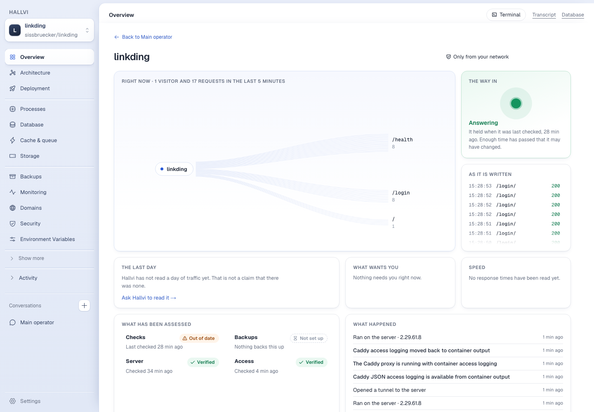
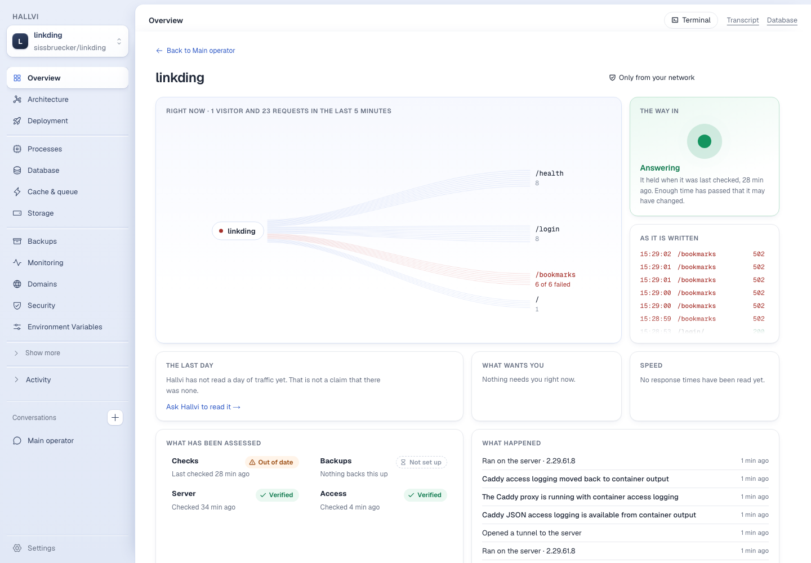
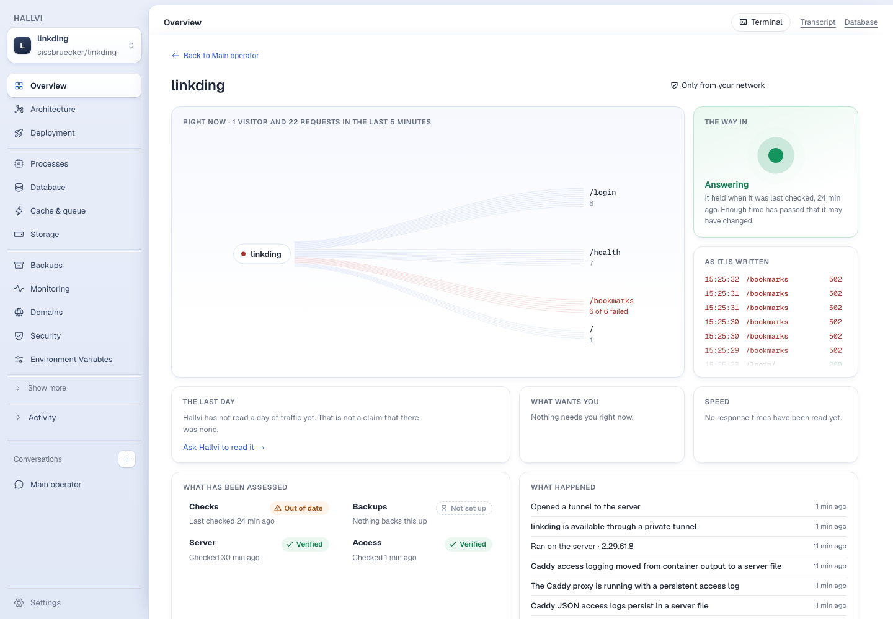
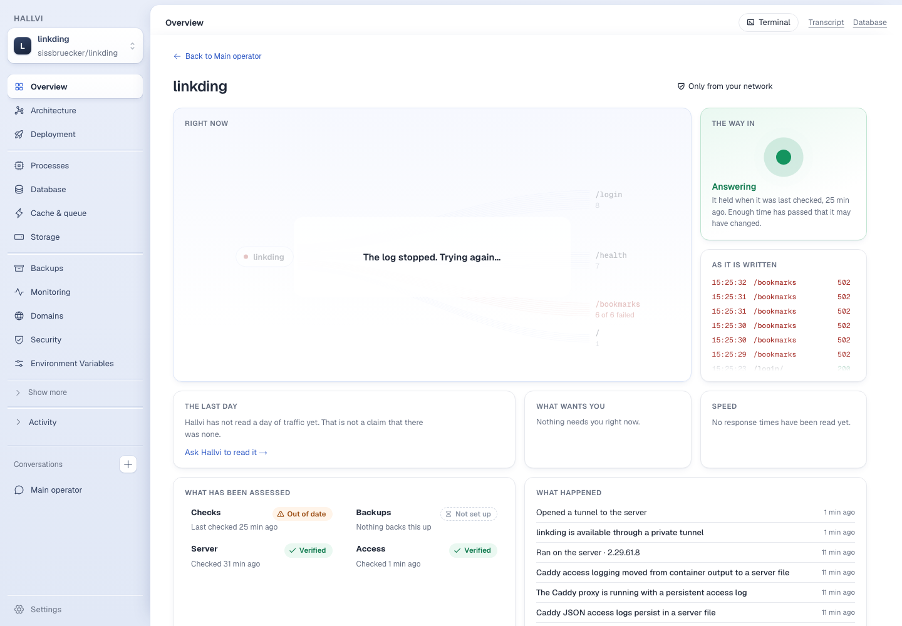

# Overview, live, on a real server

19 September 2026. Branch `claude/landing-page-directions-5dca9e`,
[PR #151](https://github.com/lustoykov/hallvi/pull/151). Controller run from the
worktree on `127.0.0.1:3735` with its own empty database, the shared Pi
account and the existing Hetzner connection. The model was the configured Pi,
the provider was real Hetzner, and nothing was seeded: every record below was
written by Pi in the main conversation.

**Revision tested: `afd9ecb5`.** The commit after it changes one label ("The
way in is open", see below) and adds this document.

## What was asked, as an owner would ask it

1. *"Read the repository, then rent the smallest suitable Hetzner server for it
   and deploy it privately for now…"* — linkding at `27b7303b`, a CX23 in
   Helsinki, private behind a tunnel on `127.0.0.1:8080`. About twelve minutes.
   No proxy and no access-log record, which is right: nobody had asked for one.
2. Overview then said **"Nobody has looked for an access log yet"**. Its own
   button, **Ask Hallvi to turn it on**, drafted the request; it was sent
   unedited. Pi put Caddy in front of the application on the server's loopback,
   turned on JSON access logging, confirmed a tunnelled request appeared, and
   saved `{kind:"access-log", source:{type:"container", name:"linkding-caddy"}}`
   with `views:["overview"]`. Overview went live without a reload of anything
   but the page.
3. *"I'd like Caddy to write its access log to a file on the server…"* — Pi
   changed the Caddyfile, mounted a host directory, confirmed a request in the
   file, and updated **the same record** to
   `{type:"file", path:"/opt/linkding/logs/caddy/access.log"}`.
4. *"I changed my mind…"* — back to container output, same record again.

Permission mode was **Pi decides** throughout. The follow itself never
prompted, which is the behaviour [Product](../../PRODUCT.md#what-the-modes-cover)
now defines.

## What was checked, for both sources

A Playwright script drove the real page while `curl` sent requests through the
tunnel; failures were real 502s, made by stopping the application container
behind Caddy. Ground truth was the server's own log, counted independently over
the same five minutes. Streaks were detected by reading the canvas: a resting
thread never exceeds alpha 48, a streak reaches about 217.

| Check | Docker logs | File |
| --- | --- | --- |
| Page equals the server's log | 23 requests, 6 failed — equal | 22 requests, 6 failed — equal |
| Lanes | `/health 8`, `/login 8`, `/bookmarks 6 of 6 failed`, `/ 1` | `/login 8`, `/health 7`, `/bookmarks 6 of 6 failed`, `/ 1` |
| Backlog on opening is not replayed as live | 0 streak pixels while idle | 0 |
| Live successes draw streaks, none red | 128 px, 0 red | 137 px, 0 red |
| Live failures draw red | 91 red px | 88 red px |
| Query strings and addresses reach the page | none (`/login/?next=/secret-token-n` shows as `/login/`) | none |
| Follow killed on the server: "live" stops | within 2.5 s: heading drops to "Right now", note "The log stopped. Trying again…" | same |
| Reconnect (15 s): totals and replay | 23 → 23, 0 streak pixels | 22 → 22, 0 |
| Follow processes on the server: open / left Overview / back / page closed | 1 / 0 / 1 / 0 | 1 / 0 / 1 / 0 |

**A true connection failure.** The server silently dropped this Mac's SSH
packets for 75 seconds (a self-removing `iptables` rule). "Live" stopped at
18 s; two retries said `ssh: connect to host … Operation timed out`; the page
recovered by itself at 84 s with the same 23 requests and no replay.

## What the real server found, all fixed in this PR

None of these showed against the local container the first version was tried
on.

1. **Every failure was counted twice.** Caddy reports a 5xx through
   `http.log.error` as well as the access logger, with the same request and
   status. Only access lines are requests now; a test holds it.
2. **Lane counts went stale.** The heading said 59 while the lanes summed to
   53: geometry is held still so the picture does not shiver, and the numbers
   were being held with it.
3. **Closing the page leaked a process.** The SSH session ended; `docker logs
   --follow` stayed on the server until its next write, which on a quiet site
   is never. The session now has a terminal, so the server hangs it up.
4. **A lost connection printed a log line**, client address included, as its
   reason. Log content is never an explanation now.
5. **A blackholed connection claimed "live" for 40 s.** Keepalive is 3 × 5 s.
6. **"The server did not accept the connection"** was said of a session that
   had been following for minutes.
7. **"Answering", in green, over a column of 502s.** For a private application
   the check behind that tile establishes that the tunnel is open, not that
   the application answers. It now says "The way in is open". (Changed after
   `afd9ecb5`; a label only.)

## Limits that remain

- A private application has no proxy until something asks for one, so Overview
  starts in "nobody has looked" and needs the one request above. Whether a
  private deployment should get Caddy and access logging from the start is a
  product decision this run did not make.
- A dead connection is noticed in about 15–18 s, not instantly.
- On reconnect, a request made in the last four seconds may be drawn twice.
  Counts are not affected.
- Only Caddy's JSON format is read. One SSH session per open page.
- The "last day" and "speed" tiles need a `usage` record, which nothing in this
  run asked Pi to write; they correctly said nothing had been read.
- My network-drop test also closed the application's tunnel, and the product
  has no tunnel supervisor: Pi reopened it when asked.

## Resources

Owner UUID `2dcf6b63-f3c7-4a61-b179-55a624347305` in the durable inventory:
Hetzner server `166535237` (CX23, `hel1`) and SSH key `130213733`, both created
by Pi for this application, labelled temporary with a 72-hour lease, and
deleted by exact ID when the run ended. Nothing else in the project was
touched.
