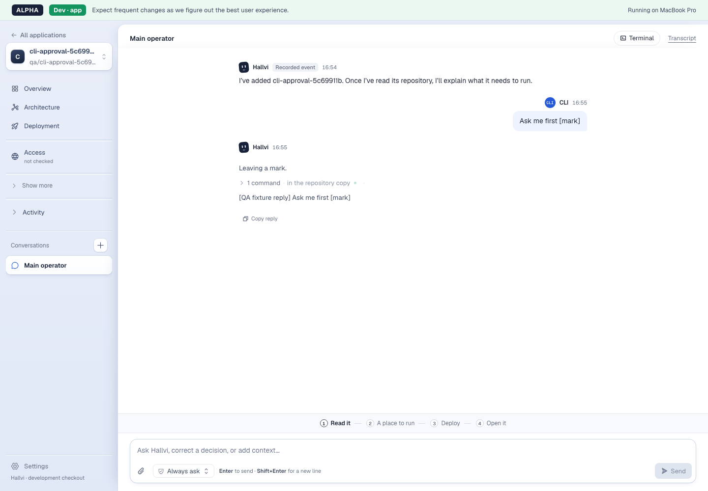

# Conversation change notifications — 29 September 2026

Environment: Node 22.23.2 on macOS; real Next development server, asynchronous
SQLite thread, execution reader and browser EventSources in disposable QA
fixtures. Based on integration revision `5521042998e3c50b4a0d37a84b411b56eb92e2b7`
with this change applied. The idle measurement scripts the worker transcript;
the CLI and restart journeys use the installed Pi packages with model responses
scripted. No live provider, retained application or deployment was used.

## Idle history work

`tests/browser/change-notifications.spec.ts` opens 1, then 5, then 10 distinct
chats of one application. Every snapshot includes 2,000 completed execution
records (1,910,890 bytes on disk) from an older conversation. The payload fits
inside the execution-reader cache. Each chat has an independent Chromium
network context, avoiding the HTTP/1 six-connection limit on one origin.

Counters are injected into the disposable fixture only: entry to
`chatSnapshot`, execution directory scans, and JSON content parses. Transcript
requests are counted at the scripted worker socket. After initial reads
settle, each window lasts 16.5 seconds, crossing the former 500 ms snapshot
poll and the 2.5/10/15-second application and permission-control cadences.

| Open chats | Idle window (ms) | Snapshots | Transcripts | Directory scans | JSON parses | Metadata refreshes | Worker subscriptions |
| --- | ---: | ---: | ---: | ---: | ---: | ---: | ---: |
| 1 | 16,512 | 0 | 0 | 0 | 0 | 1 | 1 |
| 5 | 16,512 | 0 | 0 | 0 | 0 | 5 | 1 |
| 10 | 16,517 | 0 | 0 | 0 | 0 | 12 | 1 |

Elapsed opening times for each added group were 9,706 / 10,807 / 20,201 ms.
They include navigation, development compilation, hydration and initial
snapshots; they are not per-snapshot latency or a production performance
claim. Read counts establish that the idle work stops. No full execution
request came from the permission control during those windows.

## Change, failure and recovery checks

The separate-process socket test covers one shared subscription, chat and
application scope, web-originated relay, observer failure isolation, relay
batches above 256 scopes, last-reader disconnect, and refusal of a different
controller-configuration root with the same database.

The SSE tests hold asynchronous reads open while notices arrive. Both initial
and subsequent reads schedule the later revision, without overlapping reads.
One hundred token notices in one second produce two reads; idle heartbeats
produce none. A stalled reader is closed instead of collecting snapshots.

The reconnect regression holds chat A's earlier empty directory scan, leaves
chat B subscribed, disconnects A, adds evidence while A has no listener, then
reopens A. Its first snapshot sees the new record without waiting for the old
scan. This protects reconnects that reuse an already-connected hub and
therefore receive no new worker connection notice.

The browser boundary journey renames an application through the real Next
PATCH handler. Main and side chat greetings update through their already-open
SSE streams, while another application is untouched. It checks one worker
subscription, worker loss, no snapshot polling during retry, recovery and
last-reader cleanup. The CLI approval journey opens two pages before sending
from a separate CLI process, then observes approval and completion without
reloading. The restart journey kills the real worker mid-answer and verifies
that the queued request remains for explicit Continue.

The original streaming-output, transcript, still-working and typed-information
browser journeys also pass with fixture edits explicitly notifying readers.
The initial boundary check used a nonexistent CSS selector; its recorded page
already contained the renamed greeting. The check now uses the conversation's
accessible log landmark.

The screenshot records the completed CLI request after approval and reload.
The same journey asserted approval and completion in both open pages before
that reload; the model reply and repository command are fixture controlled.

Checks: 1,144 application tests passed, three skipped; ten distinct browser
journeys passed across the focused runs; TypeScript, production build, lint
(35 existing warnings, no errors), formatting and `git diff --check` passed.
The task's browser fixtures used ports 3690–3693 and exited; the checkout's
preview-process check and port check found no remaining preview.

## Limits

The [execution-reader measurement](2026-09-29-execution-reader.md) still applies
to active full-history serialization. Notifications eliminate idle rebuilding;
they do not make serialization asynchronous or bound response size. Sustained
updates stay at a maximum of one snapshot start per 500 ms per SSE reader,
with a 100 ms first update after idle. The active-burst check establishes this
count limit, not a new latency claim. The idle result covers ten chats sharing
one application's history, not ten distinct oversized histories.

Notifications are ephemeral and require both web and worker processes from
the same release. Restarting both recovers current records; no format upgrade
or notification replay is needed. These fixtures do not prove production
deployment, a real model response or a retained-state upgrade.
